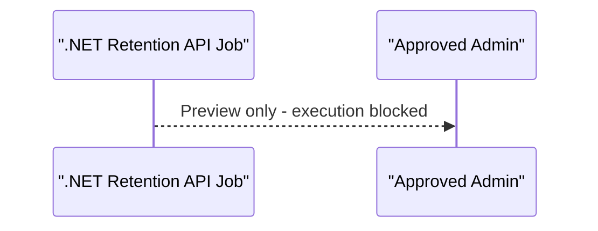

# Functional Requirements Guidance

## FR quality checks

A functional requirement is ready when it answers:

- Who or what initiates the behavior?
- What preconditions must be true?
- What input, event, or trigger starts it?
- What must the system do?
- What output, state, record, notification, event, or audit entry is observable?
- What exception paths matter?
- Which business rule or upstream requirement justifies it?
- What user story statement, objective, user value, and scenario context explain the feature?
- How will QA or a reviewer prove it?
- Which draft test case proves each acceptance criterion?
- What test data, user role, tenant/terminal context, and automation suitability apply?
- Is the FR Draft, Blocked, Ready for review, Ready for delivery, or Approved?
- Which backlog/story and test/validation links prove it is delivery-ready?
- Are policy/legal, data source, report/export, privacy, or sensitive-data dependencies resolved or explicitly carried as blockers?
- Does the FR package folder contain current `fr-001-description.md`, `fr-001-test-cases.md`, `sequence.mmd`, `sequence.drawio` when required, and `fr-001-lld.md`?

## User story context in FRs

When a user story exists, the FR package description must merge the story into the functional requirement instead of only linking to it. The FR remains the authoritative behavior contract, so readers should understand the feature intent without opening another file first.

Include:

- The `As a / I want / So that` statement.
- The story source link or backlog item.
- The feature objective in plain language.
- The user or business value.
- The primary scenario or user journey.
- Story-derived constraints, exclusions, assumptions, or scope notes.
- Story acceptance criteria that describe functional behavior, translated into FR acceptance criteria.

Do not copy implementation tasks or design decisions from the story into the FR. Keep story links for traceability, but record missing or stale story content as an evidence gap, blocker, or open question when it affects delivery readiness.

## FR package structure

Each requirement should live in its own package folder:

```text
docs/02-product/FR/fr-001/
|-- fr-001-description.md
|-- fr-001-test-cases.md
|-- sequence.mmd
|-- sequence.drawio
`-- fr-001-lld.md
```

Use `docs/02-product/FR/functional-requirements.md` as the cross-FR index, not the only place where detailed FR content lives. The index should link to each package and summarize readiness, traceability, and package artifact status.

Package file ownership:

- `fr-001-description.md`: Product-owned FR details, merged user story context, acceptance criteria, evidence, and handoff.
- `fr-001-test-cases.md`: Product-owned draft test cases for QA planning, mapped to acceptance criteria with test data needs and automation suitability.
- `sequence.mmd`: Product-owned Mermaid source for the FR behavior flow.
- `sequence.drawio`: Product-owned editable visual companion generated from `sequence.mmd` when a diagram is required.
- `fr-001-lld.md`: Architecture-owned FR-level LLD handoff, seeded by product but reviewed or completed by `ai-solution-architect` / `adp-arch-lld`.

## Sequence diagram quality

- Treat `sequence.mmd` in the FR package as the source of truth.
- Keep the Mermaid block in `fr-<nnn>-description.md` synchronized with `sequence.mmd`.
- Include the actors and systems that materially participate in the behavior: initiating user, UI or API boundary, authorization/policy check, domain system/service, persistence or external system when relevant, and audit/evidence sink when required.
- Show permission denial, validation failure, duplicate/invalid-state rejection, happy path, and material optional branches with Mermaid `alt` or `opt` blocks.
- Show observable outputs such as confirmation, rejection reason, created record, status change, notification, export, or audit evidence.
- Do not collapse the sequence into one generic "validate and save" message when acceptance criteria name multiple outcomes.
- `sequence.drawio` must match `sequence.mmd`. Prefer a rendered Mermaid SVG in the `mermaid-render` image cell. If rendering is unavailable, create an editable native Draw.io sequence diagram with participant headers, dashed lifelines, message arrows, return arrows, branch boxes, and branch separators.
- Do not ship Draw.io files that are only prose summaries, generic boxes, fixed canned lanes, unresolved placeholders, or weaker than the Mermaid source.

## Playwright artifact handoff

For UI-capable test cases, keep `fr-001-test-cases.md` focused on generated test cases and provide a stable artifact handoff path for the `playwright` skill:

- Include an artifact root such as `output/playwright/fr-001/`.
- Link each UI-capable test case to a child path such as `output/playwright/fr-001/tc-fr-001-001/`.
- Let the `playwright` skill create or read screenshots, traces, snapshots, PDFs, and notes in that folder when UI execution is requested.
- Do not embed Playwright CLI commands by default; add commands only when the requester explicitly asks for execution steps.

## Requirement wording

Prefer:

`FR-014: When a terminal operations planner submits a berth change for an active vessel visit, the system shall validate berth availability, record the change reason, notify subscribed stakeholders, and retain an audit entry linked to the vessel visit.`

Avoid:

`The system shall manage berth changes.`

## Boundary routing

- Route quality targets to `adp-arch-nfr`.
- Route screen flows, wireframes, and interaction design to `ai-ux-ui-designer`.
- Route architecture decisions, integration patterns, and ADRs to `ai-solution-architect`.
- Route backlog ordering, release grouping, planning inventory, and wave sequencing to `adp-plan-wave`.
- Route test plan creation and execution evidence to `ai-quality-engineer`.
- Route implementation tasks to the relevant delivery engineer role.

## Priority guidance

Use MoSCoW:

- **Must:** required for release value, compliance, safety, or core workflow.
- **Should:** important but can move if release risk is high.
- **Could:** useful enhancement with low release dependency.
- **Won't:** explicitly out for this release.

Nothing is `Must` unless it has acceptance criteria and source traceability.
Nothing is `Ready for delivery` unless it has an actual backlog/story link, a test/validation target, and no unresolved policy/legal, data source, or ownership blockers.

## Draft test case guidance

Generate draft test cases from acceptance criteria when producing or updating FRs. Keep them at behavior level so QA can refine them without reverse-engineering product intent.

Each draft test case should include:

- Stable ID, for example `TC-FR-001-001`.
- FR and AC trace.
- Test type: functional, API, UI, integration, negative, permission, regression, accessibility, or exploratory.
- Priority based on release value, operational risk, compliance, and failure impact.
- Preconditions and test data/fixtures, including tenant, terminal, user role, vessel/customer/order data, or source-system state where relevant.
- Steps and expected result.
- Automation suitability: automate, manual, exploratory, or pending QA review.
- Owner / next role, usually `ai-quality-engineer`.

Do not use FR-generated test cases as final execution evidence. Route final test plan, automation, execution, coverage, and evidence to `ai-quality-engineer`.

## Mermaid syntax safety

Before shipping any embedded Mermaid `sequenceDiagram`, sanitize labels and messages so common MermaidJS renderers parse the block cleanly:

- Do not use semicolons in sequence message text; some renderers parse `;` as a statement separator. Use ` - `, `,`, or words such as `and`.
- Quote participant labels that contain punctuation, slashes, parentheses, or leading punctuation such as `.NET`.
- Keep message text plain. Avoid raw pipes, unmatched brackets or quotes, and HTML-like angle brackets unless the diagram has been rendered successfully.
- Prefer concise messages over copied acceptance criteria prose.

Bad:

```text
sequenceDiagram
    participant API as ".NET Retention API Job"
    participant Admin as "Approved Admin"
    API-->>Admin: Preview only; execution blocked
```

Good:


