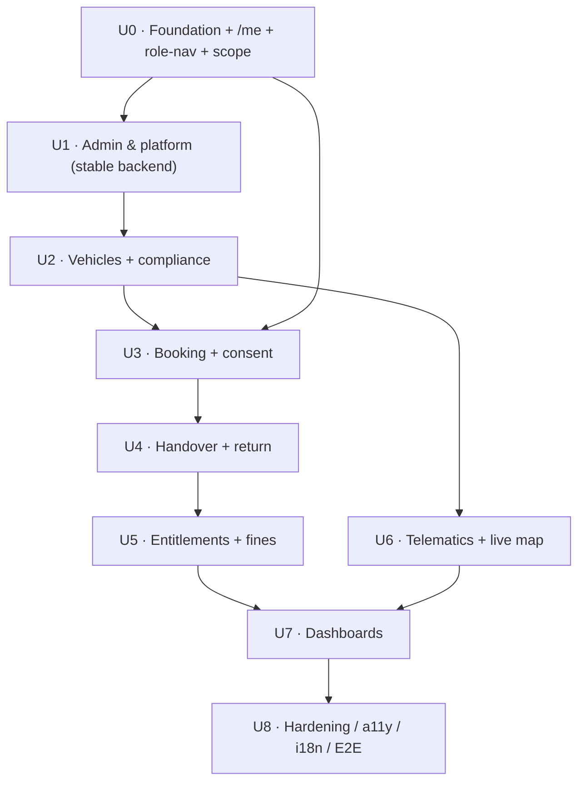

# App-UI — Phase 1 Implementation Plan (backend-parity)

The phase-by-phase plan to build the **`app-ui`** (React 19 · Vite · Wayfinder design system) up to **parity with the Phase-1 backend** delivered in `app-api`. Each phase is a self-contained file: it names the exact backend endpoints/contracts it consumes, the screens/routes, components, data/state, states (loading/empty/error/denied), RBAC + scope, i18n/RTL, MSW→real-API swap, tests, and an exit gate.

> **Operating rhythm (mirrors the backend plan):** contract-first vertical slices. For each screen — align the UI contract types with the backend `contracts/`, build the screen against MSW, then **swap MSW → real API** and prove it with a test. A screen is "done" only when it runs against the real backend, is role/scope-correct, has loading/empty/error/denied states, is keyboard+screen-reader accessible, and is EN/AR + RTL clean.

---

## 1. Current app-ui state (as of 2026-07-18)

**Foundation — DONE (do not rebuild):**
- **Auth** (`src/features/auth/`): MSAL Entra SSO **and** dev-login; `auth-context`, `require-auth`, `require-role`, `roles.ts`, `login-page`, `auth-callback`, `access-denied`. Login screen live.
- **API client** (`src/lib/api-client.ts`): typed fetch, RFC-7807 → `ApiRequestError`, 401 → session drop; `auth-headers.ts` sends `Authorization: Bearer …` (SSO) or `x-dev-person-id` (dev-login) — matches the backend `AuthGuard`.
- **Env** (`src/lib/env.ts`): Zod-validated; `VITE_API_URL` → versioned `/v1` base; Entra config; dev-login flag.
- **Shell & design**: Wayfinder navy/gold shell (collapsible sidebar, sticky header, command palette), full component library (forms, tables, dialogs, toasts, charts — Recharts), `DamageMarker`/`SignaturePad`/`CameraCapture` capture components, i18n (en/ar) with RTL.
- **MSW** (`src/mocks/`): handlers exist for **platform** only.

**Gaps to close in this plan:** contract sync with backend; role-driven nav + scope switcher from `/me` + `/hierarchy`; all domain feature screens (admin, vehicles, compliance, booking, handover, entitlements, fines, telematics, dashboards); MSW retirement; a11y/i18n/E2E hardening.

## 2. Backend Phase-1 surface this UI targets (all live under `/api/v1`)

| Area | Backend module | Key endpoints |
|---|---|---|
| Identity/platform | `platform` | `GET /me`, `GET /hierarchy`, `POST /delegations`, `GET /audit`, `GET /reports/exceptions` |
| Lookups + users | `config`, `identity` | `GET /lookups[/…]`, `POST/PATCH /admin/lookups/…`, `GET /admin/users`, `POST /admin/roles`, `DELETE /admin/roles/:id`, `POST /admin/users/:id/{suspend,reactivate}`, `GET /admin/access-review` |
| Vehicles | `vehicles` (M2) | `GET/POST /vehicles`, `GET /vehicles/:id[/history]`, `PATCH /vehicles/:id`, `POST /vehicles/:id/{transition,documents}` |
| Migration | `migration` (M3) | `POST /imports`, `GET /imports/:id[/rows]`, `POST /imports/:id/{resolve,sign-off}` |
| Compliance | `compliance` (M7) | `POST /eligibility`, `GET /compliance/{expiries,blocks}`, `POST /compliance/blocks` |
| Bookings | `bookings` (M4) | `GET /vehicles/available`, `POST /bookings`, `POST /bookings/:id/{consent,submit,approve,decline,request-changes,extend,cancel}`, `PATCH /bookings/:id`, `GET /bookings/:id[/events]` |
| Handover | `handover` (M6) | `POST /handovers`, `POST /handovers/:id/{return,damage}`, `GET /handovers/:id`, `GET /vehicles/:id/keys` |
| Entitlements | `entitlements` (M5) | `POST /entitlements`, `POST /entitlements/:id/{submit,approve,decline,consent,allocate,bsd-windows,cancel}`, `GET /entitlements[/:id]` |
| Fines | `fines` (M8) | `POST /fines`, `GET /fines`, `POST /accidents`, `POST /fines/:id/recovery`, `POST /vehicles/:id/substitution-windows` |
| Telematics | `telematics-domain` (M10) | `GET /devices`, `POST /devices[/pair]`, `POST /devices/:id/unpair`, `GET /vehicles/:id/telemetry/live`, `GET /telematics/alerts` |
| Dashboards | `dashboards` (M9) | `GET /operations/overview`, `GET /dashboards/{utilisation,fines-per-user,compliance-heat-map,entitlement-inventory,telematics-coverage}` |

## 3. Phases

| # | Phase | Backend modules | File |
|---|---|---|---|
| U0 | Foundation & API integration | platform / auth | [00-foundation-and-integration.md](00-foundation-and-integration.md) |
| U1 | Admin & platform | identity, config, user-admin, audit | [01-admin-and-platform.md](01-admin-and-platform.md) |
| U2 | Vehicle master & compliance | M2, M7, M3 | [02-vehicle-master-and-compliance.md](02-vehicle-master-and-compliance.md) |
| U3 | Booking & consent core loop | M4 | [03-booking-and-consent.md](03-booking-and-consent.md) |
| U4 | Handover & return | M6 | [04-handover-and-return.md](04-handover-and-return.md) |
| U5 | Governance: entitlements & fines | M5, M8 | [05-entitlements-and-fines.md](05-entitlements-and-fines.md) |
| U6 | Telematics & live map | M10 | [06-telematics-and-live-map.md](06-telematics-and-live-map.md) |
| U7 | Dashboards & read models | M9 | [07-dashboards-and-read-models.md](07-dashboards-and-read-models.md) |
| U8 | Hardening — a11y · i18n/RTL · E2E | cross-cutting | [08-hardening-a11y-i18n-e2e.md](08-hardening-a11y-i18n-e2e.md) |

## 4. Dependency & build order

- **U0 first** (everything needs `/me`, role-nav, scope, contract sync).
- **U1 next** — its backend (admin/lookups/users) is done + stable and won't churn; it establishes the CRUD/table/form/RBAC patterns and seeds lookups the feature dropdowns need.
- **U2 → U3 → U4 → U5** follows the backend's accountability-loop order (vehicles/compliance before booking; booking before handover; governance after).
- **U6 (telematics)** can run in parallel after U2.
- **U7 (dashboards)** reads everything → after U2–U5. **U8** is the binding hardening pass.

## 5. Cross-cutting standards (apply to every phase)

- **Contract-first**: UI request/response types must match the backend `app-api/src/contracts/*.contract.ts`. Keep a UI copy under the feature (`*.contract.ts`) generated/mirrored from the backend; a **contract-drift check** (U8) fails CI if they diverge. Never hand-shape a payload that disagrees with the backend Zod schema.
- **Data layer**: **TanStack Query** for all reads/mutations via `apiClient`; stable query keys per resource+scope; invalidate on mutation; never call `fetch` directly in components.
- **RBAC + scope**: gate routes with `require-auth` + `require-role`; the sidebar is generated from **one role→nav table** driven by `/me` roles; a **Scope Switcher** (from `/hierarchy`) passes `?scopeId=` to scoped reads. The server is the source of truth — the UI hides for UX, the backend enforces.
- **Every screen has four non-happy states**: loading (skeletons), empty (`empty-state`), error (`ApiRequestError.title` + reasons → toast/banner), and **denied** (403 → access-denied). Reason codes are localised EN + AR.
- **Money & time**: render `numeric` money as-is with currency (never re-compute); show UTC instants localised to Asia/Dubai; label "data as of" where the backend surfaces freshness.
- **Consent is a hard gate** (booking + entitlement): the UI must not allow submit/allocate without the consent step; it mirrors — never bypasses — the backend rule.
- **a11y & i18n**: keyboard-operable, labelled controls, colour-never-alone (use `status-chip`), axe-clean; every string via `react-i18next` (en + ar) with logical CSS props (RTL-safe).
- **MSW retirement**: each phase lists the handlers it removes once the screen is on the real API; MSW stays only for tests.
- **Gate per phase**: `tsc` clean · `oxlint` clean · `vitest` (unit + component + MSW) green · `vite build` OK · verified in a real browser against the running backend.

## 6. Legend
- **Status:** ✅ built · 🟡 partial/mock · ⬜ to build.
- **Page-spec ids** (A1..I2) reference `docs/startup-doccs/07_Page_Functional_Specifications.md`; routes follow the locale-prefixed `/{lang}/…` convention and the [ui-page-roadmap](../../../docs/04-planning/ui-page-roadmap/README.md).

## 7. Watch-items — status (addressed 2026-07-18)

**① Contract drift — MITIGATED (guard live).** A runnable, extensible drift guard ships in the app-ui test gate: [`src/lib/contract-drift.test.ts`](../../src/lib/contract-drift.test.ts) reads the backend source in the monorepo and asserts shared vocabularies match — today **PlatformRole ↔ `fleet_role`** (18 roles verified). **Rule:** every phase that mirrors a new backend enum / reason-code registers it in that test's `CHECKS`. Single source of truth for data shape = `app-api/src/contracts/`.

**② Governance-gated decisions — DOCUMENTED + convention-enforced.** See [governance-decisions.md](governance-decisions.md): the 8 D-decisions (D3/D6/D7/D8/D9/D12/D13/D14) + re-consent tolerance + utilisation are **rendered from the backend, never hard-coded**; the UI shows `policyVersion` + a "provisional" chip on fixtures. This is a DoD line in every phase.

**③ Route / role-driven nav — RECONCILED.** The built app **already uses a role-driven, grouped sidebar** (`app/shell/nav.ts` + `navFor(me)`; groups operations/governance/administration; role-gated) — the old "fixed 8-item rail" concern is **resolved**. The **built nav segments are canonical** for Phase 1 (do not rename shipped segments); phases target them and *add* items for missing areas:

| Area | Built segment(s) | Group | Phase | nav item |
|---|---|---|---|---|
| Booking / My bookings | `booking` (+ `bookings`) | operations | U3 | present |
| Handover / Return | `handover` (+ `/return`) | operations | U4 | present |
| Approvals | `approvals` | operations | U3 | present |
| Entitlements | `entitlements` | operations | U5 | present |
| Fleet command / live map | `console` | operations | U6 | present |
| Fines & accidents | `fines` | operations | U5 | present |
| Executive dashboard | `executive` (disabled) | operations | U7 | enable in U7 |
| Vehicle registry | `fleet` | operations | U2 | **add** |
| Compliance runway | `compliance` | operations | U2 | **add** |
| Operations overview | `operations` | operations | U7 | **add** |
| Data quality / imports | `data-quality` | governance | U2 | present |
| Audit & exceptions | `audit` | governance | U1 | present |
| Admin home | `admin` | administration | U1 | present |
| Reference data (lookups) | `admin/reference-data` | administration | U1 | present |
| Users & access | `admin/access` | administration | U1 | present |
| Org & hierarchy | `admin/organization` | administration | U1 | present |
| Policy studio (PAP) | `admin/policy` | administration | P2 | present |
| Integrations · Notifications | `admin/integrations` · `admin/notifications` | administration | P2 | present |

> When a phase needs a missing item (`fleet`, `compliance`, `operations`), add it to `nav.ts` with the right `group` + `roles` and replace its `ComingSoonPage` route — do **not** invent parallel route names. Phase docs that drafted alternate names (e.g. `book`) defer to the built segment (`booking`).

> Authoritative inputs: the backend `app-api/src/contracts/` + module endpoints (this plan's §2), `docs/04-planning/ui-page-roadmap/`, `app-ui/developer-docs/design-system.md`, and `docs/startup-doccs/07_Page_Functional_Specifications.md`. Where they disagree, the **backend contract wins** for data shape and the **design-system** wins for presentation.
