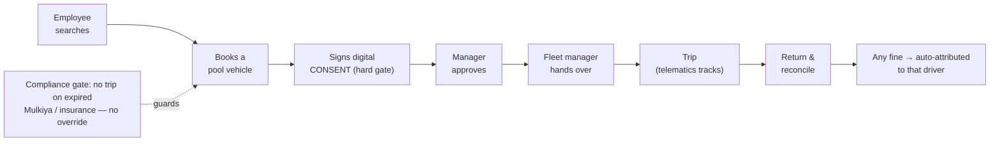
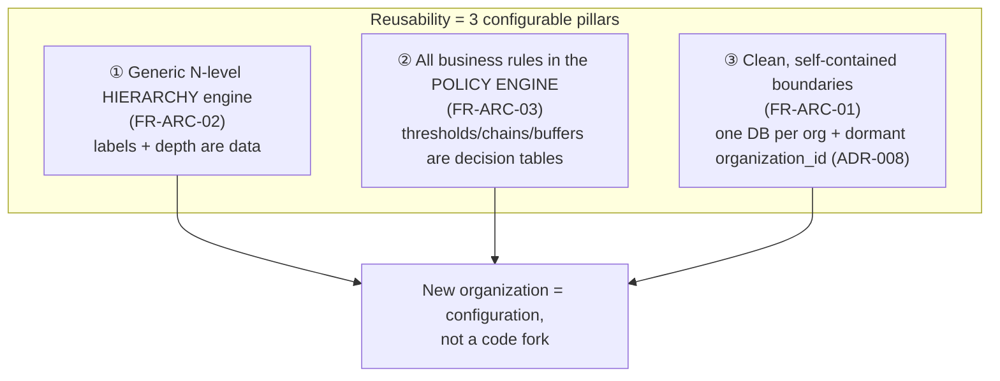
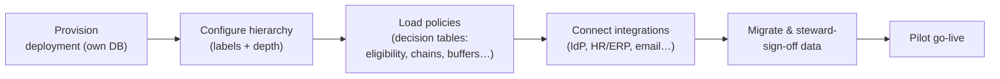

# 01 — Platform Overview & Reusability

> How to read this: start here for the "why" and the shape of the whole system, then follow the reusability pillars into [02 hierarchy](02_organization-hierarchy-engine.md), [03 policy engine](03_policy-rule-engine.md) and [04 workflow](04_approval-workflow-engine.md).

---

## 1. The problem being solved

The reference organization (AD Ports Group) operates **300+ vehicles** across multiple clusters, sites and geographies. The current state:

- Vehicle inventory is maintained **manually** across many owners — inconsistent quality, completeness and freshness.
- Only one pool (Mina Zayed, on the legacy *Mehwar* Vehicle Allocation module) has any booking system; everywhere else it is email, phone calls and walk-ins.
- When a **traffic fine** arrives days later, nobody can reliably prove **who was driving**, so it can't be recovered.
- **Registration (Mulkiya) and insurance** expire unnoticed — vehicles legally shouldn't be on the road.
- **Dedicated-vehicle ("company car") entitlements** live in email chains with no eligibility check or evidence.
- There is **no group-wide view** of utilisation, cost-per-km, or risk — capital allocation is reactive.
- Every new entity the group opens **re-creates the same mess**.

The cost sits in: avoidable lease/depreciation on under-used vehicles nobody challenges; fines/tolls/damages that can't be attributed and therefore can't be recovered; compliance lapses found after the fact; and management time lost reconciling spreadsheets.

## 2. The solution in one sentence

> A group-wide, role-based, AI-enabled fleet platform that replaces manual inventory and partial booking, governs dedicated-vehicle entitlements up to Cluster CEO, enforces driver accountability for fines/tolls/damages, captures ESG metrics, and gives management a real-time view of utilisation, cost and risk across every cluster — built on a **configurable core reusable across organizations**.

## 3. The core loop (the thing Phase 1 proves)

Success for Phase 1 = **GS Pool (Mina Zayed) fully off Mehwar**, with the KPIs met (inventory ≥98% complete, booking adoption ≥90%, **trips on expired documents = 0**, fines attribution ≥95%, entitlements in-platform ≥95%).

## 4. Capability & foundation map

**15 capability domains (C1–C15):**

| Ref | Capability | Ref | Capability |
|---|---|---|---|
| C1 | Fleet Master & Lifecycle | C9 | Fuel, Fuel Cards & Cost Capture |
| C2 | Pool Vehicle Booking & Allocation | C10 | Behaviour Scoring & Misuse Detection |
| C3 | Dedicated Vehicle Requests & Entitlements | C11 | AI Optimisation & Right-Sizing |
| C4 | Handover, Return & Damage Capture | C12 | ESG & Sustainability |
| C5 | Replacement Vehicles & Substitute Drivers | C13 | Vendor & Lease Contract Management |
| C6 | Driver Eligibility & Compliance Alerting | C14 | Toll Management |
| C7 | Fines, Black Points, Accidents & Recovery | C15 | Key & Asset Custody Management |
| C8 | Telematics, Live Tracking & Route Replay | | |

**11 platform foundations (P1–P11):** reusability by configuration · identity/SSO & access · **policy & configuration engine (the crown jewel)** · workflow & approval engine · vehicle data model · integrations map · data migration & quality · public API · notifications & alerting · audit/overrides/exceptions · reporting & analytics.

## 5. The three pillars of reusability (this is the heart of the design)

The platform is a **reusable project, not a multi-tenant SaaS**. Each organization gets its **own deployment** (own database, own hosting) — isolation is absolute by construction. Reusability comes from three architectural choices that cost almost nothing in Phase 1 and are **impossible to retrofit later**:

| Pillar | FR / ADR | What it means | Why it can't be retrofitted |
|---|---|---|---|
| **① Generic hierarchy** | FR-ARC-02 | Org structure is an N-level tree (labels + depth are configuration, up to 5 levels). AD Ports = Cluster→Pool→Location; another org = Company→Region→Branch. | Hard-coding "cluster/pool" columns everywhere would require a schema + query rewrite to re-shape. |
| **② Rules in the engine** | FR-ARC-03 | No threshold, approval chain or buffer is a hard-coded `if`. They are versioned decision tables the PDP evaluates. | Rules scattered through code can't be re-parameterised per org without editing and redeploying code. |
| **③ Clean boundaries + dormant seam** | FR-ARC-01 / ADR-008 | One deployment per org; a single inert `organization_id` column exists on core tables (RLS off, never branched on). | The expensive part of ever going multi-org is adding a tenant column to live tables and re-checking every query — do it now (inert), cheaply. |

Plus one data rule pulled into Phase 1: **the substitution-attribution model (FR-SUB-01/02)** ships in Phase 1 even though its self-service UI is Phase 2, so a fine recorded in month one is never pinned to the wrong driver for want of a data model.

### What "onboarding a new organization" actually is
A **repeatable setup**, not a build:

## 6. Non-negotiables (apply in every phase)

- **Digital consent is a hard gate** — no consent, no booking number, no allocation; no override, at any role.
- **Compliance hard blocks** — no booking on expired registration/insurance; structurally enforced, no override.
- **Segregation of Duties** — 8 structural rules enforced in the authorization layer (e.g. never approve your own booking).
- **Policy engine fails safe** — PDP unreachable ⇒ DENY + escalate, never fail open.
- **Audit is append-only and tamper-evident** — hash-chained; nothing is silently updated or deleted.
- **AI recommends, humans decide** — no AI output autonomously executes a blocking/disciplinary/financial action (Phase 3).
- **The booking path is sacred** — CPU-heavy work (telemetry, OCR) runs in separate processes; the API only awaits I/O.

## 7. Delivery phases (at a glance)

| Phase | Theme | Highlights |
|---|---|---|
| **0** | Foundation | Auth/RBAC/SoD, hierarchy engine, PDP, hash-chained audit, telematics-ingest skeleton, load test. No user-facing release. |
| **1** | MVP at GS Pool | Vehicle master, migration, booking+consent, entitlements→Cluster CEO, handover, compliance hard blocks, manual fines + black points, **simulator-first GPS**, dashboards. |
| **2** | Scale & automate | Group-wide rollout, **real telematics hardware**, mobile app + offline, OCR fuel, tolls, vendor/lease, behaviour scoring, payroll recovery, public API. |
| **3** | Intelligence & international | AI optimisation, predictive maintenance, anomaly/fraud, driver risk, copilot, CV damage comparison, ESG, jurisdiction packs, multi-region. |

Each phase ships independently and is valuable alone — Phase 1 is a working booking + accountability loop; Phase 2 automates it; Phase 3 makes it intelligent.

---

**Next:** [02 — Organization hierarchy engine](02_organization-hierarchy-engine.md) — the first reusability pillar in depth.
