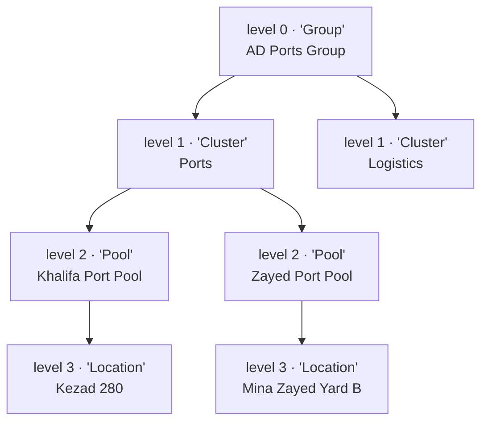
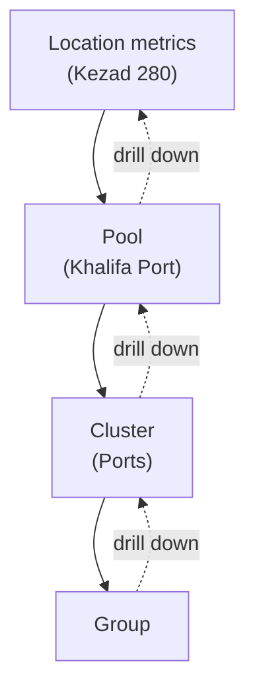
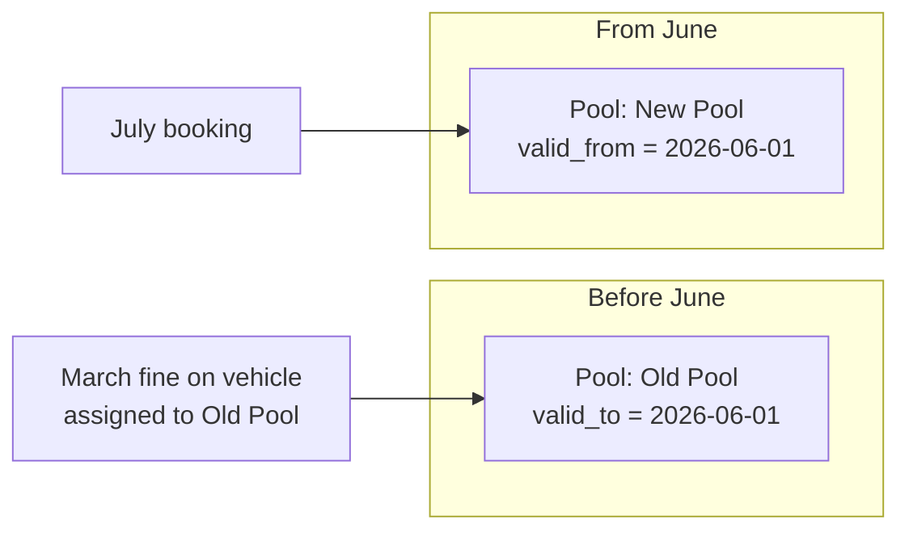

# 02 — Organization Hierarchy Engine

**Reusability pillar ①.** The single mechanism that lets the same platform model AD Ports' *Cluster → Pool → Location* today and another organization's *Company → Region → Branch → Depot* tomorrow — by **configuration, not code**. FRs: FR-CLU-01..07, FR-ARC-02.

---

## 1. The core idea: structure is data, not columns

A naive fleet system hard-codes the org shape: a `vehicles.cluster` column, a `vehicles.pool` column, and code that says `if (cluster === 'Ports')`. That system can only ever be an AD Ports system.

Instead, the org shape lives in **one generic self-referencing tree**, `hierarchy_node`. The *labels* ("Cluster", "Pool", "Location") and the *depth* (3 levels for AD Ports, up to 5) are **rows and configuration** — never code or schema.



## 2. Schema: `hierarchy_node`

| Column | Type | Notes |
|---|---|---|
| `id` | uuid PK | |
| `parent_id` | uuid FK → hierarchy_node | `NULL` at the root |
| `level_index` | int | 0 = root, 1, 2, … (depth) |
| `level_label` | text | The *word* for that level — "Cluster"/"Pool"/"Location" (configurable per org) |
| `name` | text | e.g. "Ports", "Khalifa Port Pool", "Kezad 280" |
| `path` | `ltree` (or materialized text) | Materialized path for O(log n) roll-up/scope queries |
| `valid_from`, `valid_to` | timestamptz | Effective-dated so restructures preserve historical reporting (FR-CLU-07) |

Indexes: `GIST(path)` (ltree) and `(parent_id)`. Configurable depth up to **5 levels** (FR-CLU-01).

**Why `ltree`/materialized path?** Roll-up reporting ("everything under the Ports cluster") and scope checks ("is node X within the fleet manager's scope?") are ancestor/descendant queries. A path like `group.ports.khalifa_port.kezad_280` answers them with a single indexed operator instead of recursive walks.

```sql
-- "all vehicles anywhere under the Ports cluster" (roll-up)
SELECT v.* FROM fleet.vehicle v
JOIN fleet.vehicle_hierarchy_assignment a ON a.vehicle_id = v.id
JOIN fleet.hierarchy_node n ON n.id = a.node_id
WHERE n.path <@ 'group.ports'          -- ltree "descendant-of"
  AND a.assignment_kind = 'BookingPool'
  AND a.valid_to IS NULL;
```

## 3. Vehicles are not nailed to a level — `vehicle_hierarchy_assignment`

A vehicle's place in the org is **effective-dated and multi-purpose**, not a column on `vehicle`. This is what makes transfers and restructures safe.

| Column | Notes |
|---|---|
| `vehicle_id` | FK → vehicle |
| `node_id` | FK → hierarchy_node |
| `assignment_kind` | `OwningUnit` / `BookingPool` / `PhysicalLocation` |
| `valid_from`, `valid_to` | effective window (`valid_to IS NULL` = current) |
| `changed_by`, `reason` | audit context |

Rules:
- A vehicle has **one active assignment per `assignment_kind`** at a time; an **exclusion constraint** prevents overlapping windows for the same kind.
- A **transfer** (FR-CLU-03) closes the current assignment (`valid_to = now`) and opens a new one — it's a new row, not an update. `vehicle_transfer` records `from_node, to_node, date, approver, reason`.
- **No `vehicle` column hard-codes a hierarchy depth or label** — so a 4-level org needs zero schema change.

## 4. Roles attach to a *node*, not globally — `role_assignment`

Access is **scoped by hierarchy**, which is exactly what the platform needs anyway (so no separate tenancy machinery is required).

```
role_assignment (person_id, role, scope_node_id, valid_from, valid_to)
UNIQUE (person_id, role, scope_node_id)
```

- A **Fleet Manager** is a fleet manager *of Khalifa Port Pool* (scope = that pool node). A **Cluster CEO** governs *their cluster*. A person may hold **multiple roles at multiple scopes** (e.g. a fleet manager who is also a driver — but who can never approve their own booking; see [SoD in 04](04_approval-workflow-engine.md)).
- The backend `AccessService` resolves "can this person see/act on node X?" by checking whether X is within any of the person's assigned scopes (ancestor/descendant via `path`).

```sql
-- Does person P have FleetManager rights covering node X?
SELECT EXISTS (
  SELECT 1
  FROM fleet.role_assignment ra
  JOIN fleet.hierarchy_node scope ON scope.id = ra.scope_node_id
  JOIN fleet.hierarchy_node target ON target.id = :X
  WHERE ra.person_id = :P
    AND ra.role = 'FleetManager'
    AND ra.valid_to IS NULL
    AND target.path <@ scope.path          -- X is at or under the assigned scope
);
```

## 5. Scope roll-up and drill-down (reporting)

Reports **roll up bottom→top** through the tree and **drill down** the other way (FR-CLU-06: drill-down in two clicks from the executive dashboard).



Because metrics resolve via the assignment that was **effective at the transaction timestamp**, aggregates stay correct even after the tree is reshaped (see §6).

## 6. Restructure with historical integrity (the subtle, important part — FR-CLU-07)

Organizations reorganise: pools merge, clusters split, nodes get renamed. The rule: **historical records remain attributed to the node as it existed at the time.**

- Nodes are **effective-dated** (`valid_from/valid_to`); a rename/merge/split closes old nodes and opens new ones rather than mutating in place.
- A fine from March that was on a vehicle then in "Old Pool" still reports under "Old Pool" for March, even after "Old Pool" is merged into "New Pool" in June.
- The Admin **Org & Hierarchy Configuration** screen makes this guarantee explicit in the UI copy when a structural change is made.



## 7. Configuring a different organization (the payoff)

Same engine, different rows:

| Aspect | AD Ports | Example: a logistics company |
|---|---|---|
| Depth | 3 | 4 |
| Level labels | Cluster → Pool → Location | Company → Region → Branch → Depot |
| Root | "AD Ports Group" | "Acme Logistics" |
| Terminology override | "Cluster" | "Region" (UI relabel, config only) |

No migration, no code fork — just hierarchy rows + a terminology override + branding. This is FR-ARC-02 delivering the reusability promise.

## 8. Edge cases & rules to honour when implementing

| Case | Rule |
|---|---|
| Cross-node booking | Supported by configuration where policy allows; routes extra approval to the owning node (FR-CLU-05). |
| Vehicle with no location | `PhysicalLocation` assignment optional; owning unit + booking pool mandatory (FR-CLU-02). |
| Depth beyond 5 | Not supported in Phase 1 (config cap at 5). |
| Deleting a node with history | Not allowed — close it (`valid_to`), never hard-delete (history depends on it). |
| Moving a vehicle mid-booking | Transfer allowed; the active booking keeps its `booking_scope_node_id` captured at creation. |
| Multiple roles overlapping scopes | Allowed; access = union of scopes; SoD still forbids self-approval regardless of roles held. |

## 9. Where this sits in the build

Foundation table set in **Stage 1** of the [build plan](../../04-planning/build-execution-plan.md) (`organization`, `hierarchy_node`, `vehicle_hierarchy_assignment`, `person`, `role`, `role_assignment`) — it's a cross-cutting foundation every feature joins, so it lands before any feature slice. Migration/query tests must cover **3/4/5-level** trees, transfer, and restructure-history (remediation finding B-07).

---

**Next:** [03 — Policy & rule engine](03_policy-rule-engine.md) — reusability pillar ②.
