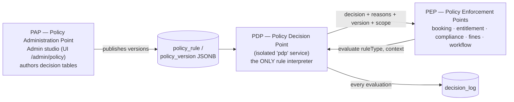
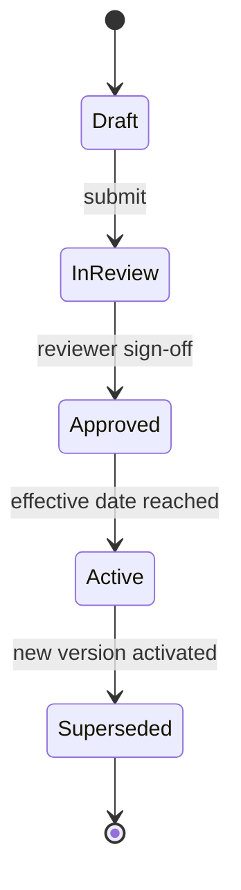
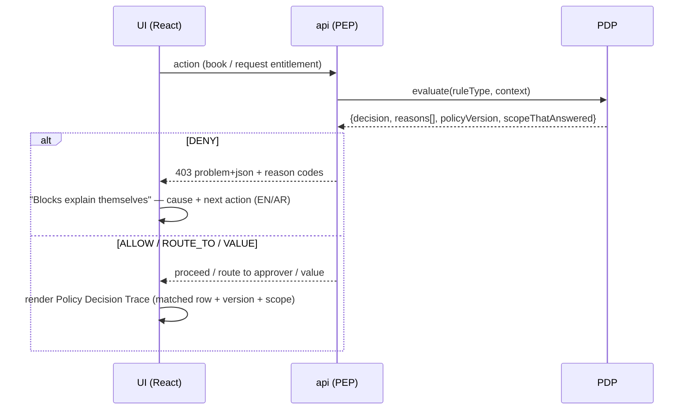

# 03 — Policy & Rule Engine (PAP / PDP / PEP)

**Reusability pillar ②ﾂ and the "crown jewel."** Every business threshold, approval chain, buffer, eligibility rule and compliance ladder lives here as a **versioned decision table**, never as a hard-coded `if`. That is what lets the same code serve any organization by editing tables. FRs: FR-POL-01..10, FR-ARC-03, NFR PDP latency.

---

## 1. The standard three-role separation

The engine follows the industry-standard pattern behind XACML/ABAC authorization and DMN decision services:



| Role | Where | Responsibility |
|---|---|---|
| **PAP** (Administration) | Admin studio in the UI | Author rules as decision tables; submit → review → approve → effective-date; dry-run diff before activation |
| **PDP** (Decision) | the `pdp` deployable | The **only** component that interprets rules; stateless; `evaluate(ruleType, context)` |
| **PEP** (Enforcement) | feature modules in `api` | **Ask, then obey.** Contain **zero** rule logic |

**The discipline that makes it reusable:** a `bookings.service.ts` knows nothing about licences, grades or black points — it asks the PDP and enforces the verdict. Re-deploying for another organization = editing decision tables, not code.

## 2. The one contract every rule type honours

```ts
evaluate(ruleType: string, context: object) => {
  decision: 'ALLOW' | 'DENY' | 'ROUTE_TO' | 'VALUE',
  reasons: string[],            // machine reason codes → localised (EN/AR) UI messages
  policyVersion: string,        // recorded on every transaction
  scopeThatAnswered: 'group' | 'cluster' | 'pool',
}
```

Each rule type declares three things (in `contracts/`):
1. an **input schema** (a Zod schema — e.g. eligibility needs grade, role, cluster, licence status, block flags);
2. an **output contract** (allow/deny/route/value + machine-readable reason codes);
3. a **safe-default fallback** (what happens if no row matches — always the safe default: deny/escalate).

Modules code against the contract **once**; rules change forever after without code.

## 3. Decision-table anatomy (DMN-style)

Rules are authored as **decision tables**: condition columns → outcome, evaluated **top-down, first match wins, with a mandatory default row**. Business-readable (HR can review it), testable, and diffable between versions.

Example — **dedicated-vehicle eligibility** (rule type `dedicated-vehicle-eligibility`, per decision D8):

| Grade | Request type | Cluster | → Outcome | → Approval chain |
|---|---|---|---|---|
| ≥ Director | Long-term | Any | Eligible | LM → Cluster Fleet Lead → Cluster CEO |
| ≥ Manager | Temporary ≤ 30 days | Any | Eligible | LM → Cluster Fleet Lead |
| Any | Any | Any | **Not eligible (default)** | — |

Stored as immutable **JSONB** (`policy_version.decision_table`), roughly:

```jsonc
{
  "ruleType": "dedicated-vehicle-eligibility",
  "version": 4,
  "rows": [
    { "when": { "grade": ">=Director", "requestType": "LongTerm" },
      "then": { "decision": "ALLOW", "reasons": ["eligible-grade-director"],
                "route": ["LineManager", "ClusterFleetLead", "ClusterCEO"] } },
    { "when": { "grade": ">=Manager", "requestType": "Temporary", "maxDays": 30 },
      "then": { "decision": "ALLOW", "reasons": ["eligible-temp-manager"],
                "route": ["LineManager", "ClusterFleetLead"] } }
  ],
  "default": { "decision": "DENY", "reasons": ["not-eligible-default"] }  // mandatory
}
```

## 4. Versioning & governance lifecycle (FR-POL-02/03)

Every rule version moves through a controlled lifecycle and is **immutable** once activated:



- Activating a change **creates a new version**; prior versions remain queryable **forever**. Every transaction records the **policy version in force** at decision time (consent already requires this).
- **High-impact rule types** (eligibility, SoD-adjacent, consent tolerance, black-point timeframe, recovery) require **second-person approval** before activation.
- **Emergency deactivation** reverts to the prior version and is logged as an exception.
- **Scope with inheritance** (FR-POL-04/06): `organization default → cluster override → pool override` where the rule type permits. The PDP resolves the **most specific applicable rule** and reports **which scope answered** — so a cluster can tighten a threshold without a code change, and the UI can show exactly which level's rule applied.

## 5. Evaluation, caching & the decision log

- **Evaluation:** rows top-down, **first match wins**, mandatory default row.
- **Cache:** compiled rules cached in **Redis**; a bounded Postgres **read-through** only on cache miss (within the latency budget); the cache is **invalidated on version activation**.
- **Decision log** (FR-POL-05): every evaluation is recorded (minimized context fingerprint, decision, reasons, version, scope, correlation id) through a durable outbox so **Internal Audit can reconstruct why any transaction was allowed, denied or routed**. Command-path PEPs write the decision evidence in the **same transaction** as the affected state; read-only evaluations use a dedicated append path. High-write → a Timescale hypertable in Phase 2.
- **No rules-engine library** (NRules/Drools/Camunda fight the versioning + audit model). Plain evaluation over JSONB + Zod is ~200 lines and entirely owned.

## 6. Two non-negotiable properties

| Property | Value | Why |
|---|---|---|
| **Latency** | PDP p95 **< 200 ms** (eligibility gate that wraps it < 500 ms) | It sits inside the booking's critical path; the whole point of the isolated `pdp` deployable is to protect this. |
| **Fail-safe** | Unreachable PDP ⇒ **DENY + escalate to a human**, never fail open | A PDP that failed open would silently make expired-insurance vehicles bookable. This is a **safety** property. |

## 7. The 12 Phase-1 rule types

Registered at MVP; later phases only **register new rule types on the same engine** (never re-architected):

| Rule type | Consumed by (PEP) | Governs |
|---|---|---|
| booking buffer | Booking | minutes between bookings per vehicle category |
| max booking duration | Booking | cap + escalation per category |
| booking approval chain | Booking (via workflow) | route + 24h timeout escalation |
| entitlement approval chain | Entitlements (via workflow) | LM→CFL→Cluster CEO thresholds + 48h escalation |
| dedicated-vehicle eligibility | Entitlements | grade/role/cluster decision table (D8) |
| driver eligibility gate | Compliance/Booking | licence + employment + block-flag composition |
| compliance alert ladders | Compliance | days-before-expiry per document type + recipients |
| hard-block conditions | Compliance | expired Mulkiya/insurance = DENY, no override |
| fines HR threshold | Fines | ≥N fines in rolling window (default 3/12mo) |
| black-point transfer timeframe | Fines | deadline + escalation cadence (D9) |
| consent re-consent tolerance | Booking/Entitlements | what modification requires re-consent (D12) |
| fuel deviation threshold | Handover | ±% flag level per category (default ±20%) |

Phase 2 adds toll recharge, behaviour weights, break-glass categories; Phase 3 adds jurisdiction packs + full historical simulation.

## 8. How the UI connects to the engine

The UI is a **thin, rule-free** surface over the engine — in three ways:



1. **Enforcement (downward):** a UI action hits an API endpoint (PEP) → `pdp.evaluate(...)` → verdict + **machine reason codes**. The UI turns codes into **localised messages** — the "blocks explain themselves" principle (denial names the cause *and* the next action). The RFC-7807 problem+json contract carries `reasons[]`.
2. **Transparency:** wherever a decision is shown (entitlement decisions, compliance blocks), the UI renders the **Policy Decision Trace** pattern — the matched decision-table row (others dimmed), the rule type, the **policy version**, which **scope answered**, and evaluation time in monospace. Always visible, never a tooltip.
3. **Authoring (PAP):** admins edit decision tables in the **Policy Engine studio** (`/admin/policy`), **dry-run** them against sample/recent transactions to see the outcome diff, then activate a new immutable version (high-impact types need a second approver). A "Test this rule" panel is the Policy Decision Trace used in reverse as an authoring aid.

The **Scope Switcher** in the header is the visible edge of the same access model — its options come from the user's actual `role_assignment` scopes, so the UI can never query outside what the backend `AccessService` allows. It is the access-control boundary *made visible*.

## 9. Per-organization configurability (the payoff)

Because thresholds/chains/eligibility are decision tables scoped org→cluster→pool, a new organization (or a new cluster within AD Ports) simply authors its own rows:

- AD Ports Cluster A: CEO sign-off for dedicated vehicles > 12 months.
- AD Ports Cluster B: a different threshold — same rule type, a pool/cluster override row.
- A brand-new organization: its own eligibility grades, buffers, ladders — no deployment.

Governance rule **FR-POL-10 / build checklist:** no business rule value is hard-coded anywhere; a build-time checklist maps every PRD threshold to its registered rule type.

## 10. Edge cases & implementation rules

| Case | Rule |
|---|---|
| No matching row | Return the **mandatory default** (safe: deny/escalate). |
| PDP down | DENY + escalate; never allow. Consuming modules treat unreachable = DENY. |
| Rule changed mid-flight | In-flight requests keep the **version they were evaluated under**; new activations don't rewrite them (booking reservation range + policy version are persisted). |
| Two rows match | First match wins (top-down); authors order rows deliberately. |
| Cross-scope ambiguity | Most specific scope wins; PDP reports which scope answered. |
| High-impact change | Second-person approval required before Active. |

## 11. Where this sits in the build

The **real PDP replaces the current hardcoded stub** in **Stage 2** of the [build plan](../../04-planning/build-execution-plan.md) (`policy-evaluator.service.ts` today returns fixed answers for 2 rule types). Foundation tables (`policy_rule`, `policy_version`, `decision_log`) land in Stage 1. Spike/benchmark evidence for latency, activation/invalidation and fail-safe is required to close remediation finding B-08.

---

**Next:** [04 — Approval & workflow engine](04_approval-workflow-engine.md) — how chains are resolved and run per organization.
