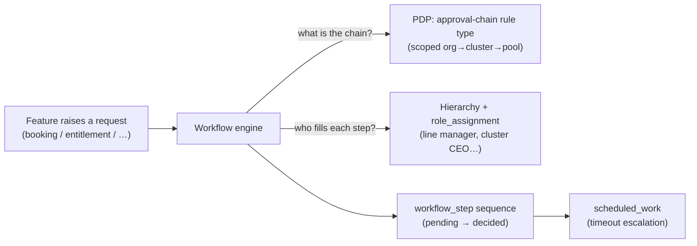
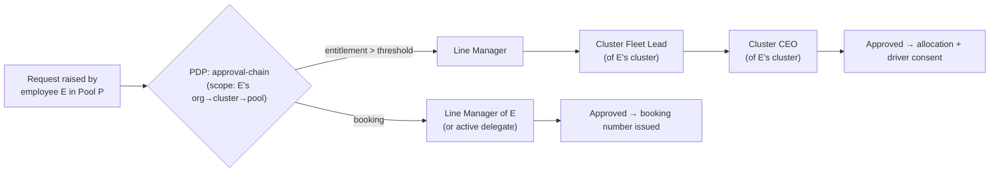
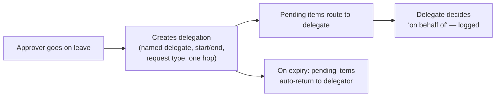
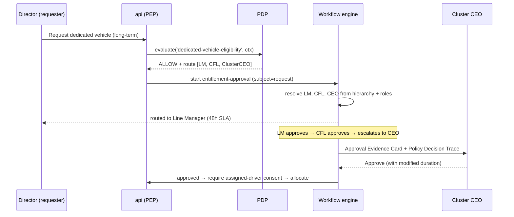

# 04 — Approval & Workflow Engine

**Platform foundation P4.** One shared engine executes **every** multi-step approval in the platform — bookings, entitlements, substitutions, overrides, recoveries — so chains, delegation, timeouts and escalation behave identically everywhere. What differs per organization is **not code — it's a decision table** resolved against the hierarchy. FRs: FR-WFL-01..06, FR-DEL-01..05, SoD-01..08.

---

## 1. Why one engine

Without a shared engine, every feature reinvents "route to approver, wait, escalate, handle delegation" — inconsistently. Foundation P4 centralises it: features **declare** a workflow type and subject; the engine **resolves** the chain (from the PDP + hierarchy), **drives** the steps, and **guarantees** no request is ever orphaned.

## 2. Chain resolution — hierarchy + policy together

The chain is **not hard-coded**. For a given request the engine asks the PDP for the applicable **approval-chain rule** (a decision table), then binds each step to a concrete person via the requester's position in the **hierarchy** and `role_assignment`.

- **Booking** (C2): routes to the requester's **line manager** (from `person.line_manager_person_id`) or their active delegate; **24-hour** timeout escalation.
- **Dedicated-vehicle entitlement** (C3): a configurable chain that culminates at **Cluster CEO** above policy thresholds — e.g. `Line Manager → Cluster Fleet Lead → Cluster CEO`; **48-hour** timeout escalation. The step's assignee is resolved by role + scope (the Cluster Fleet Lead / Cluster CEO whose scope covers the requester's cluster).

## 3. Schema

### `workflow_instance`
`id`, `workflow_type` (booking-approval / entitlement-approval / …), `subject_ref` (booking or entitlement id), `current_step`, `status` (Pending / Approved / Rejected / Escalated / Expired), `created_at_utc`.

### `workflow_step`
`id`, `workflow_instance_id`, `sequence`, `assignee_person_id`, `decided_by_person_id`, `on_behalf_of_person_id` (delegation), `decision`, `reason`, `sla_due_at`, `decided_at`.

Every step exposes **full state history** (who, what, when, decision, comment) — FR-WFL-03. "Request modification" is a first-class outcome that returns the request to the initiator with comments while preserving history (FR-WFL-04).

## 4. Delegation (FR-DEL-01..05)

- Self-service, time-boxed, scoped by request type; the delegate, the delegator's manager and affected queues are notified.
- Every decision made under delegation is recorded as **"decided by [delegate] on behalf of [delegator]"** and is reportable.
- **One hop only** — a delegate cannot re-delegate unless policy explicitly allows.
- Expired delegations **auto-return** pending items to the delegator's queue.

## 5. Escalation & durability (no orphaned requests)

- **Timeout escalation:** each step has an `sla_due_at`; if undecided by the deadline the engine escalates per policy (configurable, e.g. 24h booking / 48h entitlement).
- **Approver-unavailable handling** (FR-WFL-05): auto-reroute to the active delegate, else escalate — **no request may sit unowned**.
- **Durability:** deadlines are **rows in `scheduled_work`** (a Postgres ledger), executed by BullMQ workers that lease due rows. A **reconciler** re-enqueues due/lease-expired work after a Redis or worker crash — so a deadline can never be silently lost. BullMQ is an accelerator; Postgres is the source of truth.

## 6. Segregation of Duties (SoD) — structural, not a UI hint

The 8 SoD rules are enforced in the **authorization layer**, not by hiding a button, and every override is a `sod_exception` row **and** an audit entry, surfaced in the standing exception report (FR-AUD-03).

| Rule | Constraint |
|---|---|
| SoD-01 | A user shall not approve a booking they raised. |
| SoD-02 | A user shall not approve an entitlement they raised, regardless of role. |
| SoD-03 | The fleet manager who assigned a vehicle to a booking is not the sole investigator of a fine/accident on it (second reviewer required). |
| SoD-04 | Finance role and Fleet Manager role never co-held on the same scope. |
| SoD-05 | System Admin cannot approve operational bookings or entitlements. |
| SoD-06 | A delegate cannot approve requests raised by themselves or by the delegator. |
| SoD-07 | A data steward cannot approve transactions on records they edited within the same change window. |
| SoD-08 | Any SoD override requires a documented exception (reason + approver + audit entry). |

Consequence in practice: a request you raised **never appears in your own approval queue** — it routes to your delegate. The decision panel states this in its footer for transparency. **Each SoD rule ships with an executable integration test** (remediation finding S-02).

## 7. How the UI presents approvals

- **Approval Inbox** (`/approvals`, Line Manager / Cluster CEO): an urgency-sorted queue with an SLA timer per item; selecting one updates the decision panel without a page reload; Pending/Decided tabs; a returned-for-modification sub-state.
- **Approval Evidence Card** (design-system pattern, fixed order): requester + track record → the concrete ask (vehicle/window/cost) → **system verdicts at full weight** (each a small row: icon + statement + one-line reason, e.g. "Eligibility gate passed — licence valid to 02/2027") → justification quoted → attachments → decision controls (Approve / Request change / Decline-with-reason).
- **Entitlement decision** (`/entitlements/:id`, Cluster CEO): adds the **Policy Decision Trace** showing exactly *why* this escalated to them (e.g. "duration exceeds the 12-month auto-approve threshold"), the approval-chain stepper (prior approvers shown complete), and the **cost of the ask** as prominently as the policy half.

## 8. Per-organization / per-cluster configuration (the payoff)

Because the chain is an **approval-chain rule type** scoped org→cluster→pool:

| Scope | Configuration |
|---|---|
| Organization default | booking → line manager; entitlement → LM → CFL → Cluster CEO above threshold |
| Cluster A override | CEO sign-off above 12 months |
| Cluster B override | different threshold, extra endorsement step |
| New organization | authors its own chain rows at onboarding — no code, no deployment |

The workflow **definitions themselves** are organization-configurable and versioned like policies (FR-WFL-06).

## 9. Worked example — entitlement to Cluster CEO

## 10. Edge cases & rules

| Case | Rule |
|---|---|
| Requester is the approver | Blocked by SoD-01/02 → routes to delegate/escalates. |
| No delegate and approver unavailable | Escalate per policy; never orphan. |
| Policy changes mid-approval | The instance keeps the chain/version it started with; new activations don't rewrite in-flight chains. |
| Modification beyond consent tolerance | Booking/entitlement re-consent required before confirmation (ties to the consent gate). |
| Break-glass emergency booking (Phase 2) | Skips prior approval but **still requires consent**; flagged, notified, mandatory post-hoc review. |
| Redis/worker crash | `scheduled_work` reconciler re-enqueues due deadlines; no lost escalations. |

## 11. Where this sits in the build

The workflow engine is **Block A / Stage 1** in the [build plan](../../04-planning/build-execution-plan.md) — built alongside the hierarchy engine and before any feature that needs approvals (booking, entitlements). The 8 SoD tests are a Phase-1 acceptance gate (SoD-01..08 verified by test).

---

**Next:** [05 — Vehicle master & lifecycle](05_vehicle-master-and-lifecycle.md).
