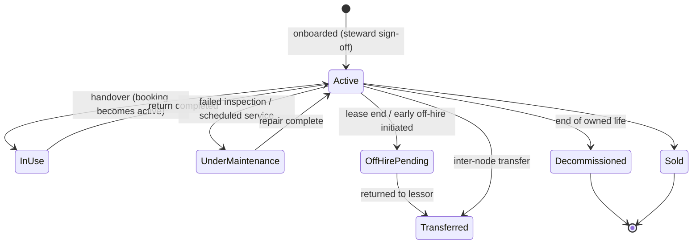
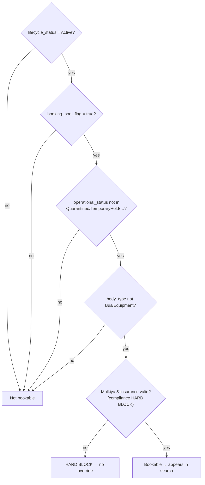
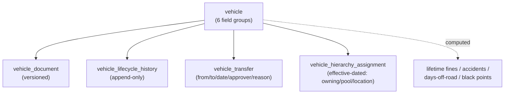

# 05 — Vehicle Master & Lifecycle

**Capability C1 — Fleet Master & Lifecycle.** The single governed group-wide vehicle record that underpins every other capability: booking, entitlement, compliance, fines, telematics and cost. FRs: FR-INV-01..11.

---

## 1. Outcome & business rules

A single, governed group-wide vehicle master reflecting the configured hierarchy.

- Every vehicle owned or leased by the group is recorded **once**, regardless of cluster.
- **Equipment** (cranes, RTGs) and **shuttle buses** may be recorded for cost reporting but **never appear in a bookable pool**.
- **Decommissioned/sold** vehicles remain searchable for historical reporting but exit operational dashboards.
- Administrators may **include/exclude** a vehicle from the active booking pool **without affecting historical records**.

## 2. The vehicle master — 6 field groups

All fields are required at onboarding unless marked optional. Jurisdiction-specific names (Mulkiya, Salik, Darb) are **configurable types**, not hard-coded.

### 2.1 Identity & classification
`id` (uuid) · **`plate`** (unique @ org) · **`chassis_vin`** (unique) · `make` · `model` · `year` · `colour` · `body_type` (Sedan/SUV/Van/Pickup/Bus/Equipment) · `use_category` (Executive/Operations/Pool/VIP/Dedicated) · `seating_capacity` · `fuel_type` (Petrol/Diesel/Hybrid/EV) · `fuel_efficiency_kmpl`.

### 2.2 Ownership & commercial
`ownership` (Owned/Leased) · `purchase_or_lease_start` · `lease_end` · `purchase_cost` / `monthly_rental` · `currency` (AED default) · `vendor_id` (P2) · `lease_contract_ref` · `early_offhire_penalty_terms` · `depreciation_rate`.

### 2.3 Compliance & documents
`mulkiya_number` + `mulkiya_expiry` · `insurance_provider` · `insurance_policy_number` + `insurance_expiry` · `insurance_coverage_type` · **`salik_tag`** (unique) · **`darb_tag`** (unique) · `fuel_card_number` · versioned document attachments (§5).

### 2.4 Operational state & hierarchy
`lifecycle_status` · `operational_status` · `booking_pool_flag` · `last_confirmed_odometer` · `next_maintenance_due` · `assignment_model` (Pool/Dedicated) · `assigned_driver_person_id` (required if Dedicated). Effective hierarchy ownership/location lives in `vehicle_hierarchy_assignment` (see [02](02_organization-hierarchy-engine.md)), **not** as columns here.

### 2.5 Telematics (optional in Phase 1)
`tracker_vendor` · `tracker_serial` · `sim` · `warranty` · **`gps_status`** (Installed/NotInstalled/Online/Offline/Faulty/UnderReplacement).

### 2.6 Computed / reserved
Lifetime fines (count/value) · black points + transfer status · lifetime accidents · days-off-road · created/modified audit · lifecycle history · dormant **`organization_id`**.

## 3. Lifecycle states (FR-INV-02) — "where it is in its life"

Seven states:

| State | Meaning | Bookable? |
|---|---|---|
| Active | Available in the fleet | ✅ (if pool + compliant) |
| In Use | On an active booking | ❌ (occupied) |
| Under Maintenance | In service/repair | ❌ |
| Off-Hire Pending | Lease ending, returning to lessor | ❌ |
| Decommissioned | End of owned life | ❌ (history only) |
| Sold | Disposed | ❌ (history only) |
| Transferred | Moved to another node/lessor | ❌ from old context |

## 4. Operational statuses (FR-INV-03) — "current disposition"

Five (nullable), orthogonal to lifecycle: `Reserve · Standby · VIP Only · Quarantined · Temporary Hold`. Used to fine-tune availability without changing the lifecycle state (e.g. a compliant Active vehicle marked `Quarantined` is excluded from search).

## 5. Bookability logic (how status gates the pool)

A vehicle is bookable **only if all** hold:

- Non-bookable statuses are **excluded from booking search** (FR-BOOK-02/08) — the employee never sees them.
- **Equipment & buses:** `body_type IN (Bus, Equipment)` ⇒ `booking_pool_flag = false`, enforced by check/trigger (FR-INV-07/09).
- The compliance **hard block** (expired Mulkiya/insurance) is structural and has **no override** — see [03 policy engine](03_policy-rule-engine.md) `hard-block-conditions`.

## 6. Uniqueness & integrity (FR-INV-05/07)

Enforced at **group level**: `plate`, `chassis_vin`, `salik_tag`, `darb_tag` are unique. Supporting indexes on `booking_pool_flag`, `mulkiya_expiry`, `insurance_expiry`, `assigned_driver_person_id`, plus active-assignment indexes on `vehicle_hierarchy_assignment`.

## 7. Document vault (FR-INV-06/08) — `vehicle_document`

Versioned compliance-document store:

`id` · `vehicle_id` · `doc_type` (Mulkiya/Insurance/Lease/OffHire) · `version` · `blob_url` (documents storage account) · `issued` · `expiry` · `uploaded_by` · `ocr_proposed jsonb` (Phase 2 auto-fill) · `confirmed_by`.

- Every upload is a **new version** (nothing overwritten).
- Phase 2: OCR proposes extracted fields (Mulkiya number/expiry, insurance policy/expiry) for **human confirmation** before the compliance ladders arm.

## 8. Data model summary

## 9. Onboarding & data quality (ties to C1 + P7)

Vehicles enter the master via **bulk import (M3)** with pre-commit validation (mandatory fields, formats, uniqueness, valid hierarchy/vendor refs), **dedup** with steward-resolved merge, and a per-vehicle **completeness score** feeding the ≥98% KPI. Records become operational **only after steward sign-off** (mitigates the High/High data-quality risk R5). See [07 — history](07_vehicle-condition-handover-and-history.md) for the lifecycle/transfer trail.

## 10. Edge cases & rules

| Case | Rule |
|---|---|
| Include/exclude from pool | `booking_pool_flag` toggled without touching history. |
| Dedicated vehicle | `assignment_model = Dedicated`, `assigned_driver_person_id` required; excluded from pool except during BSD leave windows. |
| Equipment recorded for cost | Allowed in inventory; never bookable. |
| Decommissioned vehicle | Stays searchable for history; off operational dashboards. |
| Change to any record | Event-published (FR-INV-11) for search index / dashboards / BI feed; audit entry written. |
| Odometer source of truth | Telematics wins over manual on conflict (FR-HAND-11 — see [07](07_vehicle-condition-handover-and-history.md)). |

## 11. Where this sits in the build

Vehicle master + document vault is **Stage 3.1** (first full vertical slice) in the [build plan](../../04-planning/build-execution-plan.md), after the platform + PDP foundation. Today the `vehicle` table does not exist (DB is empty); the `app-ui` Fleet Registry screen runs against mocks.

---

**Next:** [06 — Telematics, live tracking & yard](06_telematics-live-tracking-and-yard.md).
