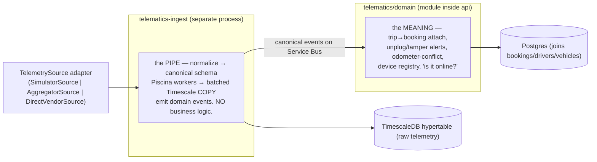
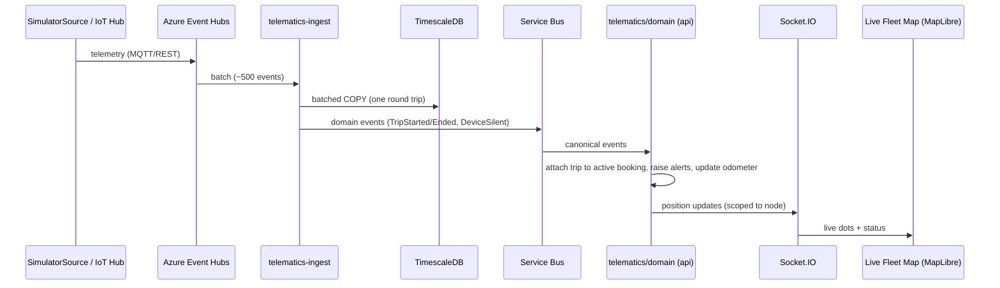
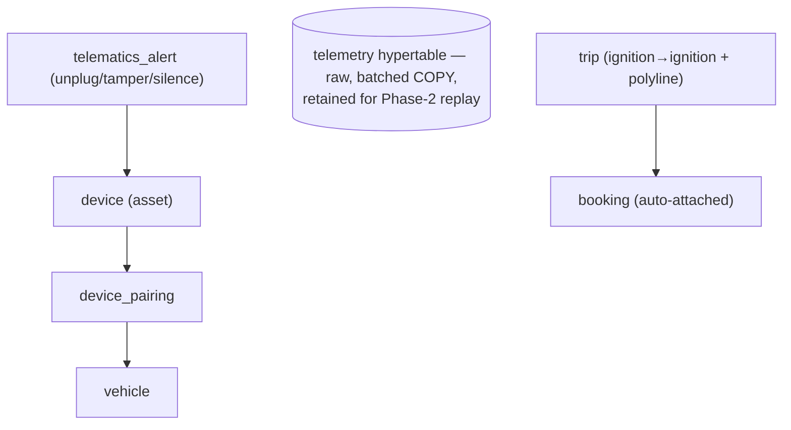

# 06 — Telematics, Live Tracking & Yard

**Capability C8 — Telematics, Live Tracking & Route Replay.** Elevated to **Phase 1 core**, built **simulator-first with no hardware in the pilot**. FRs: FR-GPS-P1-00..11. ADRs: ADR-006 (pluggable module, not a microservice), ADR-007 (simulator-first).

---

## 0. Mapping stack — MapLibre + Azure Maps, **not Google Maps**

The live map uses **MapLibre GL** (open-source client) with **Azure Maps** tiles + Route Directions — **not Google Maps** (meta-prompt §4 explicitly: "Not Google Maps"). Rationale:

| Reason | Detail |
|---|---|
| **No per-load billing surprise** | Fleet tracking refreshes positions constantly; MapLibre + Azure Maps tiles avoid Google's per-load pricing model. |
| **Data residency (PDPL)** | Location is *sensitive personal data*; Azure Maps in the UAE-North footprint keeps it in-region. |
| **Vendor-neutral** | MapLibre renders any tile source; swapping providers later is a client-config change. |

The *experience* is identical to what "Google Maps live tracking" evokes — vehicle dots moving on a street map — on a compliant, cost-safe stack. Adopting Google Maps would require a superseding ADR + residency/billing review.

## 1. Architecture — a pluggable module, not a microservice

Two pieces split for **two different reasons**:



| Piece | Nature | Split for | Owns | Never |
|---|---|---|---|---|
| **`telematics-ingest`** | Separate deployable **process** | **Runtime latency isolation** — a telemetry burst must never touch the booking event loop | source adapter, normalization, batched Timescale writes, event emission | business rules / booking reads |
| **`telematics/domain`** | NestJS module **inside `api`** | **Data locality** — its questions are joins with bookings/drivers/vehicles | trip→booking attach, unplug alerts, odometer-conflict, device registry, online-status | high-volume stream processing |

**Rule:** ingest is a dumb, fast pipe; the domain module is the smart part. Trip-to-booking attachment is a **join with bookings** → it belongs in the domain module, never in ingest.

## 2. The swappable source — simulator today, hardware later (no domain change)

```ts
interface TelemetrySource {
  start(onBatch: (points: CanonicalPoint[]) => void): void;
  stop(): void;
}
class SimulatorSource   implements TelemetrySource {} // Phase 1 — permanent, first-class
class AggregatorSource  implements TelemetrySource {} // Phase 2 — flespi/equiv.
class DirectVendorSource implements TelemetrySource {} // Phase 2 — direct vendor API
```

- **Phase 1 pilot uses `SimulatorSource`** — realistic canonical telemetry (positions, trips, ignition, odometer, injectable unplug events), driving vehicles along **real roads** (Mina Zayed → Khalifa Port → Kezad corridors) via Azure Maps Route Directions. It is a **permanent fixture** — the dev source, the load-test generator, and the demo source.
- Swapping to real hardware later is a **config change**; the domain module only consumes **canonical events** off the bus and never notices which source produced them. This is the entire "plug-and-play" promise — delivered by an interface, not infrastructure.

**Canonical schema** (vendor-agnostic, the asset that outlives any device): `position (lat/lon)`, `speed`, `ignition`, `odometer`, `fuel_level`, `dtc_codes`, `device_health`, `timestamp`.

## 3. Live map — end-to-end data flow



- The **map is scoped** to the viewer's hierarchy node (a fleet manager sees only their pool). Status dots use the shared `ok/warn/danger` language — **no glowing radar/scanline** decoration (design-system anti-pattern).
- Clicking a vehicle opens the **same inspector** used in the Fleet Registry — "where is it" and "what is it" are one interaction.

## 4. What Phase 1 delivers (FR-GPS-P1)

| FR | Capability |
|---|---|
| P1-00 | **SimulatorSource** — first-class permanent source (dev + load-test + demo) |
| P1-01 | **Telematics Adapter Layer** — one canonical schema; new source/device by config profile, not code |
| P1-02 | **Device registry & pairing** — tracker as an asset (serial, model, SIM, TDRA ref, firmware); pair/unpair audited; survives vehicle transfers |
| P1-03 | **Live fleet map** — real-time positions for operational roles, scoped to node |
| P1-04 | **Automatic odometer** — telematics odometer feeds the vehicle master; handover pre-fills |
| P1-05 | **Trip auto-attachment** — ignition-on→off trips (with polyline) attach to the active booking; out-of-booking trips flagged unassigned |
| P1-06 | **Unplug/tamper/silence alerts** — immediate alert + GPS status flip; feeds misuse log |
| P1-07 | **Untracked vehicles are explicit** — GPS status enum mandatory; coverage % on dashboards |
| P1-08 | **Device health console** — last report, signal, voltage, firmware; silent-device daily digest |
| P1-09/10 | **Source-outage resilience** — gap detection, backfill, explicit data-gap markers; outage never blocks booking/handover |
| P1-11 | Deferred to Phase 2: route-replay player, geofence corridors, video, harsh-driving |

## 5. Yard / location tracking

"Where is this vehicle in the yard, and can I use it?" is answered by three things together:

- **Location assignment** — `vehicle_hierarchy_assignment` gives an effective-dated `PhysicalLocation` node (e.g. *Kezad 280*, *Mina Zayed Yard B*) — the yard it belongs to.
- **Live position** — telematics dot on the scoped map.
- **GPS status enum** (mandatory) — `Installed / Not Installed / Online / Offline / Faulty / Under Replacement`. An **untracked** vehicle shows "Not tracked" explicitly — never a broken widget, never an assumed location. Dashboards show **tracked-coverage %** per pool.

**Phase 2** adds **geofence corridors** + deviation alerts (e.g. flag a vehicle that leaves the Mina Zayed→Khalifa corridor) — owner/tolerance per decision D21.

## 6. Device registry, pairing & health

- **`device`** — asset record: serial, model, SIM, TDRA approval ref, firmware; **independent of vehicle** (survives transfers/off-hires; the platform owns the tracker, not the lessor — this retired the old "leased vehicles have no API" risk).
- **`device_pairing`** — assigns a source stream to a vehicle (a simulated device per pool vehicle in the pilot); unpair/re-pair fully audited.
- **Device health** — reported firmware/signal/battery feed the health console; silent devices surface in a daily digest.

Hardware tiers (when procured, Phase 2): **T1** OBD-II plug-in (default, self-install < 2 min, transferable); **T2** hardwired TCU (buses/high-value); **T3** OEM embedded API. UAE path: TDRA Scheme-2 approved catalog, Abu Dhabi ITC, SIRA SecurePath.

## 7. Privacy — location is sensitive personal data (PDPL)

- Live location visible **only to operational roles** with an explicit purpose; **every view is logged**.
- **Off-shift masking** configurable; retention per decision **D4** (defaults shorter than business data).
- Employee notice is part of the consent text (D7).
- **Proven on simulated data first** — the access-logging, scoping and retention controls are exercised before any real personal location data flows (a strong PDPL story). D4 sign-off is a Phase-1 go-live gate.

## 8. The "sacred booking path" — why ingest is a separate process

Node has one JS execution thread per process. If GPS parsing ran in `api`, a burst of telemetry could block the 500 ms eligibility gate. Splitting `telematics-ingest` into its own process means ingest can saturate **its own** loop while `api` stays idle-on-I/O and answers bookings in ~12 ms. Three layers of parallelism: KEDA replicas (throughput), Piscina threads inside ingest (multi-core CPU), separate processes (latency isolation). The formal load test (5,000-vehicle burst + 500 users) guards this: `api` event-loop p99 lag must stay **< 10 ms**.

## 9. Data model



## 10. Edge cases & rules

| Case | Rule |
|---|---|
| Untracked vehicle | GPS status = Not Installed; UI states "Not tracked"; never assumed. |
| Telematics outage | Never blocks booking/handover/return; gap markers + backfill on recovery. |
| Odometer conflict | Telematics is system of record; manual value retained; data-quality flag raised (FR-HAND-11). |
| Trip with no booking | Flagged "unassigned" for fleet-manager review; not silently dropped. |
| Repeated unplug during bookings | Feeds the misuse log (Phase-2 behaviour engine); escalation = locking OBD brackets. |
| Simulator vs hardware | Domain module unchanged on swap; if it needs editing, the abstraction leaked at ingest (fix there). |

## 11. Where this sits in the build

Real ingest + domain is **Stage 4** in the [build plan](../../04-planning/build-execution-plan.md), runnable in parallel after the platform foundation, integrating trip-attach at the booking slice (Stage 3.4). Today it's a **simulator heartbeat stub** with no Timescale write and no domain module. Local Postgres already has TimescaleDB enabled.

---

**Next:** [07 — Vehicle condition, handover & history](07_vehicle-condition-handover-and-history.md).
