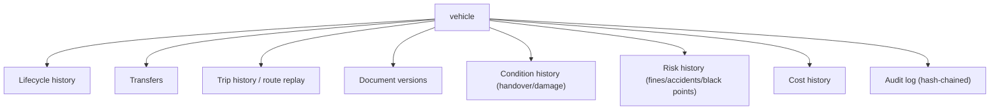
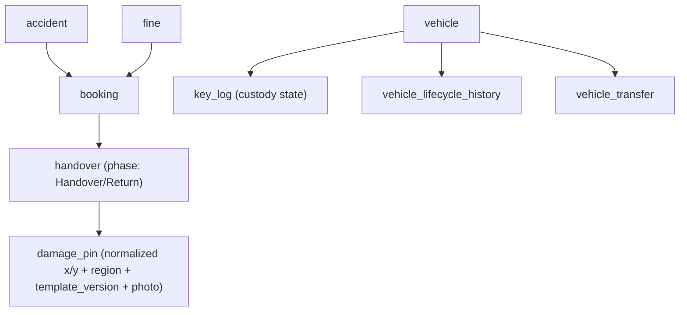

# 07 — Vehicle Condition, Handover & History

**Capability C4 — Handover, Return & Damage Capture**, plus every layer of **vehicle history** and the tamper-evident audit that ties them together. FRs: FR-HAND-01..11, FR-INV-06, FR-AUD-01..06.

---

## 1. Condition capture — handover & return

Vehicle condition, fuel level and odometer are captured cleanly at **handover** (vehicle out) and **return** (vehicle in), and compared. The fleet manager drives it from `/handover`.

```mermaid
flowchart LR
  subgraph Handover (vehicle out)
    H1["Verify booking # + driver ID<br/>+ eligibility/consent chips"]
    H2["Walkaround checklist<br/>(body, tyres, lights, assets, cabin)"]
    H3["Odometer (pre-filled from telematics)<br/>+ fuel level"]
    H4["Damage Map (tap-to-pin + photo)"]
    H5["Driver signature (condition accepted)"]
    H1 --> H2 --> H3 --> H4 --> H5 --> OUT["status → In Use"]
  end
  subgraph Return (vehicle in)
    R1["Ending odometer + fuel + condition"]
    R2["New damage? pin + photo (distinct from carried-over)"]
    R3["Reconciliation: expected vs actual fuel,<br/>on-time vs late"]
    R4["Key returned (or 'report lost key')"]
    R1 --> R2 --> R3 --> R4 --> IN["status → Active; fuel/time reconciled"]
  end
```

Captured at handover (FR-HAND-01/02/03): booking number + employee verified; starting **odometer**, **fuel level**, **GPS status**, **key issued**, date/time; the driver **signs** (digital signature on tablet/desktop) accepting condition. At return (FR-HAND-04/05/06): ending odometer, fuel, condition, damage/accident note, key returned; the system **reconciles** and flags late/early returns (feeds behaviour tracking).

## 2. The Damage Map (signature interaction pattern)

Used at handover and return; the key design decision is **portability** so marks are comparable across screens, over time, and by Phase-3 computer vision.

- A **top-down vehicle silhouette by body type** (sedan/SUV/van/bus) rendered as line-art SVG in a bordered card.
- **Tap/click anywhere → a numbered pin drops.** Each pin requires a **one-line description + a photo** before the handover can be confirmed (pins-pending-photo **blocks** confirmation).
- Existing damage from a prior handover shows as filled pins in `danger`; **new** pins this session show in `accent` until confirmed, then convert.
- A pin can't be marked "resolved/removed" without a **reason** — that becomes part of the audit trail.

**`damage_pin` storage** (why it's robust): normalized **`x`/`y` (0..1 in SVG viewBox space)** — device/zoom-independent — plus **`region_code`** (e.g. `FL-DOOR`) and **`template_id` + `template_version`** (the body-type silhouette the pin was placed on). Normalized coords + region + template version keep marks portable and **directly comparable handover-vs-return** and by CV later. State: `New / Existing / Resolved` + `resolve_reason` + `photo_blob_url`.

## 3. Reconciliation & the odometer-conflict rule

- **Fuel reconciliation** (FR-HAND-05): actual consumption (odometer delta × efficiency vs fuel-level delta) compared against expected; deviation beyond a configurable threshold (default **±20%**) is **flagged for review — advisory, never blocking** (fuel-gauge readings are approximate). The threshold is a PDP rule (`fuel-deviation-threshold`) tunable per vehicle category to manage alert noise.
- **Odometer-conflict rule** (FR-HAND-11): where telematics odometer and the manual reading disagree beyond tolerance, **telematics is the system of record**, the manual value is **retained**, and a **data-quality flag** is raised to the fleet manager. No telematics on the vehicle ⇒ the field behaves as plain manual entry (no false "matched" claim).
- **Late/early returns** are flagged automatically and visibly (feed behaviour scoring in Phase 2).

## 4. Key custody & on-vehicle assets (C15 baseline)

- **`key_log`** — per-vehicle key custody state: `Cabinet / FleetManager / DriverBooking / Lost`. Key issue/return is recorded as part of handover/return (FR-HAND-02/04). A lost key is an explicit **"report lost key"** action that starts the key-custody workflow rather than leaving the booking open.
- Phase 1 is a **manual log**; smart key cabinets are optional/Phase 2. On-vehicle asset checklist (fuel card, toll tag, first-aid, spare) verifiable at handover/return.

## 5. Offline / degraded connectivity (yards)

Ports and yards have poor coverage — this is the **design norm** for field flows, not an exception (NFR-OFF). Handover/return/damage capture operate with **local capture + automatic sync**; offline-captured records are clearly marked until synced; sync **conflicts route to a fleet-manager review queue**. (Minimal offline may be pulled into Phase 1 if a GS Pool coverage survey shows it's needed — remediation P1-R2-7; otherwise a connected handover station.)

## 6. Phase 3 — computer-vision damage comparison

Handover vs return **photo sets** are auto-compared; **new-damage candidates** are highlighted for fleet-manager confirmation (advisory, human-confirmed — "AI recommends, humans decide"). This is exactly why §2 stores normalized coords + region + template version: the pins and photos are comparable by construction.

---

## 7. Vehicle history — every layer

Multiple history layers hang off each vehicle. The governing principle is **soft-state, not soft-delete**: records move through lifecycle/status; nothing operational is hard-deleted, because history, attribution and audit depend on it.



| History type | Table / source | Captures |
|---|---|---|
| **Lifecycle** | `vehicle_lifecycle_history` (append-only) | Onboarding, every status change, decommission — node-as-it-was preserved |
| **Transfers** | `vehicle_transfer` | from-node, to-node, date, approver, reason (inter-pool/cluster moves, FR-CLU-03) |
| **Trips** | `trip` + `telemetry` hypertable | Ignition→ignition trips with polylines + attached booking; raw telemetry retained for **Phase-2 route replay** |
| **Documents** | `vehicle_document` (versioned) | Mulkiya/insurance/lease scans, each version, OCR-proposed fields (P2), expiry |
| **Condition** | `handover` + `damage_pin` | Every handover/return, odometer/fuel, damage pins (New/Existing/Resolved) with photos |
| **Risk** | `fine` / `accident` / `black_point` | Lifetime fines (count/value), accidents, days-off-road, black-point transfer status — attributed to the right driver via booking/substitution windows |
| **Cost** | computed | Lifetime fuel, tolls, maintenance, lease/depreciation → cost-per-km |
| **Audit** | `audit_log` (hash-chained) | Every state-changing action, override, exception |

## 8. Tamper-evident audit (FR-AUD / the backbone of history)

A single append-only `audit_log`, **hash-chained per organization**:

- Each row: `at_utc`, `actor_ref` (person / 'system' / 'ai'), `action` (e.g. `booking.confirm`, `sod.override`, `policy.evaluate`), `entity_ref`, `before_json`, `after_json`, `reason`, `prev_hash`, `row_hash`.
- `row_hash = sha256(prev_hash || canonical_payload)` computed in a Postgres trigger under a **per-organization advisory lock** (transaction-scoped) so concurrent writes can't fork the chain (closes remediation P0-R2-1/B-10).
- **No UPDATE/DELETE** (revoked at role level). Internal Audit gets a **read-only role** + export.
- A **verification job** recomputes the chain end-to-end (a go-live gate + scheduled).

## 9. Corrective entries (how to fix a bad record without breaking history)

Because everything is append-only + audited + steward-signed, you never edit in place. A bad migrated record is fixed with a **corrective-entry pattern**: a new versioned record + an audit reason — never an in-place mutation (remediation P1-R2-8). Consent, documents and lifecycle all follow the same insert-only + supersede model.

## 10. Data model



## 11. Edge cases & rules

| Case | Rule |
|---|---|
| Walkaround FAIL (e.g. light out) | Flag for maintenance without necessarily blocking handover (fleet-manager judgement); the flag is logged. |
| New damage at return | Same pin+photo+reason flow; visually distinguished from carried-over damage. |
| Vehicle returned to a different location | Note it; don't block. |
| Key not returned (lost) | Explicit "report lost key" action; starts key-custody workflow. |
| Offline handover | Local capture + "saved locally, will sync" indicator; conflicts → fleet-manager review. |
| Fix a wrong record | Corrective new version + audit reason; never in-place edit. |
| Odometer mismatch | Telematics wins; manual retained; data-quality flag. |

## 12. Where this sits in the build

Handover/return + Damage Map is **Stage 3.5** in the [build plan](../../04-planning/build-execution-plan.md), after booking (it references the active booking). The hash-chained `audit_log` is a **Stage 1 foundation** (built before features). History tables accrete per feature slice. Today the `app-ui` Handover screen (checklist, fuel gauge, Damage Map, signature) runs against mocks; no backend tables exist yet.

---

**Back to:** [README index](README.md) · related: [05 vehicle master](05_vehicle-master-and-lifecycle.md) · [06 telematics](06_telematics-live-tracking-and-yard.md).
