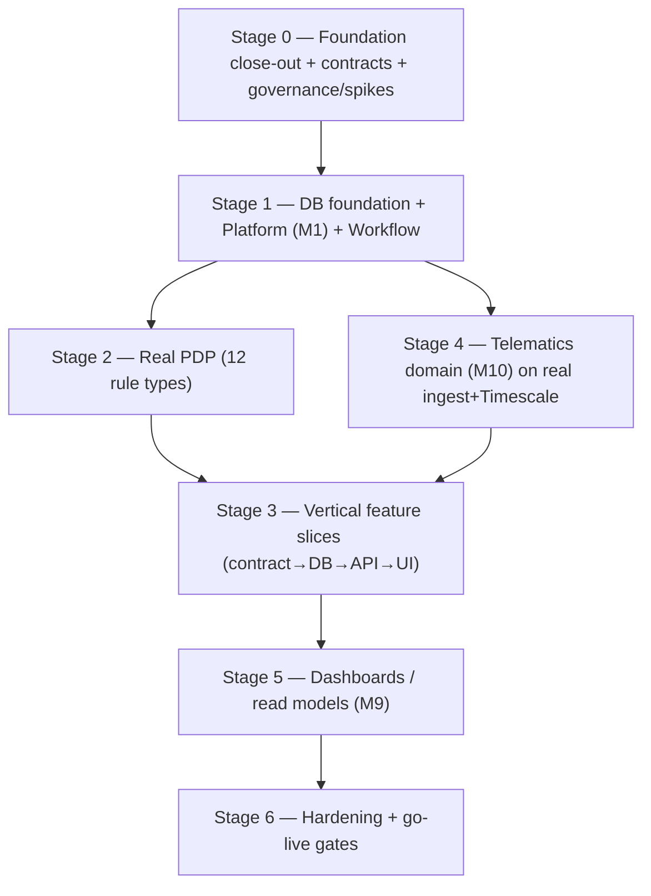

# Build Execution Plan — API · DB · UI (What to do next, and how)

| Field | Value |
|---|---|
| Document | Engineering build-sequencing & next-steps recommendation |
| Author | AI Backend Engineer (analysis of current code + business docs) |
| Date | 2026-07-17 |
| Status | **Advisory** — engineering sequencing. Does **not** override the governance gates in [implementation-plan-remediation-tracker.md](implementation-plan-remediation-tracker.md); production feature implementation stays authorization-gated (B-01/B-03/B-04). |
| Grounded in | `startup-doccs/02_PRD_v3.0`, `03_Phase1_MVP`, `08_Dev_Approach`, `10_MetaPrompt`; `implementation-plan/02_Database_Design`, `03_Backend_Design`, `04_Frontend_Design`, `06_Phase_Plan`; current `app-api` + `app-ui` source |

---

## 1. Current-state snapshot (where each track actually is)

| Track | Maturity | Reality today |
|---|---|---|
| **app-api foundation** | ✅ Done & green | 3 entrypoints (api/pdp/ingest), Fastify+SWC, Zod config layer, pino, RFC-7807 filter, Swagger, Terminus health, helmet, global prefix+versioning, lazy DB/Redis modules, OTel. Typecheck/lint/depcruise/tests/build all pass. |
| **app-api modules** | 🟡 Stubs only | `health` real. `operations` returns a **hardcoded mock** read model. `policy` is a **hardcoded evaluator** (2 rule types, no decision tables/JSONB/cache/decision_log) — **not** the real PDP. `telematics/ingest` is a **simulator heartbeat** (no Timescale write, no domain module). |
| **Database** | 🔴 Empty | `common/database/schema.ts` is empty; `drizzle/migrations/` has only `.gitkeep`. **Zero tables exist.** The entire [02_Database_Design](../implementation-plan/02_Database_Design.md) (organization, hierarchy, person, roles, policy, workflow, vehicle, booking, consent, audit, telemetry…) is **unbuilt**. |
| **Contracts** | 🟡 2 stubs | `contracts/operations-overview` + `policy-evaluation` only. No shared FE/BE contract package, no CI drift guard yet. |
| **app-ui** | 🟢 Ahead, mock-backed | Shell (header/sidebar/scope), `components/ui` (shadcn) + `patterns`, features (booking, home, design, samples), i18n en/ar, **MSW mock handlers**. Running at `localhost:5199`. **No real API integration** — it consumes mocks. *(Owned by a concurrent session — coordinate, don't overwrite.)* |
| **Platform core** | 🔴 Missing | No Entra auth, no RBAC, no **SoD guard**, no **hash-chained audit**, no **hierarchy engine**, no **workflow engine**, no outbox/inbox/scheduled_work. |
| **Governance** | ⛔ Gating | Implementation **authorization = Blocked** until Gate 0/1. Decisions D3/D4/D6/D7/D8/D9/D12/D13/D14 have **no named owners/closed values**. Stack/ADRs marked *Proposed*. |

**The core insight:** the three tracks are at wildly different maturity. The UI is furthest ahead but built on invented mock shapes; the DB — on which everything else depends — does not exist; the API has a shell but no crown jewel (PDP) or platform (auth/SoD/audit). **The single biggest risk right now is drift**: the longer the mock-driven UI and the (future) real API evolve apart, the more expensive convergence gets.

---

## 2. Guiding principles for HOW to build (adopt these as the operating rhythm)

1. **Contract-first, vertical slices.** Nothing is "backend-only" or "frontend-only". For each capability you define the **Zod contract in `contracts/` first**, then build DB → API → swap the UI from mock to the real typed client. One capability, end-to-end, before the next.
2. **DB-first *within* a slice.** Migration + Drizzle schema land before the service that queries them. Migrations are forward-only, checked in, run in CI.
3. **Dependency order beats visibility.** The non-retrofittable foundations (clean boundaries + dormant `organization_id`, hierarchy engine, PDP-in-front-of-rules, hash-chained audit, substitution-attribution model) come before any feature screen — per meta-prompt §11 and [06_Phase_Plan](../implementation-plan/06_Phase_Plan_and_Delivery.md) Phase 0/Block A.
4. **Rules live in the PDP, never in code.** No threshold/chain/buffer as a hard-coded `if`. This is why the real PDP must exist before booking/eligibility/entitlement logic.
5. **Respect the governance gates.** Foundation completion, DB schema, spikes, dev-login mode and contract locking are all *allowed* now. Production values for gated decisions (D-list) stay behind clearly-named config points until the owner signs them off — never invent a legal/HR/finance value.
6. **Don't relitigate locked architecture.** One repo / 3 deployables, Drizzle (not Prisma), one-DB-per-org + dormant `organization_id` (RLS off), simulator-first telematics, one visual register. Change only via a superseding ADR.
7. **Coordinate on `app-ui`.** A parallel session owns it. The API side delivers **contracts + endpoints**; the UI side swaps MSW handlers for the real client. Agree the contract shapes before either side hardens them.

---

## 3. Where to start (the first three moves, in order)

> These are the highest-leverage actions. Do them before any feature work.

### Move 1 — Establish the shared **contracts** package as the FE/BE source of truth
The UI already invents request/response shapes in its MSW handlers; the API has 2 stub contracts. **Reconcile them now**, before they diverge further.
- Promote `app-api/src/contracts/` (or a root `contracts/` per the plan) into the authoritative Zod schemas for every resource the UI already mocks (booking, vehicle, operations, eligibility, approval).
- Generate UI types from these schemas; wire the **CI drift guard** (regenerate + `git diff` must be clean — closes P0-R2-4 / A-01).
- Define the canonical **RFC-7807 problem+reason-code** contract (A-01) so the UI's "blocks explain themselves" strings map to stable codes.
- **Deliverable:** one `contracts/` package imported by api/pdp/ingest and code-generated into `app-ui`; drift check green in CI.

### Move 2 — Build the **database foundation** (M1 platform + policy + workflow + audit)
The DB is empty; this unblocks everything. Land the first Drizzle migrations for the **cross-cutting** tables (not features yet):
- `organization` (seed the dormant-seam UUID `00000000-0000-4000-8000-000000000001`), `hierarchy_node` (+ `ltree`/path), `person`, `role`, `role_assignment`, `delegation`, `sod_exception`.
- `policy_rule`, `policy_version` (immutable JSONB), `decision_log`.
- `workflow_instance`, `workflow_step`.
- `audit_log` (hash-chained, advisory-lock trigger — closes B-10/P0-R2-1), `outbox_event`, `inbox_message`, `scheduled_work`.
- Enable `pgcrypto` + `timescaledb` (already in local docker), `btree_gist`, `ltree`.
- **Deliverable:** `pnpm db:generate && db:migrate` produces these tables on the local Postgres (already running on :5442); a fresh-migration + seed test passes (closes B-05/B-07).

### Move 3 — Build the **Platform module (M1)** + the **real PDP** (replace the stub)
This is Block A and the crown jewel. It gates all feature logic.
- **Platform:** `HierarchyService` (N-level tree, scope roll-up), `AccessService` (RBAC by `role_assignment` scope), **`SodGuard`** (8 structural rules, each with a test — B-02/S-02), `AuditService` (hash-chained append via the trigger + service interceptor), `DelegationService`, Entra auth with a **dev-login fallback** so build proceeds without IT (P0-R1-2).
- **Workflow engine:** configurable chains, delegation, timeout escalation on `scheduled_work` + BullMQ.
- **Real PDP:** decision tables as versioned immutable JSONB, top-down first-match-wins + mandatory default, Redis compiled-rule cache with DB read-through on miss, `decision_log` write in the caller transaction, **fail-safe = DENY + escalate**, p95 < 200 ms. Register the **12 Phase-1 rule types** (each: Zod input schema + reason codes + safe default + decision-table test).
- **Deliverable:** SoD-01 integration test passes; PDP outage returns DENY; audit chain verifies under concurrent writes.

---

## 4. Detailed sequencing (stages, each shippable and testable)

### Stage 0 — Close the foundation & unblock (parallel, ~now)
- **Contracts package + CI drift guard** (Move 1).
- **`organization_id` grep guard** (no `src/modules/**` reference except `drizzle/**`) — P0-R1-3.
- **`tsc --noEmit` whole-project CI job** (already a script; make it a required gate) — P0-R2-3.
- **Migration-test + compensating-migration convention** — P0-R2-5.
- **Dev seed script** (hierarchy nodes, roles, a test person) so integration tests can run — P0-R1-4.
- **Governance/decisions in parallel** (not engineering): name owners + deadlines for D3/D4/D6/D7/D8/D9/D12/D13/D14 (B-04); Azure Week-0 pre-flight (quotas, WORM, extensions — P0-R1-1/B-14); formal ADR files (B-06); signed integration contracts for Entra/HCM/M365 (B-13).

### Stage 1 — DB foundation + Platform (M1) + Workflow (Move 2 + Move 3 platform half)
- Migrations for platform/policy/workflow/audit/outbox tables (Move 2).
- Platform module + SoD guard + audit interceptor + hierarchy + workflow + Entra/dev-login (Move 3 platform half).
- **Notification dispatcher** (P9, Email/M365) — needed by compliance ladders & booking reminders (P1-R1-5); build the port here.
- Replace the stub `operations` module's hardcoded data with a real (empty-state) read path once tables exist.
- **Exit:** SoD-01..08 tests pass; audit chain verifies under concurrency; workflow escalation timers fire.

### Stage 2 — Real PDP (Move 3 PDP half)
- Replace `policy-evaluator.service.ts` stub with the real evaluator over JSONB decision tables + Redis cache + `decision_log`.
- Register all 12 rule types (engine complete). Populate tables with **test fixtures**; production values gated on decisions (P1-R1-2).
- **Exit:** `evaluate()` p95 < 200 ms; fail-safe DENY+escalate proven (P0-R2-2 completed here); dry-run diff works.

### Stage 3 — Vertical feature slices (the bulk of Phase 1)
Build in dependency order; **each slice = contract → migration/schema → API module (controller/service/repository + PDP calls + audit + outbox) → swap UI feature from MSW to real client → integration test**.

| Order | Slice | Modules | Key gotchas to honour |
|---|---|---|---|
| 3.1 | **Vehicle master + document vault** | M2 | 6 field groups, group-level uniqueness, equipment/bus never bookable, `vehicle_hierarchy_assignment` effective-dated (B-07). |
| 3.2 | **Data migration & quality** | M3 | Bulk import + validation + dedup + steward sign-off; ≥98% completeness gate; run the cleansing sprint in parallel (P1-R1-4). |
| 3.3 | **Compliance engine + eligibility gate** | M7 | Single "can this driver take this vehicle now?" truth; hard blocks (no override); ladders via `scheduled_work`. |
| 3.4 | **Booking + consent** | M4 | `btree_gist` overlap exclusion + persisted `reservation_start/end` + policy version (B-09/P1-R2-1); **consent hard gate** after selection/before submit; 409 on conflict; HCM freshness fail-direction (P1-R2-2). |
| 3.5 | **Handover / return** | M6 | Normalized damage-pin coords + region + template version; odometer-conflict rule (telematics = system of record); yard connectivity check (P1-R2-7). |
| 3.6 | **Entitlements → Cluster CEO** | M5 | Eligibility pre-check (D8 table), approval chain via workflow, driver consent before allocation, BSD leave return. |
| 3.7 | **Fines / black points + substitution model** | M8 | Auto-attribution honouring substitution windows; platform-wide black-point block via `access_block`; ship the **substitution data model now** + a minimal admin/API entry point (P1-R2-4). |

### Stage 4 — Telematics domain (M10) — can run parallel to Stage 3 after Stage 1
- Real `telematics-ingest`: `SimulatorSource` → canonical schema → **batched Timescale COPY** → Service Bus events (replace the heartbeat stub).
- `telematics/domain` inside `api`: device registry/pairing, live map, auto-odometer, **trip→booking auto-attach** (behind a bookings port + test-double until 3.4 lands — P1-R1-1), unplug alerts.
- **Exit:** trip auto-attach tested against **adversarial** (non-booking-aware) trips, not just the deterministic simulator (P1-R2-3); `TelemetrySource` swap-tested with no domain change.

### Stage 5 — Dashboards / read models (M9)
- Read-optimised query services / materialized views over the slices above; role + scope cost-masking (A-02).
- Scope M9 to **measurable-now** KPIs at a single pilot pool; tag cost-per-km/ESG as Phase-2 (P1-R1-7).

### Stage 6 — Hardening & go-live
- Real-module load/soak/failover; migration dry-runs; pen test; **PDPL D4 sign-off**; timed RPO/RTO + outbox/DLQ replay; GS Pool UAT; sponsor go/no-go. All **11 Phase-1 go-live gates** must pass.

---

## 5. How each track develops, and how they interlock

### 5.1 Database (Drizzle) — the spine
- **Own it per bounded context** (S-03): platform tables in Stage 1; each feature slice adds its own tables in its migration. Don't front-load all tables — but **do** front-load the cross-cutting ones (org/hierarchy/person/roles/policy/workflow/audit/outbox) because everything joins them.
- Conventions from [02_Database_Design](../implementation-plan/02_Database_Design.md): `uuid` PKs, `*_at_utc timestamptz`, `numeric(14,2)`+currency, enums for closed sets, soft-state not soft-delete, dormant `organization_id` (RLS off, CI-guarded), append-only + hash-chained audit.
- **Migrations forward-only**, checked in, run in CI, with a compensating-migration pattern and a migration-test harness (P0-R2-5). Never `synchronize`.
- Local dev already has Postgres+TimescaleDB on `:5442` (docker compose) with `timescaledb`+`pgcrypto` — use it now.

### 5.2 API (NestJS) — feature modules over the platform
- Every feature is a Nest module following the **module-boundary standard** (controllers/ services/ dto/ entities/ repositories/ …). Controllers do HTTP only; services hold use cases; repositories hide Drizzle; **every PEP calls the PDP, never decides**.
- Every state change writes domain state + append-only audit + `outbox_event` in **one transaction**; Service Bus publish from the outbox dispatcher; consumers dedupe via `inbox_message`.
- Errors → RFC-7807 with stable reason codes (the filter already exists). Denials carry machine codes the UI localises.
- Keep the **booking path sacred** — no CPU-bound work in `api`; ingest/OCR stay in their own process.

### 5.3 UI (React) — swap mocks for contracts, slice by slice
- The UI is ahead but **mock-backed**. The rhythm: as each API slice lands, **replace its MSW handler with the real typed client** (`lib/api` generated from `contracts/`); keep MSW for tests only.
- Do **not** add screens without a Page Functional Spec entry (C11). Build strictly from `06_UX_Design_System_v2` + `07_Page_Functional_Specs` — one visual register, role/scope-driven nav, Scope Switcher = the access boundary made visible.
- Phase-1 committed baseline = responsive **English** UI + Legal-approved **EN/AR consent**; full Arabic/RTL UI and dark theme stay **approval-gated** (S-01) — architecture prepared, delivery deferred until Product/UX/Sponsor sign off.
- **Coordinate with the concurrent app-ui session**: agree contract shapes before hardening; the API side publishes contracts, the UI side consumes them.

### 5.4 The glue: `contracts/`
`contracts/` is the single artifact that keeps all three honest — one Zod definition serves API DTO validation, the PDP rule-type input schemas, **and** the generated UI types. The CI drift guard is what prevents the mock-UI from silently diverging from the real API. **This is the most important thing to stand up first.**

---

## 6. Testing strategy (per slice, risk-weighted)
Heaviest integration testing on the correctness-critical paths (from `03_Backend_Design` §10 / meta-prompt §7.4), in priority order:
1. PDP fail-safe (outage ⇒ DENY, never allow).
2. SoD (8 rules — a user can't approve their own booking/entitlement).
3. Consent sequencing (no number without signed consent; re-consent on material change).
4. Booking overlap/double-booking race (`btree_gist` + concurrent create/modify/extend).
5. Fine/trip attribution incl. substitution windows.
6. Audit hash-chain integrity under concurrency.
Plus: contract tests on `contracts/` (drift), migration tests, a11y (axe) in the UI, and the formal load test (floor at Stage 2, binding at Stage 6).

---

## 7. Risks & blockers to manage now
| Risk | Why it matters | Action |
|---|---|---|
| **Governance authorization Blocked** (B-01/B-03/B-04) | Production feature build is not yet authorized | Proceed with foundation/DB/spikes/contracts + dev-login; escalate decision ownership + funding in parallel. |
| **Decision D-list unclosed** | 6 of 12 PDP rule tables + consent wording need real HR/Legal/Finance values | Build engine + schema with test fixtures behind named config points; block only production values (P1-R1-2). |
| **Mock/real drift** | UI is ahead on invented shapes | Lock `contracts/` + CI drift guard **first** (Move 1). |
| **HCM/Entra dependency** | Auth + person/eligibility data are external | Dev-login mode + HCM freshness SLA with fail-safe = block (P1-R2-2). |
| **Trip-attach built before booking** | Block C precedes Block D | Bookings port + test-double, integrate at Stage 3.4 (P1-R1-1). |
| **Concurrent app-ui edits** | Two sessions touching the repo | Coordinate contract shapes; API side avoids editing `app-ui` except its API client wiring, by agreement. |

---

## 8. Immediate next actions (do these first)

- [ ] **Stand up `contracts/`** as the FE/BE source of truth + CI drift guard (Move 1).
- [ ] **Write the first Drizzle migration**: `organization` (seeded) + `hierarchy_node` + `person` + `role` + `role_assignment`; run against local Postgres (:5442); add fresh-migration + seed test.
- [ ] **Add the `organization_id` grep guard** and make `tsc --noEmit` + `depcruise` required CI gates.
- [ ] **Build the Platform module skeleton**: `AccessService` + `SodGuard` (+ SoD-01 test) + `AuditService` (hash-chain trigger) + Entra/dev-login.
- [ ] **Replace the policy stub** with the real PDP (JSONB decision tables + Redis cache + `decision_log` + fail-safe) and register the 12 rule types with fixtures.
- [ ] **In parallel (non-engineering):** name owners + deadlines for D3/D4/D6/D7/D8/D9/D12/D13/D14; raise the Azure Week-0 pre-flight; author the formal ADR files.
- [ ] **Then begin Stage 3.1** (vehicle master) as the first full contract→DB→API→UI vertical slice.

---

## 9. My recommendation, in one paragraph
**Start with the DB and the platform/PDP core, not with features, and make `contracts/` the first deliverable.** The UI being mock-ahead is an asset only if you freeze the contracts now and converge slice-by-slice; otherwise it becomes rework. Build the cross-cutting foundation (org/hierarchy/person/roles/policy/workflow/audit tables + SoD guard + hash-chained audit + the real PDP) once, prove it with the correctness-critical tests, then run disciplined **contract-first vertical slices** (vehicle → compliance → booking+consent → handover → entitlements → fines), swapping each UI feature off MSW as its API lands. Keep the booking path sacred, keep every business rule in the PDP, respect the governance gates (dev-login + fixtures unblock build without inventing gated values), and treat telematics as a parallel track that integrates at the booking slice. This sequence turns today's uneven three-track state into one coherent, testable Phase-1 loop.
