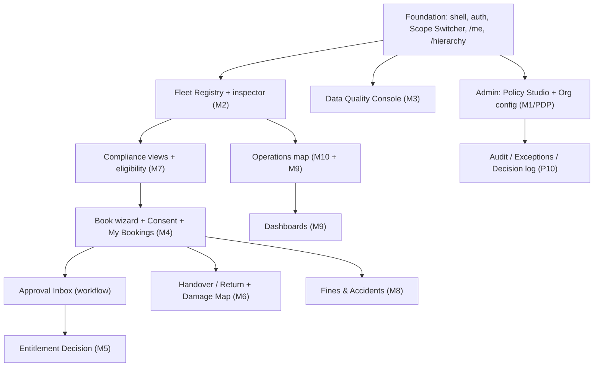

# 02 — Route & API Matrix

Consolidated reference: the master route table, the backend-endpoint→page matrix, and the build-order alignment. Pairs with [01 — Page roadmap by actor](01_page-roadmap-by-actor.md). Endpoints from `03_Backend_Design` (M1–M10); all UI routes are locale-prefixed `/{lang}/…`.

---

## 1. Master route table

| Route (`/{lang}/…`) | Page | Primary actor(s) | Phase | Status | Spec |
|---|---|---|---|---|---|
| `` (index) | Role landing redirect | all | P1 | 🟡 | — |
| `book` | Book a Vehicle (wizard) | Employee | P1 | 🟡 | A1 |
| `bookings` | My Bookings | Employee, Drivers | P1 | ⬜ | A2 |
| `approvals` | Approval Inbox | Line Mgr, Delegate, Cluster CEO, Cluster Fleet Lead | P1 | 🟡 | C1 |
| `entitlements/:id` | Entitlement Decision | Cluster CEO | P1 | 🟡 | D1 |
| `operations` | Operations / Live Fleet (Map·Radar·List) | Fleet Mgr, Fleet Lead | P1 | 🟡 (`console`) | B5/E1 |
| `handover` | Handover & Return (built as one page w/ toggle) | Fleet Manager | P1 | ✅ built (mock; target splits queue + `/handover/:id` + `/return/:id`) | B1/B2 |
| `handover/:bookingId` | Vehicle Handover | Fleet Manager | P1 | ⬜ | B1 |
| `return/:bookingId` | Vehicle Return | Fleet Manager | P1 | ⬜ | B2 |
| `fleet` | Fleet (Vehicle Registry) | Fleet Mgr, Fleet Lead, Steward, Procurement | P1 | ⬜ | B3 |
| `fines` | Fines & Accidents Register | Fleet Mgr, HR(view), Insurance, HSE | P1 | 🟡 | B4 |
| `dashboards` | Reports & dashboards (scoped) | Fleet Lead, Cluster CEO, Finance | P1 | ⬜ | P11 |
| `dashboards/executive` | Executive Dashboard | Executive | P1 | 🟡 (disabled) | F1 |
| `dashboards/finance` | Financial Dashboards | Finance | P1 | ⬜ | P11 |
| `escalations` | HR Escalations & Disciplinary | HR | P1 | ⬜ | G1 |
| `audit` | Audit Log | Internal Audit | P1 | ⬜ | P10 |
| `audit/exceptions` | Exception report | Internal Audit | P1 | ⬜ | FR-AUD-03 |
| `audit/decisions` | Decision log | Internal Audit | P1 | ⬜ | FR-POL-05 |
| `data-quality` | Data Quality & Migration Console | Data Steward | P1 | ⬜ | H1 |
| `profile` | Profile & preferences (+ delegation, behaviour) | all | P1 | ⬜ | — |
| `admin` | Admin home | System Admin | P1 | ⬜ | I2 |
| `admin/policy` | Policy Engine Studio (PAP) | System Admin | P1 | 🟡 (`policy`) | I1 |
| `admin/organization` | Org & Hierarchy Config | System Admin | P1 | ⬜ | I2 |
| `admin/access` | Access management | System Admin | P1 | ⬜ | FR-IAM-05 |
| `admin/integrations` | Integrations status | System Admin | P1 | ⬜ | P6 |
| `admin/finance` | Depreciation config | Finance | P1 | ⬜ | D6 |
| `vendors` | Vendor & Lease dashboard | Procurement | P2 | ⬜ | C13 |
| `vendors/leases` | Lease contracts | Procurement | P2 | ⬜ | C13 |
| `vendors/off-hire` | Off-hire workflow | Procurement | P2 | ⬜ | FR-VEN-04 |
| `copilot` | AI Copilot | Executive+ | P3 | ⬜ | FR-AI-11 |
| `design` | Design system showcase (internal) | — | — | ✅ | — |
| `*` | Not found (404) | all | P1 | ✅ | — |

## 2. Backend endpoint → consuming pages (by module)

| Module | Endpoint | Consumed by (pages) |
|---|---|---|
| **M1 platform** | `GET /me` | landing redirect, shell (nav+scope), profile |
| | `GET /hierarchy` | Scope Switcher, Org config |
| | `POST /delegations`, `GET /delegations` | Delegation management |
| | `GET /audit` | Audit Log |
| | `GET /reports/exceptions` | Exception report |
| **M2 vehicles** | `GET /vehicles`, `GET /vehicles/:id` | Fleet Registry, inspector, Operations map, dashboards drill-down |
| | `POST /vehicles`, `PATCH /vehicles/:id` | Onboard vehicle, edit (commercial/steward), maintenance |
| | `POST /vehicles/:id/documents` | Document vault |
| | `POST /vehicles/:id/transfer` | Transfer pool, inter-pool transfers |
| | `GET /vehicles/:id/history` | Lifecycle/transfer history |
| **M3 migration** | `POST /imports`, `GET /imports/:id` | Data Quality Console (import, validation report) |
| | `POST /imports/:id/{resolve,sign-off}` | Resolve exceptions, sign-off |
| **M4 bookings** | `GET /vehicles/available` | Book wizard step 2, waitlist |
| | `POST /bookings`, `.../consent`, `.../submit` | Book wizard, Consent Sheet |
| | `POST /bookings/:id/{approve,decline,modify,cancel}` | Approval Inbox, My Bookings |
| | `POST /bookings/:id/extend` | My Bookings (extend) |
| | `GET /bookings…` | My Bookings, Handover Queue, driver trips |
| **M5 entitlements** | `POST /entitlements`, `.../submit`, `GET /entitlements/:id` | Entitlement request/decision |
| | `POST /entitlements/:id/bsd-windows` | BSD leave-return |
| **M6 handover** | `POST /handovers`, `.../return`, `.../damage` | Handover, Return (Damage Map) |
| | `GET /vehicles/:id/keys` | Key custody, handover |
| **M7 compliance** | `GET /eligibility` | Book (gate), Handover, Approval evidence, driver eligibility record |
| | `GET /compliance/expiries` | Compliance view, Insurance compliance, Fleet runway |
| | `GET /compliance/blocks` | Black-point block indicators, HR overdue view |
| **M8 fines** | `POST /fines`, `GET /fines` | Fines register, HR fines view |
| | `POST /accidents` / `GET /accidents` | Accidents tab, Insurance/HSE views |
| | `POST /fines/:id/recovery` | Recovery tab, Finance recovery |
| | `POST /vehicles/:id/substitution-windows` | Substitution windows, substitute authorisation |
| **M9 dashboards** | `GET /operations/overview` (exists) | Operations console, Fleet-lead comparison |
| | dashboard read models | Executive/Finance/Cluster dashboards |
| **M10 telematics** | live map (Socket.IO), device/trip/alert reads | Operations map, vehicle inspector telemetry, device health |
| **Policy (PDP)** | `POST /v1/decisions/evaluate` (internal) | every PEP; surfaced in Policy Decision Trace |
| | policy CRUD + dry-run | Policy Engine Studio (PAP) |
| **Notifications (P9)** | notifications feed | Notifications slide-over, config |

## 3. Build-order alignment (pages follow the API slices)

Pages become real as their API slice lands (contract-first vertical slices — see [build-execution-plan](../build-execution-plan.md)). Rough order:

## 4. Page-count summary

| Actor group | Landing | Dedicated | Child/modal/pattern |
|---|---|---|---|
| Employee/Driver | 1 | 2 | ~10 |
| Approver + Delegate | 1 | 3 | ~4 |
| Fleet Manager | 1 | 5 | ~14 |
| Cluster/Group Fleet Lead | 1 | 5 | ~2 |
| Cluster CEO | 1 | 2 | ~2 |
| Executive | 1 | 1 | ~4 |
| HR | 1 | 3 | ~2 |
| Finance | 1 | 3 | — |
| Procurement | 1 | 4 | — |
| Insurance / HSE | 2 | 1 | — |
| Internal Audit | 1 | 2 | — |
| Data Steward | 1 | 1 | ~4 |
| System Admin | 1 | 6 | ~5 |
| Professional/Substitute Driver | 1 | — | 2 |
| Cross-cutting/global | — | 5 | ~7 |

> The counts are indicative; the authoritative list is [01](01_page-roadmap-by-actor.md). Every page must have (or gain) a Page Functional Spec entry before build.
