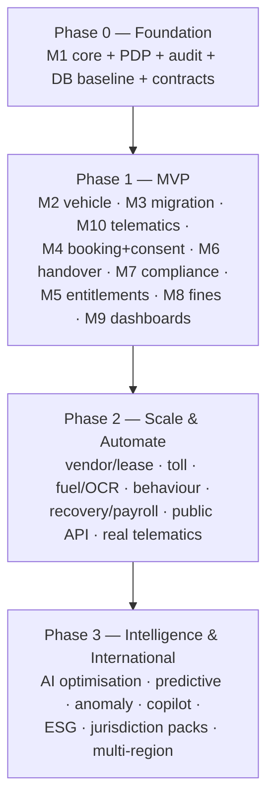

# Backend & Database — Phase-by-Phase Implementation Plan

The concrete, phase-by-phase delivery plan for the **backend (`app-api`)** and the **database (Drizzle/PostgreSQL + TimescaleDB)**. It turns the strategy in [build-execution-plan.md](../../04-planning/build-execution-plan.md) and the design in [`02_Database_Design`](../../implementation-plan/02_Database_Design.md) / [`03_Backend_Design`](../../implementation-plan/03_Backend_Design.md) into per-phase, per-slice steps: migrations, modules, endpoints, events, tests and exit gates.

| # | Document | Phase |
|---|---|---|
| 00 | [Phase 0 — Foundation](00_phase0-foundation.md) | Platform core, DB baseline, real PDP, contracts, CI gates |
| 01 | [Phase 1 — MVP (GS Pool)](01_phase1-mvp.md) · **[sub-phases →](phase1/README.md)** | Modules M1–M10 as contract-first vertical slices (blocks A–G) |
| 02 | [Phase 2 — Scale & Automate](02_phase2-scale-automate.md) | Real telematics sources, OCR fuel, tolls, vendor/lease, behaviour, recovery, public API |
| 03 | [Phase 3 — Intelligence & International](03_phase3-intelligence-international.md) | AI optimisation, predictive, anomaly, copilot, ESG, jurisdiction packs, multi-region |
| 04 | [Migration catalog & conventions](04_migration-catalog-and-conventions.md) | Ordered migration list + DB/backend conventions & DoD |

---

## 1. Scope & non-scope

**In scope:** backend NestJS modules, the three deployables (`api`, `pdp`, `telematics-ingest`, + `ocr-worker` in P2), Drizzle schema + migrations, PDP rule types, transactional eventing (outbox/inbox), scheduled work, audit, and their tests.

**Out of scope here:** UI pages (see [ui-page-roadmap](../../04-planning/ui-page-roadmap/README.md)) and non-engineering governance decisions (D-list, funding) — those are tracked in the [remediation tracker](../../04-planning/implementation-plan-remediation-tracker.md). This plan calls out where a slice **depends** on a decision but does not own closing it.

## 2. Current starting point (as of 2026-07-18)

- **Foundation done & green:** 3 entrypoints, Fastify+SWC, Zod config layer, pino, RFC-7807 filter, Swagger, Terminus health, lazy DB/Redis modules, OTel. `typecheck/lint/depcruise/test/build` pass.
- **Stubs to replace:** `operations` (mock read model), `policy` (hardcoded evaluator — **not** the real PDP), `telematics/ingest` (simulator heartbeat, no Timescale write, no domain module).
- **Database: empty** — `common/database/schema.ts` is empty, `drizzle/migrations/` has only `.gitkeep`. Every table in this plan is new.
- **Local infra:** Postgres + TimescaleDB running via `docker-compose` on `localhost:5442` (pgcrypto + timescaledb enabled); Redis on `:6379`.
- **pnpm:** use the 11.13.1 binary (`export PATH="/c/Users/jaison.joseph/AppData/Roaming/npm:$PATH"`).

## 3. How to read each phase

Every phase is delivered as **contract-first vertical slices**. Each slice specifies:

1. **Contracts** — the Zod schemas added to `contracts/` (shared by api/pdp/ingest and code-generated into the UI).
2. **DB** — the migration(s): tables, columns, constraints, indexes.
3. **Module** — the NestJS module (controllers / services / repositories) following the module-boundary standard.
4. **PDP rule types** — which decision tables the slice consumes (never hard-coded).
5. **Events** — `outbox_event` types emitted; consumers.
6. **Endpoints** — REST surface (`/api/v1/...`).
7. **Tests** — unit + the correctness-critical integration tests.
8. **Exit gate** — the acceptance that lets the next slice start.

## 4. Global engineering rules (apply to every slice)

- **DB-first within a slice:** migration + Drizzle schema land before the service that queries them. Migrations are **forward-only**, checked in, run in CI, with a compensating-migration pattern. Never `synchronize`.
- **Every PEP calls the PDP; it never decides.** No threshold/chain/buffer as a hard-coded `if`.
- **Every state change** writes domain state + append-only hash-chained `audit_log` + `outbox_event` in **one Postgres transaction**; Service Bus publish from the outbox dispatcher; consumers dedupe via `inbox_message`.
- **Dormant `organization_id`** on core tables (RLS off, never branched on); CI grep guard enforces it (`src/modules/**` except `drizzle/**`).
- **Booking path is sacred** — no CPU-bound work in `api`; ingest/OCR stay in their own process.
- **Definition of Done (per module):** FRs cited; rules via PDP; relevant SoD tests pass; audit entry on every state change + policy version recorded; `dependency-cruiser` passes; no new synchronous CPU work in `api`; reason codes EN+AR; no secrets outside Key Vault/managed identity.

## 5. Phase & module map

## 6. Legend

- **Status:** ✅ done · 🟡 stub exists · ⬜ to build.
- **Dep:** upstream slice/decision that must exist first.
- **Dxx:** governance decision (owner outside engineering) that gates production values.

> **Governance caveat:** implementation authorization is gated by the [remediation tracker](../../04-planning/implementation-plan-remediation-tracker.md) (B-01/B-03/B-04). Foundation, DB schema, spikes, contracts and dev-login are allowed now; production values for gated decisions stay behind named config points until signed off.
