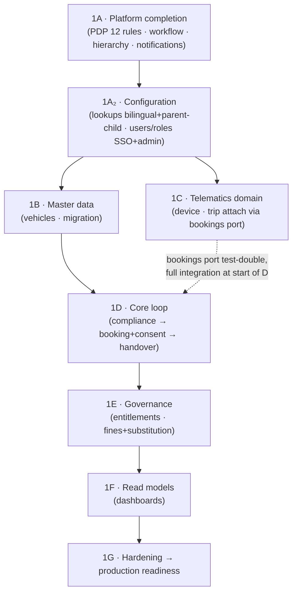

# Phase 1 — MVP: Sub-Phase Implementation Plan (GS Pool)

This folder decomposes [Phase 1 — MVP](../01_phase1-mvp.md) into **separate, self-contained sub-phases** (one per delivery block A–G), plus a consolidated critique and the production-readiness gate. Nothing in the parent plan is dropped — every module, migration, PDP rule type, event, endpoint, test, critique finding and gate item is carried into a sub-phase and cross-referenced.

**Phase goal (unchanged):** the complete accountability loop live at one pool — **book → consent → approve → handover → return → fine auto-attributed → nothing on expired documents** — with GPS via simulator, no hardware. Delivered as **contract-first vertical slices** in dependency order.

**Entry:** Phase 0 production-readiness gate green.
**Exit:** the Phase 1 gate in [09_production-readiness-gate.md](09_production-readiness-gate.md) fully green (reviewer-verified, evidence attached).

**Governing docs:** [`03_Phase1_MVP_PRD_ADPorts.md`](../../../startup-doccs/03_Phase1_MVP_PRD_ADPorts.md) · [`02_Database_Design`](../../../implementation-plan/02_Database_Design.md) · [`03_Backend_Design`](../../../implementation-plan/03_Backend_Design.md) · [migration catalog & conventions](../04_migration-catalog-and-conventions.md).

---

## 1. Sub-phase index

| Sub-phase | Block | Scope | Modules | Migrations | Doc |
|---|---|---|---|---|---|
| **1A** | A | Platform completion — full PDP (12 rule types), full workflow, full hierarchy, notification dispatcher | `policy`, `workflow`, `platform`, `notifications` | none (seed rule tables) | [01_sub-phase-1a_platform-completion.md](01_sub-phase-1a_platform-completion.md) |
| **1A₂** | A | Configuration — lookup/reference-data (bilingual, parent-child) + user/access management (SSO JIT, admin role assignment, HCM-ready) | `config` (lookups), `identity` | `0004_lookup_identity` | [01b_sub-phase-1a2_lookup-and-user-management.md](01b_sub-phase-1a2_lookup-and-user-management.md) |
| **1B** | B | Master data — vehicles + bulk migration | `vehicles` (M2), `migration` (M3) | `0005_vehicle`, `0006_migration` | [02_sub-phase-1b_master-data.md](02_sub-phase-1b_master-data.md) |
| **1C** | C | Telematics domain — device registry, live map, trip attach | `telematics/domain` (M10) | `0007_telematics` | [03_sub-phase-1c_telematics-domain.md](03_sub-phase-1c_telematics-domain.md) |
| **1D** | D | Core loop — compliance gate + booking/consent + handover | `compliance` (M7), `bookings` (M4), `handover` (M6) | `0008_compliance`, `0009_booking`, `0010_handover` | [04_sub-phase-1d_core-loop.md](04_sub-phase-1d_core-loop.md) |
| **1E** | E | Governance — entitlements + fines/substitution | `entitlements` (M5), `fines` (M8) | `0011_entitlement`, `0012_fines` | [05_sub-phase-1e_governance.md](05_sub-phase-1e_governance.md) |
| **1F** | F | Read models — dashboards + role/scope cost masking | `dashboards` (M9) | none (views) | [06_sub-phase-1f_read-models.md](06_sub-phase-1f_read-models.md) |
| **1G** | G | Hardening — binding load test, DR drill, security, UAT, go/no-go | (cross-cutting) | none | [07_sub-phase-1g_hardening-and-gate.md](07_sub-phase-1g_hardening-and-gate.md) |
| — | — | Consolidated critique (Round 1 + Round 2) | — | — | [08_critique-and-gap-analysis.md](08_critique-and-gap-analysis.md) |
| — | — | Production-readiness gate (§8) | — | — | [09_production-readiness-gate.md](09_production-readiness-gate.md) |

## 2. Dependency order & parallelism

- **1A is the prerequisite for everything** (rules + workflow + hierarchy + notifications).
- **1A₂ (configuration) follows 1A and precedes the feature blocks** — its lookups back every dropdown (body type/fuel/use category feed vehicles) and its user/role admin governs who can do what.
- **1B and 1C can run in parallel** after 1A₂.
- **1C builds trip→booking attach against a bookings port + test-double** (P1B-R1-1); full integration happens at the **start of 1D**.
- **1D order is deliberate:** compliance (M7 — the eligibility gate) is built **before** booking (M4), because booking cannot exist without the "can this driver take this vehicle now?" truth.
- **1F reads from 1B–1E; 1G is the binding validation** with real modules + migrated data.

## 3. How to read each sub-phase

Each sub-phase doc follows the plan's slice contract (parent §3):

1. **Scope & entry/exit dependencies** — what must exist first, what this unlocks.
2. **Contracts** — Zod schemas added to `contracts/` (shared api/pdp/ingest, code-generated to UI).
3. **DB** — migration(s): tables, columns, constraints, indexes, triggers.
4. **Module** — NestJS module (controllers / services / repositories), module-boundary standard.
5. **PDP rule types** — decision tables consumed (never hard-coded).
6. **Events** — `outbox_event` types emitted + consumers.
7. **Endpoints** — REST surface under `/api/v1`.
8. **Tests** — unit + correctness-critical integration tests.
9. **Exit gate** — the acceptance that lets the next sub-phase start.
10. **Traceability** — FRs, critique findings resolved, gate items advanced, migration-catalog rows, D-list decisions depended on.

## 4. Global rules (apply to every sub-phase — from the plan's §4 / conventions)

- **DB-first within a slice:** migration + Drizzle schema land before the service that queries them. Forward-only, checked in, CI-run, with a compensating migration. Never `synchronize`.
- **Every PEP calls the PDP; it never decides.** No threshold/chain/buffer as a hard-coded `if` (CI grep guard).
- **Every state change** writes domain state + append-only hash-chained `audit_log` + `outbox_event` in **one Postgres transaction**; Service Bus publish from the outbox dispatcher; consumers dedupe via `inbox_message`.
- **Dormant `organization_id`** on core tables (RLS off, never branched on); CI grep guard enforces it.
- **Booking path is sacred** — no CPU-bound work in `api`; ingest/OCR stay in their own process.
- **Time:** store UTC (`*_at_utc timestamptz`); UI localises to Asia/Dubai; centralise conversion; tz/DST boundary tests (P1B-R2-5).
- **Money:** `numeric(14,2)` + `currency char(3) DEFAULT 'AED'` — never floats.
- **Soft-state, not soft-delete** — nothing operational hard-deleted (history + audit depend on it).
- **Reason codes EN + AR**; no secrets outside Key Vault / managed identity.
- **Per-module Definition of Done:** see [conventions §5](../04_migration-catalog-and-conventions.md#5-definition-of-done-every-backenddb-slice).

## 5. Decision (D-list) dependencies tracked in Phase 1

Engineering builds the **engine** now; production **values** for these stay behind named config points / flagged fixtures until signed off (governance owns closing them). Tracked in the [remediation tracker](../../../04-planning/implementation-plan-remediation-tracker.md).

| Decision | Gates | Built against until closed |
|---|---|---|
| **D3, D6, D8, D9, D12, D14** | 6 of the 12 PDP rule tables (values) | Legal/ops-reviewed **fixtures**, dated risk (P1B-R1-2) |
| **D4** (PDPL) | Telematics retention / off-shift masking | Pulled **before** 1C; build to the decided policy (P1B-R2-6) |
| **D7** (consent wording EN+AR) | Consent hard gate content | Legal-reviewed **v0** unblocks build, not go-live (P1B-R1-3) |
| **D13** (payroll) | Recovery instruction export | Phase 2; Phase 1 records the recovery entry only |

## 6. Legend

- **Status:** ✅ done · 🟡 stub/partial · ⬜ to build.
- **Dep:** upstream slice/decision that must exist first.
- **Dxx:** governance decision (owner outside engineering) gating production values.
- **P1B-R1-x / P1B-R2-x:** Phase-1 critique findings (see [08](08_critique-and-gap-analysis.md)).

> Sub-phases are delivered as production code from day one — not spikes to be rewritten. A doc edit is never evidence; the [gate](09_production-readiness-gate.md) closes only on reviewer-verified test/telemetry evidence.
