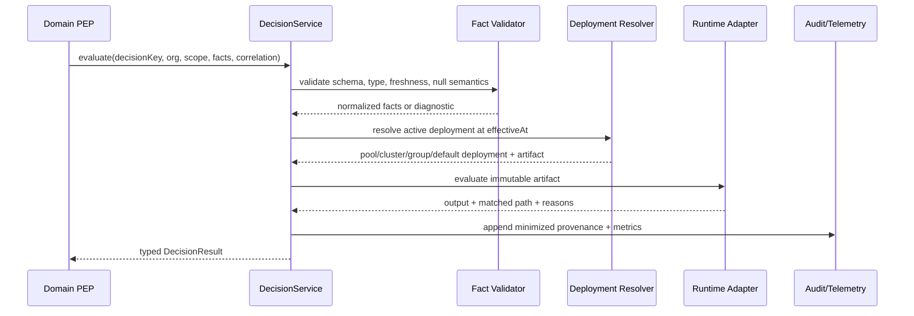

# Phase 4 - Decision Runtime and Unified Evaluation Boundary

## 1. Objective

Implement the selected runtime adapter and one production `DecisionService` that validates facts, resolves deployment/scope/effective time, evaluates deterministically, records provenance, applies failure policy, and returns typed results. All PEPs must eventually use this boundary.

## 2. Owners and dependencies

- **Primary:** AI Backend Engineer (NestJS)
- **Contributors:** Solution Architect, Database, Security, SRE, QA
- **Depends on:** Phase 2 contracts and Phase 3 persistence

## 3. Module structure

```text
src/modules/decisions/
  decisions.module.ts
  controllers/
    decisions.controller.ts
  services/
    decision.service.ts
    deployment-resolver.service.ts
    fact-validator.service.ts
    decision-audit.service.ts
    failure-policy.service.ts
  repositories/
    decision.repository.ts
  runtime/
    decision-runtime.port.ts
    selected-runtime.adapter.ts
    legacy-runtime.adapter.ts
  internal/
    scope-resolution.ts
    effective-time.ts
    checksums.ts
    result-minimization.ts
```

Keep administration/write lifecycle in a separate policy-administration module so runtime dependencies remain small and stable.

## 4. Runtime port

```ts
interface DecisionRuntimePort {
  compile(source: AuthoredDecisionArtifact): Promise<CompileResult>
  evaluate<T>(artifact: CompiledDecisionArtifact, facts: unknown): Promise<RuntimeResult<T>>
  explain(artifact: CompiledDecisionArtifact, facts: unknown): Promise<DecisionTrace>
}
```

The adapter must never perform DB, network, filesystem, or domain writes during evaluation.

## 5. Unified production request flow



## 6. Resolution algorithm

1. Validate organization and requested hierarchy node.
2. Build scope ancestry from requested pool/location to organization root.
3. At `effectiveAtUtc`, search active deployment in precedence order:
   - exact pool/location.
   - parent cluster.
   - group.
   - organization default.
4. Respect canary/shadow selector and deployment generation.
5. Resolve compiled artifact by immutable checksum.
6. Cache key includes organization, decision key, resolved scope, environment, deployment generation, and artifact checksum.
7. If cache fails, load from PostgreSQL.
8. If PostgreSQL fails, use verified last-known-good bundle only where failure policy permits.
9. Never silently fall back to an unapproved in-memory fixture in production.

O6 is a hard prerequisite for steps 1-6. The resolver uses generic effective ltree ancestry, not fixed pool/cluster columns. It rejects cross-organization, unauthorized, unknown, future or retired requested scopes according to the production contract.

## 7. Failure policy

Each decision definition declares:

- `FAIL_CLOSED`: return explicit unavailable/deny result and escalate.
- `LAST_KNOWN_GOOD`: use the most recent verified deployed artifact and flag degradation.
- `STATIC_SAFE_VALUE`: only for approved non-safety-critical configuration, with a documented value and expiry.
- `FAIL_OPEN`: exceptional, security-approved only.

Consumers must handle a typed failure result. They may not infer a value from an absent output.

## 8. Fact assembly

Domain-specific fact assemblers remain near their domain modules but implement shared contracts:

- Retrieve trusted data in bounded queries.
- Report source timestamp and freshness.
- Normalize stable codes, decimals, money, dates, and timezone.
- Exclude unnecessary personal data.
- Return fact-schema version and source provenance.
- Never let the UI submit authoritative facts for production decisions unless the fact is explicitly request-supplied.

## 9. Evaluation API

### Production

`POST /api/v1/decisions/evaluate`

- Authenticated service/user boundary according to caller type.
- Validates a registered decision key and fact schema.
- Returns typed result and provenance.
- Logs evaluation and escalation as required.

### Internal batch

`POST /api/v1/internal/decisions/evaluate-batch`

- Workload identity only.
- Bounded batch size and timeout.
- Used for replay/impact jobs, not browser calls.

### Response fields

- `decisionId`, `decisionKey`.
- `policyVersionId`, `deploymentId`, `artifactChecksum`.
- `scopeRequested`, `scopeResolved`.
- `effectiveAtUtc`.
- `output`, `reasonCodes`, `matchedPath`.
- `degraded`, `failureMode`, `durationMs`.

## 10. Decision audit and observability

- Append minimized decision evidence with trace/correlation ID.
- Link policy version/deployment IDs, not arbitrary JSON version strings.
- Never let audit-write failure silently disappear; define bounded retry/outbox behavior while preserving decision latency.
- Metrics: request count, p50/p95/p99, cache hit/miss/error, DB fallback, last-known-good use, failure mode, outcome distribution by decision and scope.
- Traces include fact assembly, resolution, runtime, audit enqueue, and total duration.

## 11. Cache and activation propagation

- Database deployment row is authoritative.
- Activation commits deployment and outbox `DecisionDeploymentActivated` atomically.
- Runtime replicas consume invalidation with inbox idempotency.
- Cache generation prevents an old event from replacing a newer bundle.
- TTL is a recovery safety net, not the primary propagation mechanism.
- Startup preloads critical active bundles and verifies checksums.
- Hierarchy generation/change events invalidate affected ancestry-resolution entries; cache keys cannot be shared across organizations or hierarchy generations.

## 12. Security controls

- Strict schemas with input size/depth limits.
- No arbitrary expressions beyond the approved language sandbox.
- Rate limits for public/user-facing evaluation endpoints.
- Service-to-service authorization for internal/batch endpoints.
- Log redaction and classification-aware output minimization.
- Signed/checksummed artifacts and runtime adapter allowlist.

## 13. Tests

- Runtime adapter conformance suite.
- Scope/effective-date boundary tests.
- Fact type/null/freshness tests.
- Cache hit/miss/invalidation/out-of-order event tests.
- Redis outage, DB outage, corrupt bundle, and last-known-good tests.
- Fail-closed consumer tests proving no hard-coded substitution.
- Multi-organization isolation tests.
- Concurrent activation/read tests.
- Load floor and memory-leak soak.

## 14. Incremental delivery slices

1. Runtime port and selected adapter with golden rules.
2. Fact validation and typed response.
3. DB deployment resolver without cache.
4. Cache and activation event propagation.
5. Audit/telemetry and failure strategy.
6. Production controller and batch adapter.
7. Legacy adapter for shadow comparison.

## 15. Exit gate

Phase 4 passes when O6 is green, the service evaluates all migrated golden policies, resolves organization/scope/effective dates correctly, proves hierarchy-change invalidation and failure behavior, meets the latency floor, and produces complete immutable provenance through one boundary.
