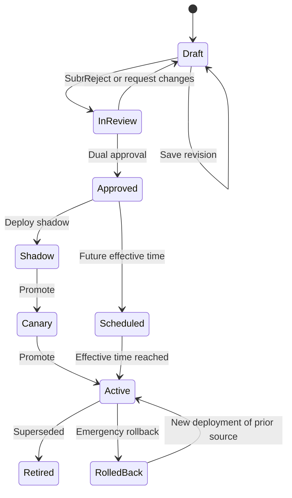

# Phase 5 - Policy Administration and Governance Lifecycle

## 1. Objective

Implement the Policy Administration Point (PAP): catalog, drafts, compiler validation, side-effect-free simulation, regression/replay, review, dual approval, effective-dated deployment, canary/shadow, version history, diff, and rollback.

## 2. Owners and dependencies

- **Primary:** AI Backend Engineer (NestJS)
- **Contributors:** Product, Solution Architect, Security, Internal Audit, Database, QA, SRE
- **Depends on:** Phase 3 registry and Phase 4 runtime
- **Human gates:** High-impact policy approval and production deployment authorization

## 3. Lifecycle



Published versions are immutable. Editing an active policy creates a draft based on that version.

## 4. Administration module

```text
src/modules/policy-administration/
  controllers/policy-admin.controller.ts
  services/
    policy-catalog.service.ts
    policy-draft.service.ts
    policy-validation.service.ts
    policy-simulation.service.ts
    policy-review.service.ts
    policy-deployment.service.ts
    policy-replay.service.ts
    policy-diff.service.ts
  repositories/policy-admin.repository.ts
  internal/
    lifecycle.ts
    impact-classification.ts
    semantic-diff.ts
```

## 5. API surface

| Method | Path | Purpose |
| --- | --- | --- |
| GET | `/api/v1/admin/policies` | Catalog/filter/health/ownership |
| POST | `/api/v1/admin/policies` | Register a new decision identity |
| GET | `/api/v1/admin/policies/:id` | Workspace: active, draft, deployments, history |
| POST | `/api/v1/admin/policies/:id/drafts` | Create draft from active/version/template |
| PATCH | `/api/v1/admin/policy-drafts/:draftId` | Save with expected revision |
| POST | `/api/v1/admin/policy-drafts/:draftId/validate` | Compile and return diagnostics |
| POST | `/api/v1/admin/policy-drafts/:draftId/simulate` | Evaluate draft without side effects |
| POST | `/api/v1/admin/policy-drafts/:draftId/replay` | Start bounded impact replay |
| GET | `/api/v1/admin/policy-replays/:id` | Replay progress and aggregate differences |
| POST | `/api/v1/admin/policy-drafts/:draftId/submit` | Submit for review |
| POST | `/api/v1/admin/policy-drafts/:draftId/approve` | Approve with SoD check |
| POST | `/api/v1/admin/policy-drafts/:draftId/reject` | Reject with mandatory reason |
| POST | `/api/v1/admin/policy-versions/:id/deployments` | Shadow/canary/schedule/activate |
| POST | `/api/v1/admin/policy-deployments/:id/promote` | Promote shadow/canary |
| POST | `/api/v1/admin/policy-deployments/:id/rollback` | Create rollback deployment |
| GET | `/api/v1/admin/policies/:id/diff` | Semantic diff between versions/draft |
| GET | `/api/v1/admin/policies/:id/decisions` | Minimized decision evidence |

All response and error schemas come from Phase 2.

Scope-specific draft/deployment operations include organization and binding target. Scope choices come from O4 manageable scopes; organization-default is explicit. Activation to hierarchy nodes is capability-blocked until O6 passes.

## 6. Compiler and validation pipeline

1. Validate authoring JSON schema and schema version.
2. Resolve fact/output/effect-intent metadata.
3. Type-check conditions and outputs.
4. Analyze unreachable, ambiguous, contradictory, duplicate, and unsafe rows.
5. Validate scope/effective/failure strategy.
6. Compile to selected runtime artifact.
7. Verify artifact checksum and round-trip metadata.
8. Execute mandatory policy test cases.
9. Return diagnostics without persisting an approved version.

Warnings may require acknowledgment; errors block submission.

## 7. Simulation

Simulation must be isolated from production behavior:

- Uses draft artifact and supplied/synthetic facts.
- Performs no escalation, domain command, production decision log, or cache activation.
- Returns matched row/path, normalized facts, diagnostics, output, reasons, and timing.
- Marks the result clearly as `SIMULATION`.
- Optionally compares draft with the active deployment for the same facts.

## 8. Replay and impact analysis

- Replay only approved/minimized fact snapshots or generated test datasets.
- Run asynchronously with bounded concurrency and quotas.
- Compare active vs draft outcomes, routes, values, and reason codes.
- Aggregate changes by decision, scope, pool/cluster, outcome, and impact category.
- High-impact publication requires reviewed replay evidence or a documented exception.
- Raw personal facts are not surfaced to authors unless explicitly authorized.

## 9. Governance and SoD

- Author cannot approve their own high-impact policy.
- High/critical policy requires two distinct approvals; one may require the owning business role or Internal Audit/Security depending on classification.
- Publisher permission is separate from author/reviewer.
- Emergency rollback requires reason, dual authorization, and post-event review.
- Every transition records actor, on-behalf-of, reason, before/after identifiers, and correlation ID in tamper-evident audit.

Use the lightweight workflow orchestrator from Phase 6 for policy-review tasks; until Phase 6 is ready, keep publication disabled rather than implementing a bypass.

## 10. Deployment semantics

- Deploy an immutable version, never a mutable draft.
- Acquire per-policy/scope/environment lock.
- Verify approvals, tests, checksums, effective range, and expected current generation.
- Insert deployment and activation outbox event in one transaction.
- Runtime consumers acknowledge generation; dashboard shows propagation status.
- Scheduled deployment worker revalidates preconditions at effective time.
- Shadow deployment evaluates but cannot influence domain behavior.
- Canary selector is deterministic and auditable.
- Validate scope binding against current/effective hierarchy generation and reject retired/invalid/cross-organization targets.
- Hierarchy move/retire impact preview must account for active/scheduled policy bindings before organization change commits.

## 11. Rollback

- Select a previously approved version.
- Validate it against current fact/output schemas or use its pinned compatibility adapter.
- Create a new deployment generation referencing rollback source.
- Preserve the failed/current deployment and all evidence.
- Broadcast invalidation and verify runtime adoption.
- Start incident/post-event review for critical policies.

## 12. Catalog metadata

Each policy exposes:

- Business and technical name.
- Decision family and impact class.
- Owner, reviewer groups, and support contact.
- Fact and output schemas.
- Current deployments by scope/environment.
- Health, last evaluation, error/fallback rate.
- Active version/effective dates.
- Draft/review status.
- Governance-decision references.

## 13. Notifications/events

- `PolicyDraftSubmitted`
- `PolicyDraftApproved` / `Rejected`
- `PolicyDeploymentScheduled`
- `PolicyDeploymentActivated`
- `PolicyDeploymentPromotionFailed`
- `PolicyDeploymentRolledBack`
- `PolicyReplayCompleted`

Use outbox/inbox and classify notification suppressibility; critical deployment failures are not suppressible.

## 14. Tests

- Lifecycle transition and authorization matrix.
- Optimistic draft conflict.
- Compiler diagnostics and mandatory tests.
- Simulation side-effect isolation.
- Self-approval and dual-control rejection.
- Concurrent deployment and expected-generation conflict.
- Scheduled activation and timezone boundaries.
- Shadow/canary determinism.
- Replay privacy/quotas.
- Rollback and invalidation propagation.
- Audit completeness.

## 15. Exit gate

Phase 5 passes when an administrator can create, validate, simulate, test, review, approve, deploy, observe, and roll back organization-default and O6-approved scoped policies without direct DB access, arbitrary code, invalid hierarchy bindings, or an unaudited bypass.
