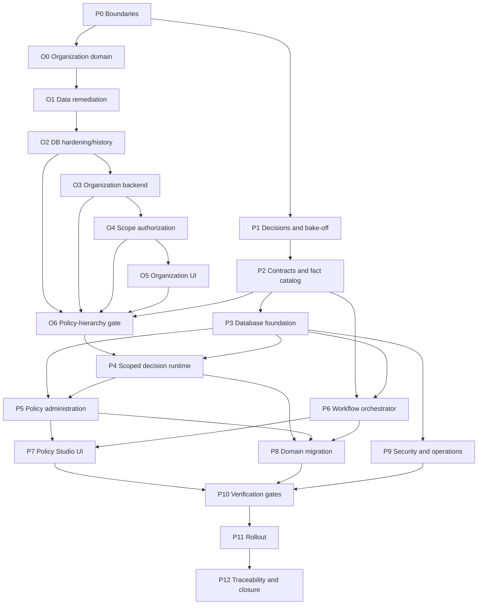

# Decision and Workflow Platform - End-to-End Implementation Plan

> **Status:** In progress - first policy-authoring vertical slice implemented 2026-07-19
> **Scope:** Reusable organization/hierarchy management, scope authorization, policy/decision platform, lightweight JavaScript workflow orchestration, administration UI, database, APIs, migration, security, testing, observability, and rollout
> **Primary owner:** AI Solution Architect
> **Delivery owners:** AI Backend Engineer (NestJS), AI Frontend Engineer (React), AI Database Engineer, AI Security Engineer, AI Quality Engineer, AI Platform Engineer, AI SRE
> **Decision gate:** Architecture approval is required before Phase 1 implementation begins

## Implementation progress

Delivered in the first vertical slice:

- Backward-compatible dynamic conditions with `eq`, `neq`, `lt`, `lte`, `gt`, `gte`, `in`, and `notIn`.
- Bilingual typed fact/operator catalogue and server-side authored-table compiler validation.
- PostgreSQL `policy_draft` persistence with optimistic revisions (migration `0014`).
- SystemAdmin policy catalogue, facts, workspace, draft-save, side-effect-free simulation, and activation endpoints.
- Wayfinder Policy Studio route with dynamic rules/conditions, typed inputs, editable VALUE/ROUTE_TO outcomes, simulation trace, draft state, and EN/AR copy.
- Contract drift, unit, live integration, HTTP authorization smoke, migration, build, and browser evidence.

Delivered in the first organization foundation slice:

- Migration `0016_organization_hierarchy_foundation`: immutable hierarchy node codes, organization/hierarchy revisions, organization-code and hierarchy org/code/path uniqueness, level/revision/date-window checks, and safe metadata backfill.
- Idempotent seed now updates canonical hierarchy codes, level metadata, Arabic labels, names and paths rather than ignoring existing rows.
- SystemAdmin Organization Administration API returns organization settings, enriched arbitrary-depth hierarchy, and explicit readiness reasons; non-admin access is denied.
- Real `/{lang}/admin/organization` Wayfinder page replaces the placeholder with readiness warning, KPI summary, accessible expandable tree, stable codes, bilingual names, and node detail.
- Live readiness remains intentionally red: seven active nodes, four roots, and six people without home scopes. Orphan test roots were not silently deleted.
- Verification: backend 240/240 unit, 80/80 integration, 5/5 E2E, migration/static/build gates; frontend 52/52 tests, typecheck/lint/build; live EN/AR tree interaction and RTL/no-overflow checks.

Delivered after adversarial critique round 1:

- Organization-aware Principal/`GET /me`, authorized hierarchy closure, stale-scope correction, and root-permission gating for `All scopes`.
- Migration `0017` with mandatory bilingual/level metadata, parent/org/level/path/cycle validation for non-root nodes, revision triggers, and append-only hierarchy history.
- SystemAdmin impact-preview, create, bilingual rename, and dependency-guarded retire endpoints plus Organization UI dialogs.
- Live lifecycle evidence: revision `1 -> 2 -> 3`, ordered history, three central audit entries, and Created/Renamed/Retired outbox events.
- Updated verification baseline: backend 242 unit, 82 integration, 5 E2E; frontend 52 tests; migration, static, build, browser, RTL/no-overflow gates green.

Organization blocker closure and scoped-policy handoff:

- Governed local remediation produced one active root and zero missing home scopes without deleting booking-referenced people.
- Migrations `0018` and `0019` add cross-table organization consistency, one active root, effective-window checks, and scoped policy-draft bindings.
- Organization management now includes safe subtree move, history, retired-node listing, reactivation, impact tokens, revision locking, keyboard tree navigation, and complete audit/outbox evidence.
- Current high-risk scope boundaries are enforced for dashboards, role grants, and vehicle lifecycle/transfer operations.
- O6 can now continue with ancestry-based policy resolution, organization/scope cache keys, scoped Policy Studio activation, and domain PEP provenance.

O6 completion update:

- Exact/nearest-ancestor/organization-default runtime resolution, organization/scope cache keys, scoped Policy Studio lifecycle, authenticated external evaluation and requested/resolved decision provenance are implemented and critique-verified.
- Migration `0022` adds decision scope provenance columns and organization-consistency FKs.
- O6 is complete; Phase 8 domain PEP migration is now active.

Not yet complete: runtime candidate bake-off, dual-control publication workflow, effective-dated scope deployments, version history/diff/replay, unified production decision provenance, and migration of domain PEPs. Direct activation remains an MVP administration capability and must not be treated as the final high-impact governance model.

Organization readiness discovered during the 2026-07-19 inspection:

- The database has a first-class effective-dated hierarchy, scoped roles, and effective-dated vehicle assignments, but no organization/hierarchy write service or API.
- `GET /hierarchy` is a minimal unscoped read and is not filtered by organization or caller-authorized scope.
- `RolesGuard` checks role names on any scope; resource-scope authorization is not implemented.
- `ScopeProvider` persists a UI selection, but domain feature queries do not consume it.
- `/admin/organization` is still a placeholder; planned `TreeTable`, `TreeView`, and `BilingualField` components do not exist in source.
- The live local DB has seven active nodes and four roots, including three leaked integration-test pools; seeded nodes still lack Arabic names and level codes, and six people lack a home pool.
- Policy resolution remains rule-type-only. Hierarchy-scoped policy activation is blocked until organization phases O0-O6 pass.

## 1. Purpose

This package first completes reusable organization and N-level hierarchy management, then replaces incremental expansion of the current hand-written decision-table evaluator with a governed decision platform and evolves the current approval-chain service into a bounded, durable workflow orchestrator.

The target is deliberately split into four responsibilities:

1. **Organization platform:** organization settings, reusable N-level hierarchy, stable scope identity, history-safe restructure, authorized scope closure, and scope propagation.
2. **Decision platform:** deterministic, side-effect-free decisions such as eligibility, configured values, calculations, approval routes, and reason codes.
3. **Workflow orchestrator:** durable human approvals, timers, reminders, escalation, modification requests, parallel/quorum steps, and cancellation.
4. **Domain services:** transactions and effects such as reserving a vehicle, allocating an entitlement, raising a block, and publishing notifications.

A policy can return an effect intent, but the decision runtime never performs the effect.

## 2. Target technology direction

| Concern | Target direction | Notes |
| --- | --- | --- |
| Decision standard | DMN-compatible decision model with FEEL-compatible expressions | Keep the persisted authoring model portable; select the runtime after the Phase 1 bake-off |
| Candidate decision runtime | Camunda-free, open-source candidate selected by bake-off | Evaluate Kogito/Drools DMN and GoRules Zen; a custom runtime is the fallback only if candidates fail mandatory criteria |
| Workflow semantics | XState-style statecharts or a small pure TypeScript reducer | No general-purpose BPMN platform in the initial target |
| Workflow durability | PostgreSQL event/history tables plus optimistic locking | Existing `workflow_instance`, `workflow_step`, `scheduled_work`, outbox, and inbox are migration inputs |
| Backend | NestJS / TypeScript | Existing application stack |
| Frontend | React 19 / Vite / TanStack Query / Wayfinder | Existing application stack and design system |
| Primary database | PostgreSQL / Drizzle | Existing application stack |
| Cache | Redis | Compiled decision bundles and metadata only; database remains authoritative |
| Background execution | Existing scheduled-work worker and outbox; BullMQ only where operationally justified | Queue is not the workflow source of truth |

## 3. Non-negotiable architecture rules

1. Decisions are deterministic and side-effect-free.
2. Workflow definitions contain only approved step types; no arbitrary JavaScript from the UI.
3. Domain services remain responsible for transactions and effects.
4. Every production decision identifies the immutable policy version and matched decision path.
5. Every workflow instance is pinned to an immutable workflow-definition version.
6. Policy and workflow publication use dual control for high-impact changes.
7. Scope resolution is explicit: pool -> cluster -> group -> organization default.
8. Effective dates, timezone, fact freshness, and null behavior are part of the contract.
9. Draft simulation is isolated from production logs, escalation, and side effects.
10. Rollback creates a new deployment; published history is never rewritten.
11. All state transitions, deployments, and approvals are auditable.
12. English and Arabic labels are presentation metadata; logic branches on stable codes only.
13. Multi-organization isolation is carried through API, cache, persistence, logs, and tests even while Phase 1 operates one organization.
14. The runtime must preserve a last-known-good compiled bundle and define fail-open/fail-closed behavior per decision.
15. No domain module may silently substitute a hard-coded value when a fail-closed decision fails.
16. Hierarchy nodes have stable business codes; `ltree` is ancestry/query state and may change on move.
17. Organization, parent/child, role scope, vehicle scope, workflow scope, and policy scope must be mutually consistent.
18. Normal users see only authorized hierarchy closure; SystemAdmin organization management may read the full organization tree.
19. Hierarchy moves and retirement require dependency impact preview covering people, roles, vehicles, workflows, dashboards, and policy bindings.
20. Organization-default policy authoring may continue, but cluster/pool/location activation is blocked until organization scope gates pass.

## 4. Phase map

| Phase | File | Outcome | Depends on |
| --- | --- | --- | --- |
| 0 | [00-current-state-and-target-boundaries.md](00-current-state-and-target-boundaries.md) | Baseline, scope, ownership, and target boundaries approved | None |
| 1 | [01-architecture-decisions-and-runtime-bakeoff.md](01-architecture-decisions-and-runtime-bakeoff.md) | Runtime, expression, workflow, and deployment decisions recorded | Phase 0 |
| 2 | [02-contracts-fact-catalog-and-authoring-model.md](02-contracts-fact-catalog-and-authoring-model.md) | Stack-neutral contracts, typed facts, authored model, and compiler rules frozen | Phase 1 |
| O0 | [organization/00-domain-boundaries-and-decisions.md](organization/00-domain-boundaries-and-decisions.md) | Organization and reusable N-level hierarchy rules approved | Phase 0 |
| O1 | [organization/01-data-quality-and-master-data-remediation.md](organization/01-data-quality-and-master-data-remediation.md) | Existing hierarchy cleaned and approved master data reconciled | O0 |
| O2 | [organization/02-database-hardening-and-history.md](organization/02-database-hardening-and-history.md) | Stable codes, constraints, history, move/retire foundations | O0, O1 |
| O3 | [organization/03-organization-administration-backend.md](organization/03-organization-administration-backend.md) | Organization settings and hierarchy CRUD/impact/history APIs | O2 |
| O4 | [organization/04-scope-authorization-and-query-propagation.md](organization/04-scope-authorization-and-query-propagation.md) | Organization-aware principal, authorized scope closure, scoped reads/writes | O2, O3 |
| O5 | [organization/05-organization-management-ui.md](organization/05-organization-management-ui.md) | Real bilingual Organization Management and authorized Scope Switcher UI | O3, O4 |
| O6 | [organization/06-policy-hierarchy-integration-gate.md](organization/06-policy-hierarchy-integration-gate.md) | Scope bindings, inheritance, invalidation, and activation gate proven | O2-O5, Phase 2 |
| 3 | [03-database-registry-and-migration-foundation.md](03-database-registry-and-migration-foundation.md) | Versioned registry, deployment, tests, audit, and workflow durability schema | Phase 2 |
| 4 | [04-decision-runtime-and-evaluation-boundary.md](04-decision-runtime-and-evaluation-boundary.md) | Production-grade organization/scope-aware decision runtime | Phase 2, Phase 3, O6 |
| 5 | [05-policy-administration-and-governance-lifecycle.md](05-policy-administration-and-governance-lifecycle.md) | Organization/scope-bound draft, review, deploy, schedule, and rollback APIs | Phase 3, Phase 4, O6 |
| 6 | [06-lightweight-js-workflow-orchestrator.md](06-lightweight-js-workflow-orchestrator.md) | Durable JavaScript approval/timer orchestrator | Phase 2, Phase 3 |
| 7 | [07-policy-studio-and-workflow-builder-ui.md](07-policy-studio-and-workflow-builder-ui.md) | Accessible Wayfinder administration UI | Phase 2, Phase 5, Phase 6 |
| 8 | [08-domain-integration-and-legacy-migration.md](08-domain-integration-and-legacy-migration.md) ([sub-plan](phase-8-domain-migration/README.md)) | Existing policies and domain PEPs migrated with parity evidence | Phase 4, Phase 5, Phase 6 |
| 9 | [09-security-audit-and-operational-observability.md](09-security-audit-and-operational-observability.md) | Security controls, immutable audit, metrics, alerts, and runbooks | Phases 3-8 |
| 10 | [10-testing-performance-and-resilience-gates.md](10-testing-performance-and-resilience-gates.md) | Automated correctness, replay, load, resilience, and accessibility gates | Phases 4-9 |
| 11 | [11-rollout-cutover-and-operating-model.md](11-rollout-cutover-and-operating-model.md) | Shadow rollout, canary, cutover, rollback, support, and ownership | Phase 10 |
| 12 | [12-traceability-deliverables-and-phase-gates.md](12-traceability-deliverables-and-phase-gates.md) | End-to-end traceability matrix and completion checklist | All phases |

## 5. Dependency flow

## 6. Delivery method

Each phase follows the same execution rhythm:

1. Confirm upstream artifacts and open decisions.
2. Freeze or update contracts before implementation.
3. Implement the smallest vertical slice.
4. Add unit, integration, contract, security, and operational evidence appropriate to the slice.
5. Run two critique rounds:
   - **Round 1:** completeness, requirements, ownership, migration, accessibility, and operations.
   - **Round 2:** concurrency, failure behavior, security, tenancy, data integrity, replay, and rollback.
6. Close findings or record a named owner, due date, and risk acceptance.
7. Pass the phase gate before starting dependent phases.

## 7. Cross-role handoff contract

| From | To | Required handoff evidence |
| --- | --- | --- |
| Solution Architect | Backend, Frontend, Database, Security, QA | Approved ADRs, module boundaries, Backend/Frontend Contract Matrix, NFRs, risk register |
| Backend | Frontend, QA, SRE | OpenAPI/contract exports, reason codes, fixtures, integration evidence, telemetry fields |
| Database | Backend, QA, SRE | Migration files, constraints/indexes, forward/compensating evidence, retention implications |
| UX/Frontend | QA, Reviewer | Feature inventory, state matrix, EN/AR coverage, keyboard/a11y evidence, screenshots |
| Security | Backend, Frontend, Platform | Threat model, control requirements, findings, exceptions, residual risk |
| QA | Delivery Planner, Release, SRE | Test report, replay/load results, defects, release recommendation |
| Platform/SRE | Release, Support | Deployment evidence, dashboards, alerts, runbooks, rollback rehearsal |

## 8. Scope boundaries

### Included

- Decision authoring, compilation, validation, simulation, deployment, evaluation, explanation, and replay.
- Organization settings, reusable N-level hierarchy administration, history-safe restructure, authorized scope closure, and scope propagation.
- Policy scope, effective dating, immutable versions, governance, and rollback.
- Typed fact catalog and fact assembly contracts.
- Lightweight JavaScript workflow definitions, tasks, timers, events, and administration UI.
- Migration of current policy tables, seed definitions, domain consumers, and approval instances.
- Security, audit, observability, performance, resilience, accessibility, i18n/RTL, and operations.

### Excluded unless separately approved

- Arbitrary user-authored JavaScript or SQL.
- A full BPMN process suite or Camunda dependency.
- Using the decision engine for transactional side effects.
- Replacing Entra ID, the platform RBAC model, the audit chain, outbox/inbox, or the organization hierarchy.
- ML models inside deterministic decision tables; model calls remain separate inputs with explicit version/provenance.

## 9. Source evidence

This package is grounded in:

- `app-api/src/modules/policy/`
- `app-api/src/modules/platform/` and `app-api/src/common/database/schema/platform.schema.ts`
- `app-ui/src/features/platform/`, `app-ui/src/app/providers/scope-provider.tsx`, and the planned `/admin/organization` route
- `app-api/src/modules/workflow/`
- `app-api/src/common/database/schema/policy.schema.ts`
- `app-api/src/common/database/schema/workflow.schema.ts`
- `app-api/src/contracts/policy-rules.contract.ts`
- `app-api/test/policy-cache.int-spec.ts`
- `app-ui/developer-docs/admin-module-plan/05_Policy_Engine_Studio_PAP.md`
- `app-ui/developer-docs/design-system.md`
- `docs/startup-doccs/07_Page_Functional_Specifications.md` (I1)
- The policy-engine and mockup critique completed on 2026-07-19

## 10. Program exit criteria

The initiative is complete only when:

- Every current policy consumer uses the unified production decision boundary.
- Organization data quality, hierarchy constraints, administration APIs/UI, and scope authorization gates pass before scoped policy deployment.
- Every production decision is attributable to an immutable deployment and policy version.
- All current decisions pass shadow parity or have an approved intentional-difference record.
- High-impact policy publication and workflow publication enforce dual control.
- Scope, effective dates, concurrency, cache propagation, rollback, and last-known-good behavior are proven.
- Policy Studio and Workflow Builder pass English/Arabic, RTL, keyboard, screen-reader, and responsive verification.
- Load, replay, failure injection, migration, security, and rollback rehearsals pass.
- Current legacy seeds and direct evaluator calls are removed or explicitly retained behind a dated compatibility exception.
- SRE dashboards, alerts, runbooks, support ownership, and release evidence are approved.
