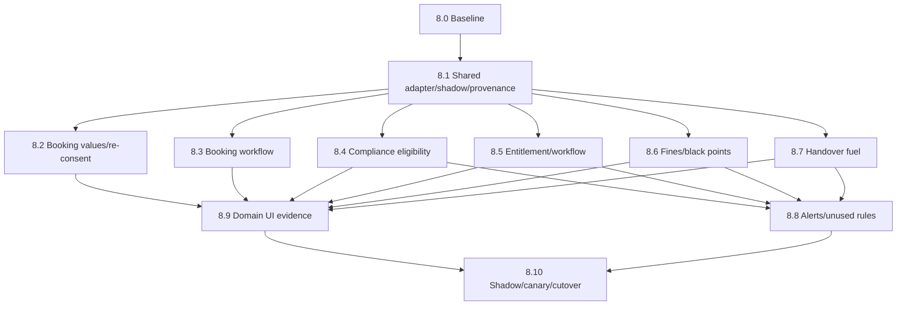

# Phase 8 - Domain PEP Migration Sub-Plan

## Purpose

Migrate every domain policy-enforcement point and approval flow to the organization/scope-aware decision boundary with immutable provenance, shadow parity, controlled cutover and rollback. No consumer is complete merely because it calls `PolicyEvaluatorService`; completion requires authoritative facts, scope/effective time, typed failure handling, persisted lineage, parity evidence and operating controls.

## Current source truth

- O4/O6 organization scope and ancestry resolution are available.
- Ten production decision calls remain distributed across Booking, Compliance, Entitlement, Fines and Handover.
- Approval workflows are runtime-built and not pinned to immutable workflow-definition versions.
- Several advisory thresholds still have hardcoded fallback behavior.
- Domain provenance is inconsistent: booking has an unverified JSONB work-in-progress; eligibility has one version string; entitlement combines decisions; fines/handover lack complete lineage.
- No shared shadow-comparison/selector adapter exists.
- Migration `0023_booking_policy_provenance` and BookingService edits are present but unverified; Sub-phase 8.0 owns accepting, repairing or reverting them.

## Mandatory phase loop

Every sub-phase follows: implement -> focused/full verification -> independent adversarial critique -> fix critical/high findings -> update this package and repository memory -> automatically start the next sub-phase.

## Sub-phase map

| Sub-phase | File | Outcome | Depends on |
| --- | --- | --- | --- |
| 8.0 | [00-baseline-and-worktree-reconciliation.md](00-baseline-and-worktree-reconciliation.md) | Current edits, consumers, contracts and golden behavior frozen | O6 |
| 8.1 | [01-shared-decision-adapter-provenance-and-shadow.md](01-shared-decision-adapter-provenance-and-shadow.md) | Shared scoped decision adapter, selector, comparison and provenance contracts | 8.0 |
| 8.2 | [02-booking-value-and-reconsent-decisions.md](02-booking-value-and-reconsent-decisions.md) | Buffer, duration and re-consent migrated without silent fallback | 8.1 |
| 8.3 | [03-booking-approval-workflow-migration.md](03-booking-approval-workflow-migration.md) | Booking route decision and immutable workflow definition pinned | 8.1, workflow foundation |
| 8.4 | [04-compliance-and-eligibility-gate.md](04-compliance-and-eligibility-gate.md) | Authoritative fail-closed eligibility with structural hard-block boundary | 8.1 |
| 8.5 | [05-entitlement-and-approval-workflow.md](05-entitlement-and-approval-workflow.md) | Separate eligibility/route provenance and pinned workflow | 8.1, workflow foundation |
| 8.6 | [06-fines-and-black-point-decisions.md](06-fines-and-black-point-decisions.md) | Event-time thresholds/timeframes, no hardcoded defaults | 8.1 |
| 8.7 | [07-handover-fuel-advisory.md](07-handover-fuel-advisory.md) | Advisory fuel decision with historical provenance | 8.1 |
| 8.8 | [08-alert-ladders-unused-rules-and-seeds.md](08-alert-ladders-unused-rules-and-seeds.md) | Missing consumers implemented or unused rules retired explicitly | 8.4-8.7 |
| 8.9 | [09-domain-ui-decision-evidence.md](09-domain-ui-decision-evidence.md) | EN/AR operational reason and trace presentation | 8.2-8.7 |
| 8.10 | [10-shadow-canary-cutover-and-legacy-removal.md](10-shadow-canary-cutover-and-legacy-removal.md) | Parity approved, canary/rollback proven, legacy paths removed | 8.2-8.9 |

## Dependency flow

## Program invariants

1. Resource organization/scope comes from persisted domain data, never request context.
2. Event-time domains evaluate at event time; interactive domains use the governed business effective time.
3. No domain side effect occurs during simulation/shadow/replay.
4. Structural controls cannot be weakened by policy.
5. Every persisted outcome records decision identity, version, requested/resolved scope, reasons, effective time and correlation.
6. Invalid typed results and fail-closed rules never silently substitute constants.
7. In-flight workflows remain pinned; migration is explicit and auditable.
8. Rollback changes selector/deployment, never rewrites domain history.

## Overall exit gate

Phase 8 completes only when all active consumers meet their sub-phase gates, all unexplained shadow divergence is zero, rollback has been rehearsed, UI evidence is approved, unused policies are retired or assigned, and direct legacy evaluator/runtime-built workflow paths are removed or covered by dated exceptions.
