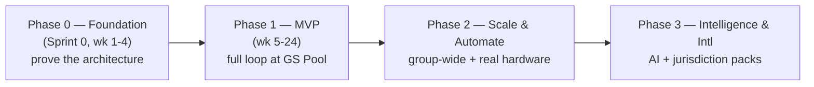
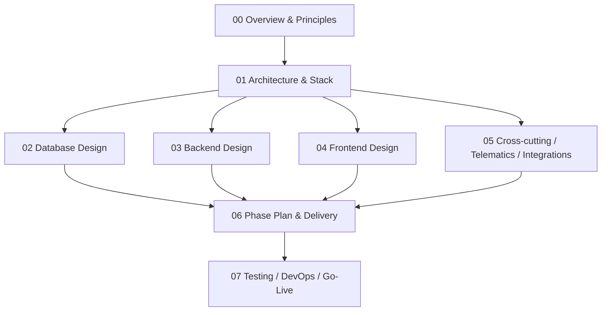

# 00 — Overview & Engineering Principles

**Companion to:** [`../startup-doccs/01_PROJECT_SUMMARY.md`](../startup-doccs/01_PROJECT_SUMMARY.md), [`../startup-doccs/10_AI_Agent_MetaPrompt_MasterBuild.md`](../startup-doccs/10_AI_Agent_MetaPrompt_MasterBuild.md)

---

## 1. What we are building (engineering framing)

A **group-wide fleet management platform** that replaces fragmented spreadsheets and email-driven approvals with one system where:

- an **employee** books a pool vehicle in under 2 minutes and signs mandatory digital consent;
- a **line manager** approves; a **fleet manager** hands the vehicle over and takes it back;
- a **Cluster CEO** governs dedicated-vehicle entitlements through a structured chain;
- every **fine, toll, and damage** is auto-attributed to the driver responsible at the time;
- **compliance** (registration/insurance/licence) is enforced with hard blocks and expiry ladders;
- **GPS telematics** (simulator-backed in Phase 1) drives a live map, auto-odometer, and trip auto-attachment;
- **operations** and **executives** see utilisation, cost, and risk through the same design language.

It is a **reusable project, not a SaaS product**: one deployment per organization (own database, own hosting). AD Ports Group is the first deployment; Phase 1 pilots at **GS Pool, Mina Zayed**, replacing "Vehicle Allocation in Mehwar".

## 2. The non-negotiable constitution (applies to every file we touch)

These override schedule pressure. If a change would break one, stop and fix the approach or escalate.

| # | Rule | Engineering consequence |
|---|------|--------------------------|
| C1 | **The booking path is sacred** | Telemetry parsing, OCR, exports, bulk migration run in a **different process** (`telematics-ingest`, workers). The `api` process only ever awaits I/O. Verified by an event-loop-lag metric. |
| C2 | **Rules live in the policy engine, never in code** | No booking buffer, approval chain, eligibility rule, or compliance ladder is a hard-coded `if`. It is a decision table the PDP evaluates. A build-time checklist + CI grep guard enforce this. |
| C3 | **The policy engine fails safe** | Unreachable PDP → `DENY` + escalate to a human. A hard block must never silently disable. |
| C4 | **Consent is a hard gate** | No signed, versioned, immutable consent record → no booking number, no allocation. No override at any role, including System Admin. |
| C5 | **Segregation of duties is structural** | The 8 SoD rules are enforced in the authorization layer, not by hiding a button. Each has an explicit test. |
| C6 | **The audit log is append-only and tamper-evident** | Every override, policy evaluation, consent, fine, and hard-block attempt is hash-chained. Nothing is deleted or silently updated. |
| C7 | **Telematics is a pluggable module, not a microservice** | `telematics-ingest` (the pipe) and the `telematics` domain module inside `api` (the meaning) are distinct. Business logic never lives in ingest. |
| C8 | **Phase 1 connects no physical hardware** | Telemetry comes from `SimulatorSource`, a permanent first-class `TelemetrySource`. Real sources are added later behind the same interface. |
| C9 | **One deployment per organization** | No active multi-tenancy. A single **dormant** `organization_id` column exists (ADR-008) but is never read/branched on by app code; a CI guard enforces this. |
| C10 | **One visual register everywhere** | Employee, fleet-manager, and executive screens use the same tokens, components, shell. No "dark control-room" theme. |
| C11 | **Every screen has a written spec first** | If a screen is not in `07_Page_Functional_Specifications.md`, add the spec before building it. |
| C12 | **Data migration is a managed capability** | Bulk import validates, deduplicates, and requires steward sign-off before records go live. |
| C13 | **AI recommends; humans decide** (Phase 3) | No AI output auto-executes a blocking, disciplinary, or financial action. |
| C14 | **Business/legal/policy decisions are not ours** | Open decisions D1–D23 belong to Legal/HR/Finance/sponsor. Implement behind a named config point and escalate; never invent a value. |

## 3. The three things that cannot be retrofitted (protect above all else)

If the plan is compressed, protect these; everything else is a feature.

1. **Clean, self-contained module & schema boundaries** so the project re-deploys for another organization by configuration (FR-ARC-01) — one DB per org, plus the dormant `organization_id` seam (ADR-008).
2. **The N-level configurable hierarchy engine** (FR-ARC-02), deployed as Cluster → Pool → Location.
3. **All business rules in the policy engine, none in code** (FR-ARC-03) — plus the **substitution-attribution data model** (FR-SUB-01/02), present in Phase 1 so a month-one fine is never pinned to the wrong driver.

## 4. Delivery phases (engineering summary)

| Phase | Goal | Headline output |
|-------|------|-----------------|
| **0 — Foundation** | Prove the architecture before any feature screen | 3 deployables to `dev`, Entra auth + RBAC/SoD + hash-chained audit, PDP (2 rule types), `telematics-ingest` skeleton with `SimulatorSource`, **the load test passing with simulator data** |
| **1 — MVP** | The complete accountability loop, live at one pool, GPS via simulator | 10 modules (M1–M10), consent gate, hard blocks, live map/auto-odometer/trip-attach, dashboards; all controlled go-live gates pass |
| **2 — Scale & Automate** | Group-wide rollout + automate manual steps + first real hardware | W1–W10: rollout, advanced telematics + `AggregatorSource`/`DirectVendorSource`, mobile app + offline, OCR fuel, tolls, replacement/substitute UI, vendor/lease, behaviour scoring, payroll recovery + break-glass + recurring + public API v1 |
| **3 — Intelligence & International** | Turn accumulated data into recommendations; go international | W1–W8: AI optimisation, predictive maintenance, anomaly/fraud, driver risk, AI copilot, CV damage comparison, ESG, jurisdiction packs + policy simulation |

Each phase ships independently and is valuable alone. **Phase 1 is a working booking + accountability platform; Phase 2 automates it; Phase 3 makes it intelligent.**

## 5. Scope guardrails (what we do NOT build)

Out of scope (validated only, integrated not replaced, or reporting-only): heavy equipment (cranes/RTGs — EAM), fixed-route shuttle buses, driver-licence issuance, physical workshop execution, Oracle finance modules, payroll execution (we raise recovery instructions; payroll executes). Equipment/buses may exist in inventory for cost reporting but never in a bookable pool.

## 6. How the plan documents relate

Read 01 next: [Architecture & Technology Stack](01_Architecture_and_Tech_Stack.md).
