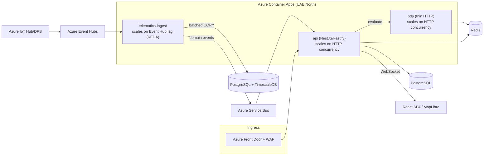
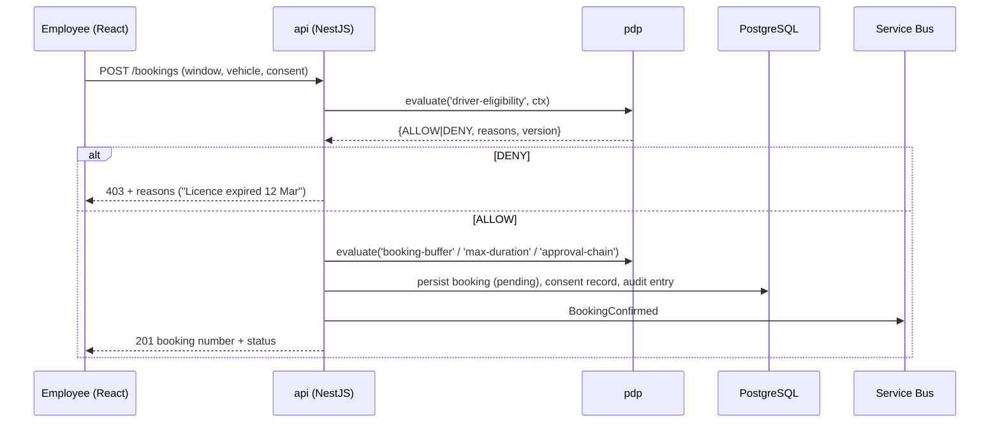

# 01 — Architecture & Technology Stack

**Companion to:** [`../startup-doccs/08_Development_Approach_and_Implementation_Plan.md`](../startup-doccs/08_Development_Approach_and_Implementation_Plan.md)

---

## 1. Technology stack — proposed baseline

Every row remains proposed until its ADR is approved. After approval, substitutions require a superseding ADR.

| Layer | Choice | Notes |
|-------|--------|-------|
| Cloud | **Azure — UAE North (Dubai) only** | Data residency policy; Entra + Oracle Fusion are cloud-to-cloud. |
| Backend | **NestJS + TypeScript 7** on the **Fastify** adapter, compiled directly with **SWC CLI** | Direct SWC compilation avoids Nest CLI's TypeScript 7.0 compiler-API preflight while `tsc --noEmit` remains the strict type gate. |
| Frontend | **React 19 + TypeScript 7 + Vite 8** | Shared Zod schemas/types with backend via `contracts/`; use current stable releases and validate upgrades through the full pnpm gate. |
| UI components | **Tailwind CSS + shadcn/ui (Radix primitives)** | Owned/copied-in, accessible-by-default, token-themed (global standard); **light + dark** and **English + Arabic (RTL)** first-class. |
| i18n | **react-i18next** (English + Arabic, RTL) | Locale-aware `Intl` formatting; logical-property layout mirrors automatically. |
| Database | **PostgreSQL** (Azure Flexible Server) + **TimescaleDB** + `pgcrypto` | One engine to operate; Timescale hypertables for telemetry. |
| ORM | **Drizzle ORM** (+ Drizzle Kit migrations) | Raw-SQL control is required for hash-chain triggers, exclusion constraints, Timescale DDL and batched COPY. |
| Cache / jobs | **Azure Cache for Redis** + **BullMQ** (sandboxed processors) | PDP/eligibility cache, job queues, Socket.IO adapter. |
| Eventing | **Azure Service Bus** (domain events) + **Azure Event Hubs** (telemetry ingress) | Different shapes, different tools — never conflated. |
| CPU-heavy work | **Piscina** worker pool — inside `telematics-ingest` only | Real OS threads; never in `api`. |
| Compute | **Azure Container Apps** + KEDA | Not AKS unless a future ADR justifies it. |
| Realtime | Nest WebSocket gateway + **Redis adapter** (Socket.IO) | Live fleet map, booking status. |
| Maps | **MapLibre GL** (client) + **Azure Maps** (tiles + Route Directions) | Route Directions also drives the simulator. |
| Identity | **Microsoft Entra ID** (OIDC via MSAL / `passport-azure-ad`) | MFA for elevated roles. |
| OCR (P2) | **Azure AI Document Intelligence** (async submit-and-poll) | Never awaited in a request handler. |
| IoT / simulation | **Azure IoT Hub + DPS**, consumed via the Event-Hubs-compatible endpoint | Device-realistic simulation for the pilot. |
| Observability | **OpenTelemetry → Application Insights** + event-loop-lag custom metric | One trace view across deployables. |
| Validation | **Zod** (+ `nestjs-zod`) | One schema serves API DTOs, React forms, and PDP rule-type input schemas. |
| Logging | **nestjs-pino** | Structured, low overhead. |
| IaC / CI | **Bicep** + **GitHub Actions with OIDC federated credentials** | Proposed Azure-native baseline; no stored cloud secrets in CI. A different IaC tool requires an approved ADR before scaffold. |
| Boundaries | **dependency-cruiser** in CI | Enforces module import rules without an Nx workspace. |

**Package management:** pnpm 11.13.1 is the sole package manager for the root workspace, `app-api`, and `app-ui`. The root `pnpm-lock.yaml` is authoritative; npm/yarn/bun lockfiles are prohibited. Direct dependencies stay on current stable releases unless an upstream peer/runtime incompatibility is documented and covered by a revisit condition.

## 2. One project, three (Phase-1) deployables

**One repo, one `package.json`, one build, three entrypoints, three Dockerfiles, three Azure Container Apps.** Shared types are a plain import — no workspace, no version drift. What differs is which modules each entrypoint composes and **which event loop bears the load**.



| Deployable | Type | Scales on | Must never |
|------------|------|-----------|------------|
| `api` | Nest HTTP (Fastify) | HTTP concurrency | do CPU-bound work |
| `pdp` | Nest HTTP (thin) | HTTP concurrency | perform unbounded I/O or execute business side effects |
| `telematics-ingest` | Nest standalone context (no HTTP) | Event Hub consumer lag (KEDA) | serve user traffic or contain business rules |

**Why split:** one Node process has one JS execution thread. Same-process, 40ms of GPS parsing blocks the 500ms eligibility gate; separate processes, ingest saturates its own loop while `api` answers in ~12ms. Three layers of parallelism (replicas via KEDA, threads via Piscina inside ingest, processes for latency isolation) — none contradicts one-loop-per-process.

Phase 2 adds a fourth deployable, `ocr-worker` (rides inside ingest in Phase 1; its own Container App at Phase 2 volume).

## 3. Repository layout (monorepo, greenfield)

`<app-slug>-api/` (backend, three entrypoints) and `<app-slug>-ui/` (frontend) are naming-neutral placeholders. Target backend layout:

```
<app-slug>-api/
  src/
    contracts/               # Zod schemas + canonical telemetry schema (shared, imported by api/pdp/ingest and generated into UI types)
    modules/
      platform/              # identity, RBAC + SoD guard, hierarchy, audit
      policy/                # the PDP (decision tables, evaluator, decision log)
      workflow/              # approval chains, delegation, escalation timers
      vehicles/              # vehicle master + document vault
      bookings/              # booking, waitlist, consent sequencing
      entitlements/          # dedicated-vehicle requests, eligibility, Cluster CEO chain
      handover/              # handover/return, damage capture, key log
      compliance/            # compliance alerting engine, eligibility gate, hard blocks
      fines/                 # fines/black points/accidents, attribution, recovery, substitution model
      migration/             # bulk import, validation, dedup, steward sign-off
      telematics/
        ingest/              # Event Hubs consumer, TelemetrySource adapters, Piscina pool, Timescale writer  (runs in telematics-ingest)
        domain/              # trip→booking attach, unplug alerts, odometer conflict, device registry (runs in api)
    main.ts                  # boots HTTP api
    main.pdp.ts              # boots pdp (thin HTTP)
    main.ingest.ts           # boots standalone telematics-ingest — NO HTTP server
  Dockerfile.api  Dockerfile.pdp  Dockerfile.ingest
  drizzle/                   # schema + migrations (checked in, run in CI)
  test/                      # integration + e2e (Supertest, Testcontainers)
```

Target frontend layout is in [04 — Frontend Design](04_Frontend_Design.md).

**Module boundary rule (dependency-cruiser, CI-enforced):** `telematics/ingest` must never import from `bookings`, `entitlements`, or `handover`. Each Nest module exports only its service; everything else lives in `internal/`.

```js
// .dependency-cruiser.js (illustrative)
{ name: 'ingest-must-not-import-request-path', severity: 'error',
  from: { path: '^src/modules/telematics/ingest' },
  to:   { path: '^src/modules/(bookings|entitlements|handover)' } }
```

## 4. The policy engine — PAP / PDP / PEP (the crown jewel)

The single mechanism that makes the platform reusable by configuration. Follows the industry-standard authorization/decision-service separation (XACML/ABAC + DMN decision tables).

| Component | Where | Responsibility |
|-----------|-------|----------------|
| **PAP** (Administration) | Admin studio (React, Phase 1 minimal) | Author rules as decision tables; submit → review → approve → effective-date. |
| **PDP** (Decision) | `pdp` deployable | The **only** component that interprets rules. Stateless. |
| **PEP** (Enforcement) | booking, entitlements, compliance gate, fines, workflow modules | Ask, then obey. Contain **zero** rule logic. |

**The one contract every rule type honours:**

```ts
evaluate(ruleType: string, context: object) => {
  decision: 'ALLOW' | 'DENY' | 'ROUTE_TO' | 'VALUE',
  reasons: string[],          // machine-readable reason codes → user-facing messages
  policyVersion: string,      // recorded on every transaction
  scopeThatAnswered: 'group' | 'cluster' | 'pool',
}
```

- Decision tables stored as **versioned, immutable JSONB** in Postgres; evaluated **top-down, first-match-wins, mandatory default row**.
- Each rule type declares: **input schema** (a Zod schema in `contracts/`), **output contract** with reason codes, and a **safe-default fallback** (deny/escalate).
- Compiled rules cached in Redis; cache invalidated on version activation. A bounded Postgres read-through is allowed only on cache miss and must stay within the measured latency budget.
- **Every evaluation is logged** (minimized context fingerprint, decision, reasons, version) through a durable decision-log outbox. The caller persists the decision result and outbox record in the same transaction as the affected command; read-only evaluations use a dedicated append path.
- **No rules-engine library** (NRules/Drools/Camunda fight the versioning+audit model). Plain evaluation over JSONB + Zod is ~200 lines and ours.
- **Latency < 200 ms** (in the booking path); **fails safe** — unreachable PDP returns `DENY` + escalate.

**Phase 1 rule-type catalog (12, registered at MVP):** booking buffer · max booking duration · booking approval chain · entitlement approval chain · dedicated-vehicle eligibility · driver eligibility gate · compliance alert ladders · hard-block conditions · fines HR threshold · black-point transfer timeframe · consent re-consent tolerance · fuel deviation threshold. Later phases only **register new rule types** — the engine is never re-architected.

## 5. Telematics — the pipe vs. the meaning (never confuse)

| | `telematics-ingest` (separate process) | `telematics` domain module (inside `api`) |
|---|---|---|
| Split for | Runtime **latency isolation** | **Data locality** (joins with bookings/drivers) |
| Owns | `TelemetrySource` adapter, normalization → canonical schema, Piscina, batched Timescale COPY, emitting domain events | Trip→booking attachment, unplug/tamper alerts, odometer-conflict resolution (FR-HAND-11), device registry & pairing, online-status |
| Never | contains business rules or reads booking tables | does high-volume stream processing |

```ts
interface TelemetrySource {                 // the plug — in telematics-ingest
  start(onBatch: (points: CanonicalPoint[]) => void): void;
  stop(): void;
}
class SimulatorSource   implements TelemetrySource {} // Phase 1 — permanent, first-class
class AggregatorSource  implements TelemetrySource {} // Phase 2 — flespi/equiv.
class DirectVendorSource implements TelemetrySource {} // Phase 2 — direct vendor API
```

Swapping the source is a **config change**; the domain module only ever consumes canonical events off Service Bus. This is the "plug-and-play" promise delivered by an interface, not infrastructure. Graduates to a standalone microservice only if decision **D23**'s trigger fires.

## 6. Data flow (booking + telemetry)



Telemetry: `SimulatorSource`/IoT Hub → Event Hubs → `telematics-ingest` (Piscina normalize → batched COPY to Timescale → emit `TripEnded`/`DeviceSilent`) → `api` `telematics/domain` (attach trip to booking, raise unplug alerts) → Postgres → SignalR → live map.

## 7. Architecture Decision Candidates

All entries below have status **Proposed** until individual ADR files record options, decision owner, approval, consequences, and revisit condition.

| ADR | Status | Decision candidate | Rationale |
|-----|--------|--------------------|-----------|
| ADR-001 | Proposed | One project, three deployables (`api`, `pdp`, `telematics-ingest`) | Latency isolation without distributed-monolith cost |
| ADR-002 | Proposed | Drizzle over Prisma | Hash-chain triggers, exclusion constraints, Timescale DDL and batched COPY need raw-SQL control |
| ADR-003 | Proposed | Build the PDP; don't buy a rules engine | Versioning + audit requirements need a measured proof-of-concept before approval |
| ADR-004 | Proposed | One deployment per organization; no active multi-tenant/RLS machinery | Simpler runtime isolation; reusability comes from the configurable core |
| ADR-005 | Proposed | Isolate CPU-bound work from the request path | The <500ms gate and <200ms PDP depend on protecting Node's event loop |
| ADR-006 | Proposed | Telematics = pluggable module with swappable `TelemetrySource`, not a microservice | Avoids splitting trip↔booking joins while retaining source substitution |
| ADR-007 | Proposed | Simulator-first: `SimulatorSource` is a permanent first-class source | Pilot needs no hardware; doubles as load generator and demo source |
| ADR-008 | Proposed | Dormant `organization_id` on core tables; RLS deferred | Preserves a future migration path without enabling active multi-tenancy |
| ADR-009 | Proposed | Org **hierarchy nodes** (Cluster/Pool/Yard) are a first-class **entity** (`hierarchy_node`, `ltree`); the **level taxonomy** and all pick-lists are **lookups**. Business logic branches on stable **`code`**, never label/UUID; scopes are never stored in the generic lookup table; labels are never resolved on the authz/booking hot path. | Keeps the security/roll-up tree typed, indexed and join-free on the hot path while making levels, nodes and pick-lists fully data-configurable + bilingual per org (protects performance, scalability, reusability; avoids polymorphic-lookup complexity). Governs [Sub-Phase 1A₂](../05-implementation/backend-db-implementation-plan/phase1/01b_sub-phase-1a2_lookup-and-user-management.md). |

Next: [02 — Database Design](02_Database_Design.md).
