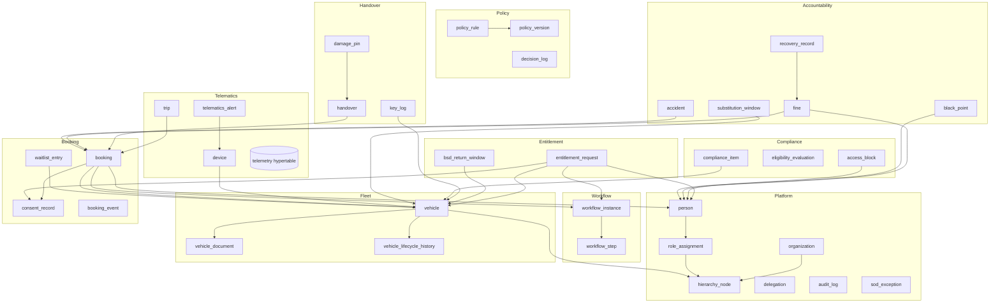

# 02 — Database Design

**Companion to:** [`../startup-doccs/03_Phase1_MVP_PRD_ADPorts.md`](../startup-doccs/03_Phase1_MVP_PRD_ADPorts.md) §5 (data model), [`../startup-doccs/08_Development_Approach_and_Implementation_Plan.md`](../startup-doccs/08_Development_Approach_and_Implementation_Plan.md) §5

**Engine:** PostgreSQL (Azure Flexible Server) + TimescaleDB + `pgcrypto`. **ORM:** Drizzle. **Migrations:** Drizzle Kit, checked in, forward-only, run in CI. One database per organization.

---

## 1. Conventions

- **Schema:** all app tables under the naming-neutral `fleet` domain schema (telemetry hypertable may live in `telemetry`).
- **Primary keys:** `uuid` (`gen_random_uuid()` from `pgcrypto`), column `id`.
- **Timestamps:** `created_at_utc timestamptz NOT NULL DEFAULT now()`, `updated_at_utc timestamptz NOT NULL DEFAULT now()` (trigger-maintained). Business time is always UTC; UI localises to Asia/Dubai.
- **Money:** `numeric(14,2)` + `currency char(3) DEFAULT 'AED'`. Never floats.
- **Enums:** Postgres `enum` types for closed sets (lifecycle, statuses); lookup tables where values are org-configurable.
- **Soft state, not soft delete:** records move through lifecycle/status; nothing operational is hard-deleted (history + audit depend on it).
- **Dormant multi-org seam (ADR-008 / FR-ARC-01a):** seed one organization row with valid UUID `00000000-0000-4000-8000-000000000001`; every core entity table carries `organization_id uuid NOT NULL DEFAULT '00000000-0000-4000-8000-000000000001' REFERENCES fleet.organization(id)`. **RLS OFF. App code must not branch on this field.** A CI architecture rule rejects organization-dependent branching until a superseding ADR enables it.
- **Auditing:** every state-changing write emits an append-only, hash-chained `audit_log` entry (see §9) via a service-layer audit interceptor + DB trigger.

## 2. Domain map



## 3. Platform (M1)

### `organization` (dormant-seam anchor)
`id`, `name`, `code`, `default_currency`, `default_timezone`, `created_at_utc`. Single seeded row in Phase 1. The infrastructure/repository layer supplies its identifier; business modules never branch on it.

### `hierarchy_node` (FR-CLU-01/02 — N-level configurable tree)
| Column | Type | Notes |
|--------|------|-------|
| `id` | uuid PK | |
| `parent_id` | uuid FK → hierarchy_node | null at root |
| `level_index` | int | 0=Cluster, 1=Pool, 2=Location for AD Ports |
| `level_label` | text | "Cluster"/"Pool"/"Location" (config) |
| `name` | text | e.g. "Ports", "Khalifa Port Pool" |
| `path` | ltree / text | materialized path for fast roll-up/scope queries |
| `valid_from`, `valid_to` | timestamptz | supports restructure with historical integrity (FR-CLU-07) |

Indexes: `GIST(path)` (or `ltree`), `(parent_id)`. Configurable depth up to 5 levels.

### `vehicle_hierarchy_assignment` (effective-dated ownership/location)
`id`, `vehicle_id`, `node_id`, `assignment_kind` (OwningUnit/BookingPool/PhysicalLocation), `valid_from`, `valid_to`, `changed_by`, `reason`. A vehicle can have one active assignment per `assignment_kind`; an exclusion constraint prevents overlapping effective windows. Reports resolve ancestry from the assignment that was effective at the transaction timestamp, preserving history through hierarchy restructures. No vehicle column hard-codes a hierarchy depth or label.

### `person`
Employee/driver/professional-driver master, synced from Oracle Fusion HCM (I1). `id`, `hcm_employee_id` (unique), `full_name`, `email`, `grade`, `employment_status`, `licence_number`, `licence_expiry`, `line_manager_person_id` (FK self), `home_pool_node_id` (FK), `is_professional_driver`, `sponsor`, timestamps. Index `(hcm_employee_id)`, `(line_manager_person_id)`, `(licence_expiry)`.

### `role` + `role_assignment` (P2 — roles attach to a person *per scope*)
`role` = closed set (Employee, Approver, Delegate, FleetManager, ClusterFleetLead, GroupFleetLead, ClusterCEO, Procurement, Finance, HR, InsuranceLead, HSE, InternalAudit, Executive, DataSteward, SystemAdmin). `role_assignment`: `id`, `person_id`, `role`, `scope_node_id` (FK hierarchy_node), `valid_from`, `valid_to`. **A person may hold multiple roles at multiple scopes.** Unique `(person_id, role, scope_node_id)`. This table backs both RBAC and the SoD guard.

### `delegation` (FR-DEL-01/02)
`id`, `delegator_person_id`, `delegate_person_id`, `request_type`, `valid_from`, `valid_to`, `one_hop_only bool DEFAULT true`. Expired delegations auto-return items to the delegator queue (worker).

### `sod_exception` (SoD-08)
`id`, `sod_rule_code`, `subject_person_id`, `approver_person_id`, `reason`, `linked_entity_ref`, `created_at_utc`. Every SoD override is a row here **and** an `audit_log` entry; also surfaced in the standing exception report (FR-AUD-03).

## 4. Policy engine (M1 / P3)

### `policy_rule`
`id`, `rule_type` (e.g. `driver-eligibility`), `scope_node_id` (group/cluster/pool for inheritance FR-POL-04), `status` (Draft/InReview/Approved/Active/Superseded), `effective_from`, `effective_to`, `created_by`, `approved_by`.

### `policy_version` (immutable JSONB decision tables — FR-POL-02)
`id`, `policy_rule_id` FK, `version` (int, monotonic), `decision_table jsonb` (ordered rows: conditions → outcome + reason codes, mandatory default row), `input_schema_ref`, `activated_at`, `superseded_at`. **Insert-only.** Activation creates a new version and invalidates the Redis compiled-rule cache.

### `decision_log` (FR-POL-05 — every evaluation)
`id`, `rule_type`, `policy_version_id`, `context jsonb`, `decision`, `reasons text[]`, `scope_that_answered`, `evaluated_at_utc`, `correlation_id`, `subject_ref`. Append-only; joins the audit trail so Internal Audit can reconstruct why any transaction was allowed/denied/routed. High-write → consider a Timescale hypertable in Phase 2.

## 5. Workflow (M1 / P4)

### `workflow_instance`
`id`, `workflow_type` (booking-approval, entitlement-approval), `subject_ref` (booking/entitlement id), `current_step`, `status` (Pending/Approved/Rejected/Escalated/Expired), `created_at_utc`.

### `workflow_step`
`id`, `workflow_instance_id` FK, `sequence`, `assignee_person_id`, `decided_by_person_id`, `on_behalf_of_person_id` (delegation), `decision`, `reason`, `sla_due_at`, `decided_at`. Escalation deadlines create durable `scheduled_work` rows; BullMQ workers execute leased rows and the reconciler restores missed work.

## 6. Fleet master (M2) — the central data model (FR-INV, §5.2)

### `vehicle`
Six field groups (all mandatory at onboarding unless marked optional). Represented as typed columns; enums for closed sets.

| Group | Columns |
|-------|---------|
| **Identity** | `id`, `plate` (unique @ org), `chassis_vin` (unique), `make`, `model`, `year`, `colour`, `body_type` (Sedan/SUV/Van/Pickup/Bus/Equipment), `use_category` (Executive/Operations/Pool/VIP/Dedicated), `seating_capacity`, `fuel_type`, `fuel_efficiency_kmpl` |
| **Commercial** | `ownership` (Owned/Leased), `purchase_or_lease_start`, `lease_end`, `purchase_cost`/`monthly_rental`, `currency`, `vendor_id` (FK vendor — P2), `lease_contract_ref`, `early_offhire_penalty_terms`, `depreciation_rate` |
| **Compliance** | `mulkiya_number`, `mulkiya_expiry`, `insurance_provider`, `insurance_policy_number`, `insurance_expiry`, `insurance_coverage_type`, `salik_tag` (unique), `darb_tag` (unique), `fuel_card_number` |
| **Operational** | `lifecycle_status` (Active/InUse/UnderMaintenance/OffHirePending/Decommissioned/Sold/Transferred), `operational_status` (Reserve/Standby/VIPOnly/Quarantined/TemporaryHold/null), `booking_pool_flag`, `last_confirmed_odometer`, `next_maintenance_due`, `assignment_model` (Pool/Dedicated), `assigned_driver_person_id`; effective hierarchy ownership/location lives in `vehicle_hierarchy_assignment` |
| **Telematics (optional P1)** | `tracker_vendor`, `tracker_serial`, `sim`, `warranty`, `gps_status` (Installed/NotInstalled/Online/Offline/Faulty/UnderReplacement) |
| **Computed / reserved** | lifetime fines count/value, black-point + transfer status, lifetime accidents, days-off-road (materialized views or triggers); `organization_id` (dormant) |

Uniqueness (FR-INV-05) enforced at group level: `plate`, `chassis_vin`, `salik_tag`, `darb_tag`. Indexes: `(booking_pool_flag)`, `(mulkiya_expiry)`, `(insurance_expiry)`, `(assigned_driver_person_id)` plus active-assignment indexes on `vehicle_hierarchy_assignment(node_id, assignment_kind, valid_to)`. **Equipment & buses:** `body_type IN (Bus,Equipment)` ⇒ `booking_pool_flag=false` enforced by check/trigger (FR-INV-07/09).

### `vehicle_document` (FR-INV-06/08 — versioned attachments)
`id`, `vehicle_id`, `doc_type` (Mulkiya/Insurance/Lease/OffHire), `version`, `blob_url`, `issued`, `expiry`, `uploaded_by`, `ocr_proposed jsonb` (P2), `confirmed_by`. Blob in the documents storage account.

### `vehicle_lifecycle_history` / `vehicle_transfer` (FR-INV-06 / FR-CLU-03)
Append-only lifecycle + inter-node transfer log: `from_node`, `to_node`, `date`, `approver`, `reason`. Preserves node-as-it-was for historical reporting.

## 7. Booking (M4)

### `booking`
`id`, `booking_number` (unique, issued **only** on confirmation after consent), `employee_person_id`, `vehicle_id`, `booking_scope_node_id`, `window_start`, `window_end`, `reservation_start`, `reservation_end`, `reservation_policy_version_id`, `destination`, `purpose`, `passenger_count`, `status` (Draft/PendingApproval/Approved/Declined/Active/Completed/Cancelled/NoShow), `consent_record_id` (FK, **NOT NULL before number issued**), `policy_version_booking_chain`, `expected_fuel`, `is_recurring_parent` (P2), `created_at_utc`. `reservation_start/end` persist the PDP-expanded conflict window used at commit time; they are immutable after approval except through the controlled modify/extend transaction. Indexes: `(vehicle_id, reservation_start, reservation_end)`, `(employee_person_id)`, `(status)`, `(booking_number)`.

Migration 1 enables `btree_gist` and creates the structural overlap guard:

```sql
ALTER TABLE fleet.booking
  ADD CONSTRAINT booking_vehicle_reservation_no_overlap
  EXCLUDE USING gist (
    vehicle_id WITH =,
    tstzrange(reservation_start, reservation_end, '[)') WITH &&
  ) WHERE (status IN ('PendingApproval', 'Approved', 'Active'));
```

Booking create/modify/extend evaluates the buffer, writes its policy version and effective reservation range, and commits the booking, consent link, audit entry and outbox event in one transaction. A conflict returns HTTP 409. Existing approved future bookings retain the range and policy version used when approved; a later policy activation does not rewrite them.

### `waitlist_entry` (FR-BOOK-10/13)
`id`, `pool_node_id`, `employee_person_id`, `window_start/end`, `position`, `status`. Cancellation auto-allocates next eligible (consent captured before their number issues).

### `booking_event` (FR-BOOK-14 — feeds Phase 2 behaviour scoring)
Append-only: create/approve/modify/cancel/no-show/late-return/extension, with actor + timestamp. No-show/late-return captured from day one even though scoring is Phase 2.

### `consent_record` (M4/M9 — hard gate C4/FR-CON)
Postgres **pointer row** to the immutable Blob object: `id`, `subject_person_id`, `vehicle_category`, `window_start/end`, `policy_version`, `blob_url` (WORM container), `employee_id`, `signed_at_utc`, `ip`, `device`, `supersedes_consent_record_id`, `linked_booking_id`/`linked_entitlement_id`. **Insert-only.** Re-consent (FR-CON-03) creates a new record that references the record it supersedes.

### `consent_lifecycle_event` (append-only)
`id`, `consent_record_id`, `event_type` (Signed/Voided/Superseded/Expired), `reason_code`, `actor_person_id`, `at_utc`, `correlation_id`. Decline/cancellation appends `Voided`; re-consent appends `Superseded` against the previous record. Neither the pointer row nor WORM object is mutated.

## 8. Entitlements (M5), Handover (M6), Compliance (M7), Accountability (M8)

- **`entitlement_request`** (FR-DVR): `id`, `requester_person_id`, `request_type` (LongTerm/Temporary/WithDriver/WithoutDriver), `justification_category`, `justification_text`, `duration`, `start/end`, `location_node_id`, `business_unit`, `cost_centre`, `vehicle_id` (on allocation), `eligibility_result jsonb`, `consent_record_id`, `status`, `workflow_instance_id`. **`bsd_return_window`**: dedicated vehicle temporarily bookable during leave (proposed from HCM leave calendar, auto-reverts).
- **`handover`** (FR-HAND): `id`, `booking_id`, `phase` (Handover/Return), `odometer`, `fuel_level`, `gps_status`, `key_ref`, `signature_blob_url`, `condition_note`, `fuel_deviation_pct`, `at_utc`, `offline_captured bool`, `synced_at`. **`damage_pin`**: `handover_id`, **normalized** `x`/`y` (0..1 in SVG viewBox space — device/zoom-independent), `region_code` (e.g. `FL-DOOR`), `template_id` + `template_version` (body-type silhouette the pin was placed on), `description`, `photo_blob_url`, `state` (New/Existing/Resolved), `resolve_reason`. Normalized coords + region + template version keep marks portable across screens and directly comparable handover-vs-return and by Phase-3 CV (see [04 — Frontend Design](04_Frontend_Design.md) §13). **`key_log`**: per-vehicle key custody state (Cabinet/FleetManager/DriverBooking/Lost).
- **`compliance_item`** (FR-COMP-01): tracked expiry per vehicle/driver (Mulkiya, insurance, lease, Salik, Darb, fuel card, licence) with `next_alert_at`. **`eligibility_evaluation`**: append-only log of every "can this driver take this vehicle now?" decision. **`access_block`**: platform-wide driver blocks (e.g. overdue black-point transfer), `person_id`, `reason`, `raised_at`, `cleared_at`.
- **`fine`** (FR-FINE): `id`, `reference`, `datetime`, `location`, `amount`, `black_points`, `status` (Paid/Unpaid/Disputed), `authority`, `booking_id` (nullable), `attributed_person_id`, `attribution_basis` (Booking/AssignedDriver/Substitution). **`black_point`**: transfer status + timeframe (D9) + escalation. **`accident`**: full register + attachments + days-off-road. **`recovery_record`** (FR-FINE-07): Identified→Notified→Recovered/Waived + waiver reason/approver. **`substitution_window`** (FR-SUB-01/02 — **Phase 1 data model**): `vehicle_id`, `substitute_person_id`, `start`, `end`, `approver`, `reason`; fine/accident attribution honours it.

## 9. Tamper-evident audit (FR-AUD / C6)

Single append-only `audit_log` table, hash-chained per organization in a Postgres trigger:

```sql
-- row_hash = sha256(prev_hash || canonical_row_payload)
CREATE TABLE fleet.audit_log (
  id            bigserial PRIMARY KEY,
  organization_id uuid NOT NULL REFERENCES fleet.organization(id),
  at_utc        timestamptz NOT NULL DEFAULT now(),
  actor_ref     text NOT NULL,            -- person id or 'system'/'ai'
  action        text NOT NULL,            -- e.g. booking.confirm, sod.override, policy.evaluate
  entity_ref    text NOT NULL,
  before_json   jsonb,
  after_json    jsonb,
  reason        text,
  prev_hash     bytea,
  row_hash      bytea NOT NULL
);
```

- The insert trigger obtains `pg_advisory_xact_lock(hashtextextended(organization_id::text, 0))`, reads the latest hash for that organization, and computes `row_hash = digest(coalesce(prev_hash,'') || canonical_payload, 'sha256')` (`pgcrypto`). Transaction-scoped locking releases automatically on commit/rollback and prevents forks without a global cross-organization lock.
- `canonical_payload` uses an explicit versioned field order and normalized JSON representation. The verification job applies the same canonicalization version.
- **No `UPDATE`/`DELETE`** (revoked at role level). Internal Audit gets a read-only role + export (FR-AUD-02).
- A verification job recomputes the chain end-to-end (go-live gate + scheduled).

## 9.1 Durable events and critical work

- **`outbox_event`:** `id`, `aggregate_type`, `aggregate_id`, `event_type`, `payload`, `schema_version`, `correlation_id`, `occurred_at`, `published_at`, `attempt_count`, `last_error`. Written in the same Postgres transaction as the domain state and audit row; a dispatcher publishes to Service Bus and marks delivery.
- **`inbox_message`:** `consumer_name`, `message_id`, `received_at`, `processed_at`, `result`; unique `(consumer_name, message_id)` provides consumer idempotency.
- **`scheduled_work`:** `id`, `work_type`, `subject_ref`, `due_at`, `status`, `attempt_count`, `lease_until`, `last_error`. Approval deadlines, compliance evaluations and notification obligations are durable here. BullMQ is an execution accelerator; a reconciler re-enqueues due/leased-expired work from Postgres after Redis or worker failure.

## 10. Telemetry (M10)

### `telemetry` — TimescaleDB hypertable
Partitioned by time + `vehicle_id`. Columns: `time timestamptz`, `vehicle_id`, `device_id`, `lat`, `lon`, `speed`, `ignition`, `odometer`, `fuel_level`, `dtc_codes`, `device_health jsonb`. **Written via batched COPY** (never per-row inserts). Continuous aggregates + retention configured from day one so Phase 2 route-replay reads Phase 1 raw data retroactively.

### `device`, `device_pairing`, `trip`, `telematics_alert`
- **`device`** (FR-GPS-P1-02): asset record — serial, model, SIM, TDRA approval ref, firmware; survives vehicle transfers.
- **`device_pairing`**: assigns a source stream to a vehicle (simulated device in the pilot); unpair/re-pair audited.
- **`trip`** (FR-GPS-P1-05): ignition-on→off with polyline, `booking_id` (auto-attached), `unassigned bool`. Attached by the `telematics/domain` module (a join with bookings), never in ingest.
- **`telematics_alert`** (FR-GPS-P1-06): unplug/tamper/silence events; feed the misuse log (Phase 2 behaviour engine).

## 11. Consent & document object storage

| Store | Backing | Rule |
|-------|---------|------|
| Consent records | Blob **WORM/immutable** container + `consent_record` pointer | Never updated; time-based retention lock (duration per D7/D4). This is the technical guarantee behind "consent is immutable". |
| Vehicle docs, photos, signatures | Blob (ZRS prod), private endpoint | Versioned; lifecycle rule purges raw OCR uploads after parse + retention. |
| Event Hubs checkpoints | Blob container | Ingest consumer offsets. |

## 12. Indexing, retention & performance

- **Booking conflict/buffer** is the hottest path → `btree_gist` exclusion on `(vehicle_id, tstzrange(reservation_start, reservation_end, '[)'))` for active statuses, plus a supporting `(vehicle_id, reservation_start, reservation_end)` index.
- **Compliance ladders** → partial indexes on `mulkiya_expiry`/`insurance_expiry`/`licence_expiry` where not-expired.
- **Decision log & telemetry** are high-write → Timescale hypertables + retention/continuous aggregates.
- **Retention:** location data retention per **D4 (PDPL)** — configured, purpose-bound, access-logged; proven on simulated data before real data flows.

## 13. Migrations & data migration

- **Schema migrations:** Drizzle Kit, checked in, forward-only, reviewed like code, run in CI; never `synchronize: true`. `organization_id` present from migration 0 (inert).
- **Data migration (M3, FR-MIG):** `import_batch`, `import_row` (row-level status + reason), `dedup_candidate` (steward-resolved merge). Pre-commit validation (mandatory fields, formats, uniqueness, valid hierarchy/vendor refs); per-vehicle completeness score feeds the ≥98% KPI; **steward sign-off before records become operational** (mitigates Risk R5 High/High).

Next: [03 — Backend Application Design](03_Backend_Design.md).
