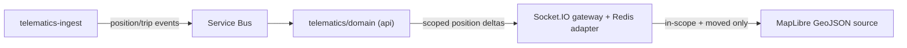

# 04 — Frontend Application Design

**Stack:** React 19 + TypeScript 7 + Vite 8, **Tailwind CSS 4 + shadcn/ui (Radix)**, TanStack Query, react-hook-form + Zod, MSAL, MapLibre GL, react-i18next, managed through the root pnpm 11 workspace. **Light + dark themes and English + Arabic (RTL) are first-class from Phase 1.** **Authoritative UI inputs:** [`../startup-doccs/06_UX_Design_System_v2.md`](../startup-doccs/06_UX_Design_System_v2.md) + [`../startup-doccs/07_Page_Functional_Specifications.md`](../startup-doccs/07_Page_Functional_Specifications.md). **Never invent a screen or a token** — build only what those specify.

---

## 1. Conventions (non-negotiable, from the design system)

- **One visual register everywhere** — employee, fleet-manager, line-manager, executive screens use the **same** light-first professional language, same card/table/chip/chart components, only density differs. No dark "control-room" theme (retired). No per-role accent/radius.
- **Every colour/space/radius/font comes from tokens** (design system §3). No hardcoded hex/px/font in a component.
- **The fixed App Shell is built once** and never rebuilt per screen; only the content area changes.
- **Status is never colour alone** — icon + label + position (glare, colour-blindness, printed handovers).
- **Blocks explain themselves** — a denial names the cause and the next action.
- **The 2-minute booking** is the performance/interaction budget for the core journey.
- **Every screen must already exist in the Page Functional Specifications**; if not, add the spec first (C11).
- **Component layer = shadcn/ui (Radix) + Tailwind CSS**, owned in-repo and themed entirely by the design tokens (mapped to shadcn CSS variables). Follow shadcn conventions (`components.json`, `cn()`, `class-variance-authority`). See §16.
- **Use shadcn primitives directly wherever they fit** — buttons, forms, tables, badges, alerts, cards, overlays, menus, command/search and navigation controls. Custom components are reserved for domain visualizations or composed workflow patterns and remain wrapped in shadcn surfaces.
- **Bilingual & bi-directional** — every screen works in **English (LTR)** and **Arabic (RTL)**; logical-property layout mirrors automatically. **Light + dark** is a token swap. First-class from Phase 1. See §16.
- **Ultra-modern = current global standard, clean and accessible** (shadcn/Radix), constrained to the design tokens — no neon, no ambient motion; micro-interactions respect `prefers-reduced-motion`.

## 2. Project structure (`<app-slug>-ui/`, greenfield placeholder)

```
<app-slug>-ui/
  src/
    app/
      shell/            # AppShell: fixed Header (64px) + Sidebar (240/72px) + content area
      routing/          # route table, guards (auth + role/scope), lazy routes
      providers/        # MSAL, QueryClient, theme (token) provider, i18n (EN/AR + RTL)
    design-system/
      tokens/           # CSS variables (design-system 3 layers) = shadcn theme vars, light + dark
      ui/               # shadcn/ui components owned in-repo (button, input, badge, table, dialog, drawer, popover, command, tabs, sonner, form, calendar…)
      components/       # composed: status chip, signal-bar card, stepper, banner (built on ui/ + tokens)
      patterns/         # DamageMap, VehiclePoolFinder, ApprovalEvidenceCard, PolicyDecisionTrace, OperationsTableMap, PoolRadar
    features/
      booking/ my-bookings/ approvals/ entitlements/
      handover/ fleet/ fines/ operations/ dashboards/
      compliance/ admin-policy/ migration/
    lib/
      api/              # typed client generated from contracts/ (shared with backend)
      auth/             # MSAL wrappers, token acquisition, role/scope claims
      scope/            # Scope Switcher state (user assignments → visible tree)
      hooks/            # TanStack Query hooks per resource
    i18n/               # react-i18next catalogs: en/, ar/ (RTL)
  tailwind.config.ts    # design tokens wired into the Tailwind theme
  components.json       # shadcn/ui config (paths, style, cn())
```

## 3. The App Shell (design system §4)

```
┌───────────────────────────────────────────────────────────────┐
│ HEADER (fixed 64px)  [Logo] [Scope Switcher ▾]  [Search] [🔔][?][Avatar▾] │
├──────────┬────────────────────────────────────────────────────┤
│ SIDEBAR  │ CONTENT AREA (scrolls; max-width 1280px centred)    │
│ 240px /  │  page header row (breadcrumb/title + primary action)│
│ 72px     │  page content                                       │
└──────────┴────────────────────────────────────────────────────┘
```

- **Header:** sticky, `--surface` + 1px border + backdrop blur on scroll; global search (`Cmd/Ctrl+K`); notifications slide-over; avatar (profile, theme toggle, sign out). Scope Switcher hidden for Employee.
- **Sidebar:** sticky under header; 240px expanded ↔ 72px icon rail (persisted); off-canvas drawer < 768px. Active item = filled icon + `--accent-soft` + left bar (never colour alone). **Contents generated from one role→nav-item table**, not per-role custom builds.
- **Content area:** the only region that varies per screen; page header row holds breadcrumb + single primary action.

## 4. Role- & scope-driven navigation (design system §5.1)

The sidebar is rendered from a single source-of-truth table (role × nav-item), the same matrix in the design system. Examples: Employee → Home/Book, My bookings; Fleet Manager → Handover, Fleet, Fines, Operations, Reports(pool); Cluster CEO → Approvals, Entitlements(decide), Reports(cluster); Executive → Reports(group); Data Steward → Data quality; Admin → Policy engine, Org settings. Every item also respects **scope**.

### The Scope Switcher (§5.2) — access-control boundary made visible
Header component whose options are **generated from the user's actual `role_assignment` scopes**, never a static list. Selecting a node (Cluster → Pool → Location tree, searchable) updates every scoped element on the page **in place** (skeleton, no full reload). Current selection shown as `Ports Cluster / Khalifa Port Pool ▾`. **No page ever queries outside the current scope + role** — the switcher's option list *is* the boundary, matching what the backend `AccessService` enforces.

## 5. State & data

- **Server state:** TanStack Query is the default — this app is almost entirely server state (bookings, vehicles, approvals, dashboards). Query keys include scope so a scope change refetches. Mutations invalidate affected keys; optimistic updates only where safe.
- **Client state:** minimal — Scope Switcher selection, theme, wizard step, unsynced offline captures (Phase 2). No Redux.
- **API client:** typed, generated from `contracts/` (shared with backend) so request/response types can't drift. Adds correlation id, auth token, and surfaces `reasons[]` from 403s as localised messages.
- **Realtime:** Socket.IO client for live map + booking status; subscriptions scoped to the current node.

## 6. Signature interaction patterns (design system §7 — build once, reuse)

All patterns are composed from the shadcn/ui primitives in `design-system/ui/` + design tokens (see §16); the custom-drawn ones (Damage Map, Pool Radar, Operations map) are canvas/SVG/WebGL wrapped in shadcn shells (cards, sheets, tabs) so they stay in one register.

| Pattern | Used by | Notes |
|---------|---------|-------|
| **Damage Map / Condition Capture** | Handover/Return | Top-down vehicle SVG by body type; tap-to-pin; each pin needs a photo before confirm; pins-pending-photo blocks confirmation; pinch-zoom on mobile, ≥44px targets. |
| **Vehicle & Pool Finder** | Booking, Fleet, inspector drill-down | Results grouped by Pool→Cluster hierarchy; filter chips (status/body/compliance); linked to Scope Switcher — never returns out-of-scope results. |
| **Approval Evidence Card** | Line-manager & Cluster CEO approvals | Fixed order: requester + track record → the ask → **system verdicts (full weight, not hidden)** → justification → attachments → decision controls. |
| **Policy Decision Trace** | Entitlement decisions, compliance blocks | Shows the matched decision-table row (others dimmed) + rule type + policy version + eval time in monospace. Always visible, never a tooltip. |
| **Operations Table & Map** | Fleet-lead / operations | Light-surface map (muted, **no decorative radar-sweep/glow** — the data-driven Pool Radar in §14 is distinct), status dots in the shared ok/warn/danger language, attention queue (ranked list + action), pool-load table. Same language as booking, only denser. |
| **Pool Radar (radial availability)** | Operations, Booking (optional) | Radial view of a pool's vehicles by status **ring** + category **sector**; hover/tap for details; one of three synchronized lenses (Radar · Map · List); SVG ≤ ~150 dots, WebGL/canvas beyond. See §14. |

## 7. Screens for Phase 1 (map to Page Functional Specifications + role table)

Each is a route slice: route loader/query, form/table/view, validation, a11y, loading/error/empty, tests. Built strictly from the page spec entry.

| Screen | Route | Actor(s) | Core content |
|--------|-------|----------|--------------|
| Book a Vehicle | `/book` | Employee | 4-step wizard: Window → Vehicle (Finder) → **Consent (inline, interruptive)** → Confirmed; buffer-aware availability; waitlist offer; eligibility banner if blocked. |
| My Bookings | `/bookings` | Employee | Upcoming/Active/Past; cancel/modify (re-consent if material), extend active, view consent record, download receipt. |
| Approvals | `/approvals` | Line Mgr, Cluster CEO | Queue + Approval Evidence Card decision panel with system verdicts. |
| Entitlement Decision | `/entitlements/:id` | Cluster CEO (decide), others (submit/view) | Eligibility evidence, approval chain, Policy Decision Trace, cost of the ask. |
| Handover & Return | `/handover` | Fleet Manager | Checklist, fuel gauge, odometer, **Damage Map**, signature pad; return reconciliation + fuel-deviation flag. |
| Vehicle Registry | `/fleet` | Fleet Mgr, Fleet Lead, Data Steward | Fleet vitals, filterable manifest (Finder), docked inspector, document vault, lifecycle/transfer. |
| Fines & Accidents | `/fines` | Fleet Mgr, HR(view) | Register, attribution + basis, recovery status, black-point transfer state, substitution windows. |
| Operations | `/operations` | Fleet Mgr, Fleet Lead | Three synchronized lenses — **Radar · Map · List** (§14) — over the in-scope pool's live vehicles (status, hover/tap details, exact GPS); attention queue; pool load. |
| Dashboards | `/dashboards` | Fleet Lead, Cluster CEO, Executive | Utilisation, cost (masked per role), compliance heat map, entitlement inventory, telematics coverage %, KPI tiles. |
| Consent Sheet | inline in `/book` step 3 | Employee | Full-attention, cannot be skipped; EN/AR; binds driver/category/window/policy version. |
| Data Quality Console | `/data-quality` | Data Steward | Import batch → validation report → resolve exceptions → sign off. |
| Policy Engine (PAP, minimal) | `/admin/policy` | System Admin | Author decision tables, submit→review→approve→effective-date, dry-run diff. |

## 8. Internationalization, theming & accessibility

- **Approved Phase 1 baseline:** English responsive UI plus mandatory Legal-approved EN/AR consent. Author components with logical CSS properties and translation keys so approved later languages do not require structural rework.
- **Proposed scope uplifts:** full Arabic/RTL UI and a user-selectable dark theme must not enter the Phase 1 committed backlog until Product/UX/Sponsor approve cost, translation ownership, test coverage and schedule impact. If not approved, retain the prepared architecture and defer feature delivery.
- **a11y:** WCAG 2.1 AA — semantic HTML + Radix primitives (accessible by default), full keyboard path, visible focus ring, status as text + icon (never colour alone), labelled icon-only controls, contrast floors (text ≥ 4.5:1, icons ≥ 3:1) verified with axe in CI (not assumed).

## 9. Performance budget (design system §9)

FCP < 1.5s (mid-range Android) · INP < 200ms · one variable display font + system body font · inline SVG icons (no icon font) · skeletons over spinners · `content-visibility: auto` on below-fold dashboard sections · route-level code splitting · booking page kept lean (the 2-minute journey). NFR: booking search < 2s (P95); dashboard first paint < 4s.

## 10. Auth (MSAL)

Entra sign-in via MSAL → API session token; role + scope claims drive nav generation and route guards on the client (defence-in-depth; the backend `AccessService` is the real boundary). MFA enforced by conditional access for elevated roles. Dev-login mode available locally.

## 11. Offline (Phase 2, designed-for now)

Handover/return must work in yards with poor coverage. Phase 1 performs a GS Pool coverage survey and keeps data shapes idempotent/offline-ready. If the survey fails the agreed coverage threshold, Product/Operations must approve either a connected handover station or a minimal Phase 1 offline capture change; otherwise IndexedDB capture, auto-sync and conflict review remain Phase 2.

## 12. GPS Tracking & Live-Map Visualization (deep design)

**Goal.** Show every in-scope vehicle's current location and current trip on a live map that stays smooth from ~50 pilot vehicles to the **5,000-vehicle** NFR target, on mid-range hardware, and **never** touches the `api` event-loop budget. Renderer + tiles are locked (doc 01): **MapLibre GL JS** (open-source WebGL vector rendering) + **Azure Maps** vector tiles + Route Directions, all UAE North.

### 12.1 The load-bearing decision — GPU layers, not DOM markers
The #1 map performance failure is one HTML/React marker per vehicle: at 5,000 vehicles that is 5,000 DOM nodes mutated every telemetry tick. Instead:

- Represent the whole fleet as **one GeoJSON source** (`FeatureCollection` of WGS84 points) drawn by **GPU layers** (`circle`/`symbol`) — thousands of vehicles render in a single WebGL pass.
- Update in place with `map.getSource('vehicles').setData(fc)`. **Never** recreate the map/source/layers per tick, and **never** hold positions in React state that re-renders the map container.
- Encode status with **`feature-state`** (`ok`/`warn`/`danger`, moving/idle) + data-driven style expressions — no re-tessellation on status change.
- **Cluster** at low zoom (`cluster: true`) so a group is one counted bubble; expands on zoom-in. The pilot (50) needs no clustering, but shipping it makes group-wide rollout free.
- DOM markers are used **only** for the single selected/inspected vehicle (rich popup), never for the fleet.

### 12.2 Realtime transport & cadence

- Transport: the existing **Socket.IO gateway + Redis adapter** (doc 03 §7). The map subscribes to a channel **scoped to the current hierarchy node** (Scope Switcher) — the server never streams vehicles the user cannot see (same boundary as `AccessService`; RBAC + PDPL).
- **Deltas only:** push only vehicles that moved since the last frame as a compact array `[{id,lat,lon,hdg,status,ts}]`; the client merges into the source. A full snapshot is sent only on (re)subscribe.
- **Cadence:** telemetry NFR is < 30s end-to-end; the socket coalesces to ~1 update/vehicle every few seconds, and the client **interpolates** between the last two points with `requestAnimationFrame` + easing so motion looks continuous with no extra traffic.
- **Viewport scoping (group-wide):** at cluster/group scope, constrain the subscription to the map's current **bbox + zoom**; debounce `moveend` (250 ms) before re-subscribing. Off-screen vehicles are not streamed.

### 12.3 Performance guardrails (mid-range Android, INP < 200ms)
| Technique | Why |
|---|---|
| GeoJSON source + `setData`; `feature-state` for status | GPU draw; no per-tick DOM/React work |
| `requestAnimationFrame` interpolation; cancel on hidden tab (Page Visibility API) | Smooth motion; ~zero CPU when not visible |
| Web Worker to parse/merge large delta batches | Main thread stays free for input (INP) |
| Debounced viewport re-subscribe; capped socket FPS | Bounded work regardless of fleet size |
| Server-side polyline simplification (Douglas–Peucker); raw stays in Timescale | Fewer vertices to draw; replay fidelity kept |
| `minzoom`/`maxzoom`, label collision, `symbol-sort-key` | Fewer symbols/labels at low zoom |
| `prefers-reduced-motion` → snap instead of animate | a11y + perf |

### 12.4 Semantics, design-system fit & accessibility
- Status is **icon + label + colour**, never colour alone (design principle 2); muted street basemap; **no radar sweep / glow rings** (anti-pattern §2.4). This is the **Operations Table & Map** pattern (design system §7.5) in the one light-first register.
- The map is **never the only view**: it is paired with the **operations table** (sortable, keyboard-navigable, screen-reader-friendly) listing the same in-scope vehicles + attention queue. Selecting a row focuses the marker and vice-versa — satisfies WCAG (a map alone is not accessible) and is faster for triage.
- Per-vehicle drill: click → inspector with plate (monospace), current trip, speed, ignition, driver, and a **"data as of"** timestamp.

### 12.5 Trips & route replay
- **Current trip (Phase 1):** a `line` layer from the active trip polyline (GeoJSON `LineString`, WGS84), extended as the trip grows.
- **Route replay (Phase 2, W2):** a scrubber replays Timescale raw trip points **retroactively** (so Phase-1 retention must be long enough — flagged in the Phase-2 critique); playback animates a marker along the simplified polyline while raw stays authoritative.
- **Geofence corridors (Phase 2, D21):** `fill`/`line` overlays; deviation is computed **server-side** and surfaced as attention-queue items, not client geometry math.

### 12.6 Privacy (PDPL — applied to simulated data too)
Live location is visible only to operational roles with a purpose; **every view is logged**; off-shift masking is configurable; a "data as of" timestamp is always shown; retention per D4. These controls are exercised on **simulated** location data in Phase 1 so they are proven before any real personal data flows.

### 12.7 Phase fit
Phase 1: live map + current-trip polyline + auto-odometer, driven by `SimulatorSource` (≥90% pilot-coverage gate). Phase 2: real hardware (source swap only — **no client change**, the map only consumes canonical positions off the socket), route-replay player, geofence corridors, harsh-driving overlays.

## 13. Vehicle Damage / Condition Capture (deep design)

**Goal.** Let a fleet manager mark scratches/dents on a top-down vehicle at handover and return — fast, on a yard tablet, with photo evidence — and store the marks so they stay meaningful on any screen and are directly comparable handover-vs-return (and by computer vision in Phase 3). This is the design-system **Damage Map / Condition Capture** pattern (§7.1); below is its technical realization.

### 13.1 The load-bearing decision — normalized coordinates + semantic region + template version
Do **not** store pins as pixels. Store:
- **Normalized coordinates** `x, y ∈ [0,1]` in the SVG **viewBox** space → resolution-, zoom-, and device-independent; the same pin renders correctly on a phone and a boardroom screen, and years later.
- A **semantic region code** (e.g. `FL-DOOR`, `RR-BUMPER`, `ROOF`, `WINDSCREEN`) from the SVG zone tapped → survives art refinements and is the anchor Phase-3 CV uses to align handover vs return.
- The **body-type template id + version** the pin sits on → pins stay interpretable if a template changes; CV compares like-for-like.

This trio (normalized xy + region + template version) is the standard way to keep annotations portable and comparable; pixel coordinates are the classic mistake.

### 13.2 Rendering & interaction
- **Inline SVG** top-down silhouette per body type (sedan/SUV/van/pickup/bus) — inline SVG only, no icon font. Zones are `<path>`s with region ids; pins are light overlay nodes positioned by `transform: translate()` from normalized coords.
- **Pointer Events** (unified mouse/touch/pen): tap to drop a numbered pin; **pointer capture** for drag-to-reposition; hit target ≥ 44 px even when the visible dot is smaller. Pinch-zoom on mobile is view-only — coordinate math stays in viewBox space so zoom never corrupts stored positions.
- Prior-handover damage renders as filled **danger** pins (read-only context); new pins render in **accent** until confirmed. A pin cannot be marked resolved/removed without a **reason** (audit).
- Only the dragged pin re-renders on pointer-move (not the whole list).

### 13.3 Photo evidence (mandatory, performance-friendly)
- Each **new pin requires a photo** before the handover can be confirmed (blocks confirmation — design-system state).
- **Client-side compression before upload:** resize via `createImageBitmap`/canvas to ~1600 px long edge, JPEG ~0.7 (typically <300 KB) so a weak-signal yard tablet still uploads quickly. **Strip GPS EXIF** (PDPL) but honour orientation.
- Upload out-of-band: API returns **202 + jobId** to Blob (documents account) without blocking the form; a thumbnail shows immediately from the local bitmap.

### 13.4 Signature & audit
Canvas signature pad (Pointer Events) stored to Blob with employee id, timestamp, IP, device. On confirmation the handover + pins + photos + signature become **immutable** (append-only; corrections are new records with a reason, never in-place edits).

### 13.5 Offline-first (yards)
Pins, compressed photos, and signature are captured to **IndexedDB** and auto-synced on reconnect with a fleet-manager conflict queue. Phase 1 web keeps these shapes offline-ready so the Phase 2 mobile app reuses them unchanged.

### 13.6 Accessibility
Keyboard alternative to tapping: pick a region from a labelled list + severity, dropping a pin at the region centroid. Each pin is a labelled, focusable element with a text description; a screen-reader summary reads "3 damage points: front-left door scratch (photo attached), …". Status is text + icon, never colour alone.

### 13.7 Phase-3 CV-readiness (built in now, no rework)
Because pins carry normalized coords + region code + template version and photos are captured consistently, Phase-3 computer-vision comparison can align return vs handover photo sets, propose new-damage candidates, and map each to a region — as an **advisory, human-confirmed** overlay on the same component. No later data migration.

**Data-model impact:** `damage_pin` stores normalized `x,y` + `region_code` + `template_id`/`template_version` (see [02 — Database Design](02_Database_Design.md) §8).

## 14. Pool Radar — interactive pool-availability visualization (deep design)

**Status: proposed UX pattern, not approved Phase 1 scope.** Build begins only after the UX owner adds it to the controlled design system/page specification and Product approves its cost and acceptance criteria. Until then, Map + List are the required Operations views.

**What it is.** When a pool is selected (Scope Switcher or a pool chip), the **Pool Radar** shows every vehicle in that pool as a dot on a **radial layout whose geometry encodes real data** — not a decorative sweep. It answers, in one glance, *“what is in my pool right now, and can I use it?”*. It is one of **three synchronized lenses** over the same live, scope-bound vehicle set:

- **Radar** — radial availability/status view (this section); best for a single site where exact geography matters less than “how many, what state”.
- **Map** — exact GPS location (§12); best for “where exactly is each vehicle”.
- **List** — the accessible, low-power operations table (sortable, keyboard/SR-friendly) and the default fallback.

A segmented control **Radar · Map · List** toggles the lens; selection, filters, and the detail card are shared, so switching never loses context.

> **Design-system reconciliation (deliberate, recorded).** The retired anti-pattern (§2.4) is the *decorative* neon “radar sweep + glow” of the old dark console. This Pool Radar is the opposite: a **data-driven radial chart** in the light-first professional register — rings/sectors/positions carry meaning, status uses the standard `ok`/`warn`/`danger` tokens as **icon + label + colour**, there is **no ambient sweep, no glow, no scanlines**, and motion respects `prefers-reduced-motion`. It must be added to `06_UX_Design_System_v2.md` as a new signature pattern (with a `07_Page_Functional_Specifications.md` entry) and signed off by the UX owner before build — documented, not silent.

### 14.1 What the geometry means (the information value)
Nothing on the radar is arbitrary — every channel is a real dimension:

| Visual channel | Encodes | Example |
|---|---|---|
| **Ring (radius from centre)** | Availability / readiness tier | inner→outer: **Available now** → **In buffer/cleaning** → **On trip / booked** → **Blocked** (expired docs, maintenance, black-point) |
| **Sector (angle)** | Vehicle category (or sub-location) | Sedan · SUV · Van · Pickup wedges |
| **Dot** | one vehicle | colour + icon + label = status; monospace plate on focus |
| **Centre** | the selected pool | live tally “12 / 30 available” + coverage % |
| **Dot spacing** | de-overlap only (not data) | force-collide keeps dots readable |

So a fleet manager instantly sees “inner ring empty → nothing free now; three vehicles in the outer ring → why blocked?” without reading a table. Filters re-flow the dots.

### 14.2 Interaction
- **Select pool** → dots animate to their ring/sector (or appear instantly under reduced-motion).
- **Hover (pointer) / tap (touch)** a dot → **detail card**: plate, make/model, status + reason, current booking/driver, fuel, odometer, GPS status, and actions **Book** · **View on map** · **Open handover**. Desktop = popover; mobile = **bottom sheet**.
- **Keyboard** → arrow-key roving focus between dots; Enter opens the card; same actions reachable.
- **Filter chips** (status, category, “available only”) re-run the layout.
- **“View on map”** switches to the Map lens focused on that vehicle (and back). The Booking flow's Vehicle step can embed the radar as an optional “pool at a glance”.

### 14.3 Rendering & libraries (proven, mobile-first, performance-tiered)
The standard pattern: **compute layout with D3, render with the cheapest sufficient technology, escalate to WebGL only when counts demand it.**

| Layer | Choice | Why |
|---|---|---|
| Layout | **D3 `d3-force` (`forceRadial` + `forceCollide` + light `forceManyBody`) + `d3-scale`/`d3-shape`** | Global standard for bespoke viz; radial force settles dots onto status rings without overlap. Deterministic seed → stable layout. Simulation **stops after settle** (no forever-loop → battery/CPU friendly). |
| Renderer ≤ ~150 dots (a pool) | **SVG** via **visx** (Airbnb's React + D3 primitives) | Crisp, accessible (each dot is real DOM → focus/aria), trivial hover; the pilot pool is ~30–50 vehicles, so SVG is ideal. |
| Renderer > ~150 dots (cluster/group radial) | **Canvas 2D, or WebGL via PixiJS** | GPU-drawn sprites handle thousands interactively on mobile; a quadtree hit-index maps taps to dots. Renderer swaps behind the same component API. |
| Map lens | **MapLibre GL (WebGL)** from §12 | Already touch-native and mobile-friendly. |

Escalation is automatic on dot count, so the pilot ships lean (SVG) and group-wide rollout is free (WebGL). All viz chunks are **code-split / lazy-loaded** so the radar/map JS never taxes the booking page's budget.

### 14.4 Live data
Same source as the map (§12): TanStack Query seed + **Socket.IO delta stream scoped to the selected pool** (RBAC/PDPL boundary). A status change animates a dot from one ring to another (reduced-motion → instant). Only in-scope vehicles are ever fetched or streamed.

### 14.5 Mobile behaviour (first-class)
- The radar is a **responsive square** sized by a container query; on phones it becomes the primary view, the legend collapses to a chip row, and the detail card is a **bottom sheet**.
- **Touch:** tap = select + card; long-press = quick actions; hit target ≥ 44 px (larger than the visual dot); no hover-only affordances; optional pinch-zoom for dense pools.
- **List is the default on very small / reduced-data devices** (fastest, most accessible); the user can switch to Radar/Map.

### 14.6 Accessibility
The radar is **never the only way** to the data — the synchronized **List** view is the equal-status alternative (mirrors the §12 map rule). Each dot is focusable with an aria-label (“SUV DXB-30541 — available, fuel 80%, GS Pool”); roving `tabindex`; a screen-reader summary reads the tally (“GS Pool: 12 available, 8 on trip, 3 maintenance, 2 blocked”); status is text + icon + colour with a colour-blind-safe palette; reduced-motion disables the settle animation.

### 14.7 Phase fit
If approved for Phase 1: Radar + Map + List on the **Operations** screen, driven by `SimulatorSource` positions/status; the same trio can enrich the **Booking → Vehicle** step. If not approved: deliver Map + List and retain Radar as a future enhancement. Phase 2+: real hardware feeds the selected views unchanged.

## 15. Mobile-first & responsive engineering (whole application)

**Commitment: every screen is responsive and usable on a phone from Phase 1** — not a shrunk desktop. The web app is touch-capable; native/offline capability remains Phase 2 unless the coverage decision approves a Phase 1 change.

- **Mobile-first CSS + container queries:** components are correct at any width (a card, the Vehicle Finder, the radar behave by *their* container, not just the viewport) — per design system §8.
- **Fluid everything:** `clamp()` type scale, fluid spacing, no fixed-pixel layouts; **touch targets ≥ 44×44 px** everywhere; visible focus rings for keyboard.
- **Shell on mobile:** header collapses to 56 px, the Scope Switcher becomes a compact label, the sidebar is an **off-canvas drawer** (hamburger) < 768 px.
- **Data-dense screens degrade gracefully:** tables become **stacked cards** < 768 px (never horizontal-scroll a data table except telemetry grids with a sticky first column); the 4-step booking stepper collapses to progress dots + current-step label; side-by-side panels (Approval Evidence Card, entitlement) **stack**.
- **Maps & radar are touch-native:** MapLibre gestures, radar tap/long-press, bottom-sheet detail cards; heavy viz is **lazy-loaded** and **WebGL/canvas-tiered** so mid-range Android stays in budget (FCP < 1.5s, INP < 200ms).
- **Field-readiness:** Phase 1 provides responsive web and idempotent sync-ready contracts. PWA installability and IndexedDB offline capture are proposed changes gated by the yard-connectivity decision; otherwise they remain Phase 2.
- **Verified, not assumed:** responsive + touch + a11y are tested with **Playwright device emulation** (phone/tablet viewports) and **axe** on every screen (doc 07); the design system's responsive rules (§8) are the acceptance bar.

## 16. UI foundation — Tailwind CSS + shadcn/ui, theming, and Arabic/RTL (deep design)

**Proposed implementation baseline.** The component layer is **shadcn/ui** (Radix primitives) styled with **Tailwind CSS**, themed by design-system tokens. Product/UX/Architecture must approve this choice before scaffold; the approval records accessibility, support, upgrade and design-token consequences. Components are copied into the repo, owned and auditable.

### 16.1 shadcn + Tailwind sit on the design tokens (no brand drift)
The design system's three token layers (06 §3) stay the source of truth; shadcn's theme variables are **mapped onto them**, so changing the brand hue re-themes every shadcn component with zero component edits.

| shadcn / Tailwind variable | Design-system token | Notes |
|---|---|---|
| `--background` / `--foreground` | `--bg` / `--ink` | page surface + text |
| `--card` / `--card-foreground` | `--surface` / `--ink` | cards, panels |
| `--muted` / `--muted-foreground` | `--surface-2` / `--ink-2` | table stripes, captions |
| `--primary` / `--primary-foreground` | `--accent` (harbor teal) / `--on-accent` | primary actions, active |
| `--secondary` / shadcn `--accent` | `--accent-soft` | soft highlights, selected rows |
| `--border` / `--input` / `--ring` | `--border` / `--border` / `--accent` | dividers, fields, focus ring |
| `--destructive` | `--danger` | destructive actions |
| `--radius` | 8px controls; cards use `rounded-xl` ≈ 14px | one radius family (06 §3.3) |
| `--ok` / `--warn` / `--danger` / `--info` (added) | fixed status semantics | **not** re-derived from brand (06 §2.1) |

- Tokens live once as CSS variables in `design-system/tokens/` and are wired into `tailwind.config.ts` (`theme.extend.colors` → `var(--…)`), so Tailwind utilities (`bg-primary`, `text-muted-foreground`, `border-border`) and shadcn components both read them.
- `components.json` points shadcn at the tokens + the `cn()` helper (`clsx` + `tailwind-merge`); variants use `class-variance-authority` (shadcn standard).
- Re-theme = edit Layer-1 tokens only (the 06 §2 “re-brand by one hue” contract holds); light/dark = the same variable names redefined under `.dark`.

### 16.2 Dark & light theme
- Class strategy: `class="dark"` on `<html>` (Tailwind `darkMode: 'class'`); a small `ThemeProvider` sets it from `localStorage` → else `prefers-color-scheme`; toggle in the avatar menu; an inline pre-hydration script sets the class before first paint (**no theme flash**).
- Every token has a light and dark value (06 §3.1); components are authored once and inherit. Dark mode is the muted design-system dark (surfaces lighten off near-black), **not** neon. Both themes are contrast-checked in CI.
- Maps/radar honour theme (MapLibre light/dark style swap; the radar reads the same tokens).

### 16.3 Component mapping (design-system inventory → shadcn primitives)
Built once in `design-system/ui/`, composed everywhere; all keep the designed states (hover, focus-visible, active, disabled, loading, error, empty) and icon+label status.

| Design-system element | shadcn / Radix building block |
|---|---|
| Button (primary/secondary/quiet/destructive) | `Button` (cva variants) |
| Inputs + inline validation | `Input`/`Textarea`/`Select` + `Form` (react-hook-form + Zod resolver) |
| Status chip (icon + label) | `Badge` (variant per ok/warn/danger/info) |
| Date-time range picker | `Popover` + `Calendar` (react-day-picker), locale/RTL-aware |
| Scope Switcher (searchable tree) | `Popover` + `Command` (cmdk) |
| Global search (⌘K) | `Command` dialog |
| Data table (sticky header, row actions) | shadcn `Table` + **TanStack Table** (sort/filter/virtualize) |
| Consent Sheet (interruptive) | `Dialog` (desktop) / `Drawer` (mobile bottom-sheet), focus-trapped |
| Toasts / inline banner | **Sonner** / `Alert` |
| Tabs — Radar · Map · List | `Tabs` or `ToggleGroup` |
| Detail popovers / inspectors | `Popover` / `Sheet` |
| Skeleton loaders | `Skeleton` |

Signature patterns (§6) — Damage Map, Pool Radar, Operations map — are **custom** canvas/SVG/WebGL (D3/visx/PixiJS/MapLibre) wrapped in shadcn shells so they sit in the same register.

### 16.4 Arabic + English, RTL-first
- **`react-i18next`** with `en` and `ar` catalogs (namespaced per feature); keys, not hardcoded strings; reason codes localised; pluralization + interpolation via i18next.
- **Direction:** `dir="rtl"` + `lang="ar"` on `<html>` for Arabic; Radix primitives are direction-aware; Tailwind uses **logical utilities** (`ps-*`/`pe-*`, `ms-*`/`me-*`, `text-start`/`text-end`, `start-*`/`end-*`) so the shell, sidebar, availability strip, radar labels and signal bars **mirror automatically** — no duplicated RTL CSS.
- **Type:** an Arabic family (e.g. IBM Plex Sans Arabic / Noto Kufi Arabic) declared in the same token slots as the Latin faces so the scale holds; monospace data (plates/IDs) stays LTR-embedded inside RTL text (`bdi` / `unicode-bidi: isolate`).
- **Formatting:** `Intl.NumberFormat`/`DateTimeFormat`/`RelativeTimeFormat` per locale; AED currency; numeral system per preference; dates keep the weekday (operational users think in days).
- **Scope-uplift gate:** full Arabic UI + RTL in Phase 1 remains proposed until Product/UX/Sponsor approve translation ownership, content review, RTL QA, accessibility coverage, schedule and budget. Logical-property and message-key readiness may be built without activating the uplift.

### 16.5 Performance & footprint
- Tailwind JIT emits only used utilities → tiny CSS (fits the 06 §6 < 30 KB critical budget); shadcn components are tree-shaken copy-in (only what is imported) — no monolithic component-library runtime; Radix is small and headless.
- Heavy viz stays lazy-loaded (§12/§14); the booking-page JS budget (< 50 KB) is held by code-splitting features + viz chunks. `font-display: swap`, preloaded variable Latin + Arabic display fonts; system UI stack for body.

### 16.6 Governance
This pins the **implementation** of the design-system component inventory (06 §6) to shadcn/ui + Tailwind while keeping the tokens (06 §3) as the source of truth — **no token values change**. Record the adoption + token map in `06_UX_Design_System_v2.md` and add `components.json` to the design-system kit; the UX owner ratifies.

Next: [05 — Cross-Cutting, Telematics & Integrations](05_CrossCutting_Telematics_Integrations.md).
