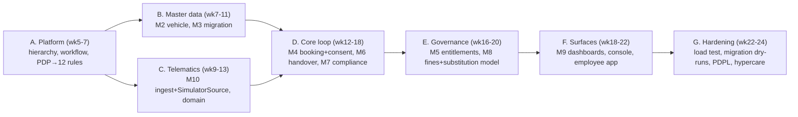

# 06 — Phase-by-Phase Delivery Plan

**Companion to:** [`../startup-doccs/08_Development_Approach_and_Implementation_Plan.md`](../startup-doccs/08_Development_Approach_and_Implementation_Plan.md) §8, [`../startup-doccs/03_Phase1_MVP_PRD_ADPorts.md`](../startup-doccs/03_Phase1_MVP_PRD_ADPorts.md), [`../startup-doccs/10_AI_Agent_MetaPrompt_MasterBuild.md`](../startup-doccs/10_AI_Agent_MetaPrompt_MasterBuild.md) §8.

**Sequencing principle:** order is dictated by **dependency**, not visibility. Foundations that cannot be retrofitted come first; feature screens come last within each phase. Weeks are indicative.

---

## Phase 0 — Foundation (Sprint 0, Weeks 1–4) · no user-facing release

**Goal:** prove the architecture before a single feature screen. Everything here is impossible to add cleanly later.

| Week | Deliverable | Acceptance |
|------|-------------|------------|
| 1 | Monorepo scaffold: `<app-slug>-api` (3 entrypoints, 3 Dockerfiles), `<app-slug>-ui` (Vite), `contracts/`, Bicep IaC for UAE North, CI pipeline, OpenTelemetry wired, `dependency-cruiser` boundary rule | All three apps deploy to `dev`; health probes green; traces visible in App Insights |
| 1–2 | Entra auth + RBAC + **SoD guard** + **hash-chained audit interceptor** | Integration test proves **SoD-01** (no self-approval); audit chain verifies |
| 2 | Postgres schema baseline via Drizzle migrations in CI; **dormant `organization_id`** on core tables; `pgcrypto`/`timescaledb` enabled | CI **grep guard** proves no app code references `organization_id`; migrations run forward-only in CI |
| 3 | **PDP** with 2 rule types (booking buffer, driver eligibility) + `decision_log` + Redis cache | `evaluate()` p95 **< 200ms**; PDP outage returns **DENY** (fail-safe test) |
| 4 | `telematics-ingest` skeleton with `SimulatorSource`, Piscina, batched Timescale COPY | **The load test (below) passes with simulator data** |

**Exit gate:** the load test passes; the four non-retrofittable foundations (clean boundaries + dormant seam, hierarchy engine skeleton, PDP-in-front-of-rules, hash-chained audit) exist and are tested. Do not start Phase 1 features until green.

### The load test (formal gate — re-run before every later go-live)
Replay a **5,000-vehicle telemetry burst** (~167 msg/s sustained, 10× burst) while driving `POST /bookings` and the eligibility gate at **500 concurrent users**.
**PASS =** eligibility gate p95 **< 500ms** · PDP p95 **< 200ms** · `api` event-loop p99 lag **< 10ms** · ingest consumer lag returns to zero within **60s** of burst end. Runs on Azure Load Testing; the simulated fleet is the generator.

### Critique & Gap Analysis (Phase 0)

> Two adversarial review passes over the Sprint-0 plan. Each finding is an engineering gap to close **before/during** Sprint 0. Severity: **H** = blocks the exit gate; **M** = must be scheduled; **L** = track.

**Round 1 — completeness & external dependencies**

| # | Gap / critique | Sev | Impact | Resolution / owner |
|---|---|---|---|---|
| P0-R1-1 | Azure provisioning (≥20 vCPU Container Apps quota, Event Hubs TUs, `timescaledb`/`pgcrypto` allowlist, WORM container) has lead time; Week 1 "deploy to dev" assumes it is done | H | Sprint 0 cannot deploy | Add a **Week 0 pre-flight**: raise all `09_Azure_Resource_Request` items + quota tickets before Sprint 0 (Platform Engineer) |
| P0-R1-2 | Entra app registrations, security groups, conditional-access (MFA) are external IT actions; auth work (Wk1–2) blocks on them | H | Auth/RBAC slips | Request app regs + groups in Week 0; ship a dev-login mode so build proceeds (Platform + Cybersecurity) |
| P0-R1-3 | The `organization_id` grep guard is undefined — migrations legitimately reference the column | M | False CI failures or a leaky guard | Define it as "no reference under `src/modules/**` except `drizzle/**`"; add an allowlist + a guard test |
| P0-R1-4 | No `dev` seed/reference data (hierarchy nodes, roles, a test person) — no integration test can run | M | SoD-01 test cannot be authored | Add a seed script as a Wk1 deliverable |
| P0-R1-5 | Event-loop-lag metric is wired but no alert threshold/dashboard is provisioned; acceptance only says "traces visible" | M | Regressions invisible until Phase 1 | Add the p99>10ms alert + latency dashboards to Sprint-0 DoD (SRE) |
| P0-R1-6 | The Wk4 load test runs against a 2-rule skeleton on a near-empty DB, so it passes trivially | M | Architecture "proven" on unrealistic data | Label the Wk4 run a **floor**; the binding run is Block G with real modules + migrated data |

**Round 2 — second-order & correctness**

| # | Gap / critique | Sev | Impact | Resolution / owner |
|---|---|---|---|---|
| P0-R2-1 | **Audit hash-chain concurrency:** `row_hash = sha256(prev_hash || payload)` needs serialized append; concurrent writes fork/duplicate the chain and the go-live chain-verification gate then fails intermittently | H | Tamper-evidence broken under load | Serialize appends (single-writer per chain via advisory lock / `SERIALIZABLE`); add a concurrent-write chain-integrity test in Sprint 0 |
| P0-R2-2 | PDP fail-safe test proves DENY on outage, but the **"+ escalate to a human"** half is untestable in Sprint 0 (no workflow until Block A) | M | Fail-safe only half-proven | Ship an interim escalation stub now; complete the escalation test in Block A |
| P0-R2-3 | `tsc --noEmit` whole-project gate (catches strict-null/tuple errors in specs that `jest`/`nest build` miss) is in doc 07 but not a Sprint-0 CI gate | M | Type errors ship in tests | Add `tsc --noEmit` as a required CI job in Wk1 |
| P0-R2-4 | No CI drift-check between `contracts/` and the generated UI types | M | Silent FE/BE contract drift | Add a "regenerate + git-diff must be clean" CI step |
| P0-R2-5 | Forward-only migrations are stated, but no compensating-migration pattern or migration-test harness is established | M | No safe prod schema rollback path | Establish the migration-test + compensating-migration convention in Sprint 0 |
| P0-R2-6 | Three envs on Dedicated-D4 + HA Postgres from day one with no budget alert as acceptance | L | Cost surprise | Wire budget alerts (70/90/100%) into Sprint-0 DoD |

---

## Phase 1 — Foundation MVP (Weeks 5–24) · GS Pool go-live

**Goal:** the complete accountability loop live at one pool, GPS via simulator, no hardware. **Governing doc:** `03_Phase1_MVP_PRD_ADPorts.md`.

### Block A — Platform (Weeks 5–7)
- **Build:** configurable N-level hierarchy engine (deployed Cluster→Pool→Location); shared workflow/approval engine (chains, delegation, escalation timers); extend the PDP from 2 → the **full 12 rule types**.
- **Each rule type ships with:** a Zod input schema, an output contract with reason codes, a safe-default fallback, and a decision-table test.
- **Acceptance:** all 12 rule types pass their decision-table tests and are logged in the decision log; workflow escalation timers fire (24h booking / 48h entitlement). **Do not start Block B until green.**

### Block B — Master data (Weeks 7–11)
- **M2 Vehicle master:** full data model (6 field groups), 7 lifecycle + 5 operational statuses, group-level uniqueness (plate/VIN/Salik/Darb), document vault (versioned), pool include/exclude, equipment/bus never bookable, event-publish on change.
- **M3 Data migration:** bulk import (CSV/XLSX), pre-commit validation, dedup with steward-resolved merge, reconciliation report + per-vehicle completeness score, **steward sign-off before operational**. (Mitigates Risk R5 High/High.)
- **Acceptance:** a real pilot inventory imports to ≥98% completeness with steward sign-off; uniqueness + lifecycle rules enforced.

### Block C — Telematics (Weeks 9–13)
- **M10:** `telematics-ingest` with `SimulatorSource`; `telematics/domain` (device registry & pairing, live map, auto-odometer, **trip auto-attach**, unplug alerts); GPS status enum mandatory; privacy guardrails on simulated data (access logged, retention D4, off-shift masking); source-outage resilience (gap detection + backfill).
- **Acceptance:** one simulated device per pool vehicle; live map + auto-odometer + trip auto-attach verified; unplug alert exercised via injected events; `TelemetrySource` swap-tested (simulator → stub aggregator) **with no domain change**.

### Block D — Core loop (Weeks 12–18)
- **M4 Booking:** web booking, availability/buffer, waitlist, **consent sequencing** (after selection, before submission), eligibility gate, unique number on confirmation, reminders, no-show/late capture, mid-trip extension.
- **M6 Handover & return:** verify booking+employee, odometer/fuel/GPS status/signature, return reconciliation + fuel-deviation flag (advisory), key log; offline-ready data shapes; odometer-conflict rule (telematics is system of record).
- **M7 Compliance engine:** expiry ladders, single eligibility gate (one truth), **hard blocks (no override)** on expired Mulkiya/insurance; every evaluation + block logged.
- **Acceptance:** end-to-end loop — book → consent → approve → handover → return → fine attributes to driver; zero bookings possible on expired documents; override attempts denied + logged.

### Block E — Governance (Weeks 16–20)
- **M5 Entitlements:** request types, eligibility pre-check (D8 decision table), justification, approval chain to **Cluster CEO**, driver consent before allocation, BSD leave return (from HCM calendar, auto-revert), utilisation/justification report.
- **M8 Fines & black points:** manual register, **auto-attribution** to the booking-active driver (else assigned driver, honouring substitution windows), fines-per-user + ≥3/12mo HR alert, accidents register, **black-point transfer** deadline + platform-wide block, minimal recovery record, **substitution-attribution data model (FR-SUB-01/02) present now** (UI Phase 2).
- **Acceptance:** entitlement runs through the Cluster CEO chain; a fine recorded against a substitution window attributes to the substitute; overdue black-point transfer blocks the driver platform-wide.

### Block F — Surfaces (Weeks 18–22)
- **M9 Dashboards** + fleet console + employee web app + basic executive view — **built strictly from** `06_UX_Design_System_v2.md` and `07_Page_Functional_Specifications.md`, one visual register, role/scope-driven nav, Scope Switcher.
- **Acceptance:** each screen matches its page spec; cost masking per role; KPI tiles live; visual review passes design-system anti-patterns (§2.4).

### Block G — Hardening (Weeks 22–24)
- Load/soak/failover with real modules; migration dry-runs; security-pipeline and penetration gates; **PDPL privacy review sign-off (D4)** for location data; timed RPO/RTO restore + outbox/DLQ replay drill; GS Pool UAT; sponsor go/no-go; training/support/continuity/rollback/hypercare readiness; KPI dashboard live from day one.

### Parallel non-engineering tracks (assign owners at kickoff — Risk R12 High/High)
These block the build and are outside engineering control; they belong on the critical path with named owners and dates.

| Decision | Blocks | Owner |
|----------|--------|-------|
| D7 consent wording (EN + AR) | all booking (consent gates every number) | Legal |
| D8 dedicated-vehicle eligibility policy | the entitlement decision table | Group HR / Cluster CEOs |
| D9 black-point transfer timeframe | the platform-wide driver block | Group HR / Legal |
| D13 recovery mechanism + waiver authority | recovery pipeline v1 | HR / Legal / Finance |
| D14 utilisation definition | every dashboard + right-sizing input | Group Services / Finance |
| D4 location-data residency & retention (PDPL) | **M10 go-live gate** | Cybersecurity / Legal |
| D3, D6, D12 | disciplinary steps, depreciation, re-consent tolerance | HR / Finance / Legal |
| D22 telematics device + ingestion (Phase 2 hardware) | Phase 2 procurement lead time | Procurement / D&T / Cybersecurity |

### Phase 1 go-live gates (all 11 must pass)
1. Inventory migrated, **≥98% complete**, steward signed off.
2. All GS Pool employees SSO-enabled; roles assigned; **SoD-01..08 verified by test**.
3. Consent wording (D7) approved + loaded **EN + AR**, incl. location-tracking notice.
4. Compliance **hard blocks proven** — zero vehicles bookable with expired documents; override attempts denied + logged.
5. Simulator drives **≥90%** of pool vehicles; live map + auto-odometer + trip auto-attach verified; unplug alert exercised; source contract/conformance tests pass.
6. **PDPL/security review (D4) signed off** for location data, sensitive-read audit and retention.
7. Load, soak, failover, security-pipeline and penetration tests pass defined thresholds.
8. Timed PITR/restore plus outbox/inbox, Service Bus DLQ and scheduled-work replay prove RPO ≤1 hour and RTO ≤4 hours.
9. GS Pool business UAT is signed; no open Sev-1/Sev-2 defect; lower defects have accepted treatment.
10. Sponsor, Business Service Owner, Security, Operations and Delivery sign go/no-go; rollback authority is named.
11. Legacy service is read-only; controlled offline continuity procedure, training, support, two-week hypercare roster and KPI dashboard are active.

### Phase 1 KPIs (instrument from day one)
Inventory completeness ≥98% · booking adoption ≥90% · entitlements in-platform ≥95% · booking approval cycle ≤4 working hours (median) · entitlement approval cycle ≤5 working days · **trips on expired Mulkiya/insurance = 0** · fines attribution ≥95% · black-point transfers within timeframe ≥95% · **telematics coverage (simulated) ≥90%** · **trips auto-attached ≥90%**.

### Critique & Gap Analysis (Phase 1)

> Two review passes over the MVP plan. Round 1 targets sequencing/scope integrity; Round 2 targets correctness, concurrency, and edge cases the first pass under-weighted.

**Round 1 — sequencing, dependencies & scope integrity**

| # | Gap / critique | Sev | Impact | Resolution / owner |
|---|---|---|---|---|
| P1-R1-1 | **Dependency inversion:** Block C (wk9–13) builds trip auto-attach (FR-GPS-P1-05) before Booking (Block D, wk12–18) exists, so it cannot be integration-tested until D | H | Trip-attach unverified for weeks; rework risk | Build attach behind a bookings port + test-double in C; full integration test at the start of D |
| P1-R1-2 | **Rules vs decisions:** Block A can build the engine, but 6 of the 12 rule *tables* need closed decisions (D8, D9, D12, D14, D3, D6) to hold real values | H | Rules built on placeholders; rework when decisions land | Split "engine complete" (Block A) from "tables populated + second-person approved" (gated on decisions); track per rule type |
| P1-R1-3 | **Consent hard-gate has no contingency:** if D7 (EN+AR wording) slips, all booking is blocked (C4 forbids override) | H | Whole go-live blocked | Escalate D7 with a dated deadline; pre-load a Legal-reviewed v0 to unblock *build* (not go-live) |
| P1-R1-4 | **Migration circularity:** the ≥98% go-live gate needs a cleansed dataset, but the cleansing sprint is only implied in Block G | H | Data not ready at go-live | Schedule the cleansing sprint in parallel with Blocks B–E; assign the steward at kickoff |
| P1-R1-5 | **Notification dispatcher is unowned** — M7 ladders and M4 reminders need it, but no block builds it | M | Alerts/ladders cannot deliver | Add the notification dispatcher (P9, Email/M365) explicitly to Block A/D |
| P1-R1-6 | **Business UAT requires controlled evidence** | M | Adoption/usability risk | Run a 1–2 week UAT with GS Pool users across Block F→G; sign scenario results and defect disposition |
| P1-R1-7 | **KPI reality at a single pilot pool:** cost-per-km and ESG need Phase-2 data; "basic executive view" is vague | M | Dashboard over-promises | Tag each Phase-1 KPI measurable-now vs Phase-2; scope M9 to the measurable set |

**Round 2 — correctness, concurrency & edge cases**

| # | Gap / critique | Sev | Impact | Resolution / owner |
|---|---|---|---|---|
| P1-R2-1 | **Double-booking race:** availability and commit must share one effective reservation range | H | Same vehicle double-booked | Persist PDP-expanded `reservation_start/end` + policy version; enforce `btree_gist` exclusion; concurrent create/modify/extend tests |
| P1-R2-2 | **Eligibility vs HCM freshness:** the gate reads employment/licence from HCM-synced data; stale sync could allow an ineligible driver, or an HCM outage could block everyone | H | Wrong allow/deny at the gate | Define an HCM freshness SLA; set the fail-direction (fail-safe = block + escalate); show "data as of" on the gate |
| P1-R2-3 | **Trip-attach ≥90% KPI is self-fulfilling:** a booking-aware simulator makes attach deterministic — it measures the simulator, not the algorithm | M | False confidence in attach accuracy | Add non-booking-aware / adversarial trips (drift, overlap, gaps) to the test set and measure against those |
| P1-R2-4 | **Substitution model has no Phase-1 entry point:** the data model ships but the UI is Phase 2 — "fleet manager records manually" has nowhere to record | M | Feature exists but unreachable; mis-attribution persists | Add a minimal admin/API entry for substitution windows in Block E, or document the interim process |
| P1-R2-5 | **Time-zone/DST correctness:** UTC storage + Asia/Dubai UI across booking windows, buffers, 24h/1h reminders, and days-before-expiry ladders invites off-by-hours bugs | M | Wrong reminders/expiry/edges | Add tz-boundary test cases; centralize conversion; document the rule |
| P1-R2-6 | **D4 (PDPL) timing vs Block C:** M10 privacy guardrails are built wk9–13 but D4 sign-off is a late gate — late changes force telematics rework | M | Rework of telematics privacy | Pull D4 to precede Block C; build to the decided policy, not a guess |
| P1-R2-7 | **Yard connectivity:** Phase-1 web handover on a tablet in a low-coverage yard, with offline deferred to Phase 2, may not complete | M | Handover unusable in the field | Validate GS Pool coverage; if poor, pull minimal offline capture into Phase 1 or provide a connected handover station |
| P1-R2-8 | **Post-go-live data correction** conflicts with append-only/audit + steward sign-off; no defined way to fix a bad migrated record | L | Ops friction after go-live | Define a corrective-entry pattern (new versioned record + audit reason), never in-place edit |

---

## Phase 2 — Scale & Automate (group-wide + first real hardware)

**Precondition:** Phase 1 KPIs met at GS Pool. **Governing doc:** `04_Phase2_Scale_Automate_ADPorts.md`. New rule types register on the **same** engine (toll recharge, behaviour weights, break-glass categories) — no re-architecture.

| WS | Workstream | Builds on |
|----|-----------|-----------|
| W1 | Group-wide rollout (onboard clusters/pools via M3 tooling; per-cluster policy config; entity champions) | M1–M3 |
| W2 | **Advanced telematics + real hardware** — swap `SimulatorSource` for `AggregatorSource`/`DirectVendorSource` (domain module untouched); route-replay player (reads Phase 1 raw trips retroactively); geofence corridors + deviation alerts (D21); harsh-driving signals; hardwired-TCU for buses/high-value | M10 |
| W3 | Mobile app (iOS + Android) — booking + consent + handover/return; **offline field capture with sync**; push + SMS | M4, M6 |
| W4 | Mobile damage capture (photos, annotations, digital acknowledgement) | M6 |
| W5 | Fuel automation — OCR/NLP invoice ingestion (confirm until ≥95%); Oracle AP path; fuel-card master + misuse flags | M2 cost fields |
| W6 | Toll management — Salik/Darb ingestion (statement fallback); auto-attribution honouring substitution windows; recharge policy (D19) | M8 attribution model |
| W7 | Replacement & substitute **self-service UI** (on the Phase 1 attribution model); auto-revert on expiry | FR-SUB-01/02 |
| W8 | Vendor & lease management — vendor master, lease records, off-hire + penalties, renewal pipeline (90/60/30), scorecards, contract-vs-invoice flags | M2 commercial fields |
| W9 | Behaviour scoring — score from Phase-1 events (no-shows, late/early returns); self-visible; HR gate | FR-BOOK-12 events |
| W10 | Recovery automation + break-glass + recurring bookings + public API v1 (payroll recovery D13; break-glass categories D17 with mandatory post-hoc review) | M8 recovery |

**Phase 2 gate additions:** PDPL privacy-by-design review **before W2 go-live**; OCR ≥95% before manual confirm removed; toll auto-attribution ≥90%; break-glass 100% post-hoc review.

### Critique & Gap Analysis (Phase 2)

> Round 1 targets rollout/automation ordering; Round 2 targets trust, security, and scale-up second-order effects.

**Round 1 — rollout, automation & ordering**

| # | Gap / critique | Sev | Impact | Resolution / owner |
|---|---|---|---|---|
| P2-R1-1 | **Canonical schema unproven against real hardware:** W2 claims "domain untouched" on the swap, but real devices bring vendor quirks (partial fields, clock skew, new DTCs) that can leak into the canonical schema | H | Abstraction leaks → domain rework | Contract-test the canonical schema against **real vendor payload samples** before the production swap; per-vendor conformance suite |
| P2-R1-2 | **PAP scale for W1:** per-cluster policy authoring needs mature PAP tooling; Phase-1 PAP is "minimal" | M | Multi-cluster config bottleneck/errors | Harden PAP (authoring, review, diff, effective-dating) as a W1 prerequisite |
| P2-R1-3 | **W10 bundles unlike work** (payroll recovery + break-glass + recurring + public API v1); payroll (D13) is legally gated and can sink the bundle | M | One blocker stalls four features | Unbundle W10; gate only payroll on D13; ship the rest independently |
| P2-R1-4 | **Ordering:** W6 toll auto-attribution "honours substitution windows" but substitution self-service is W7 | M | Mis-attributed tolls | Sequence W7 before/with W6, or fall back to the Phase-1 manual substitution model |
| P2-R1-5 | **OCR ≥95% has no labeled eval set / owner** — "confirm until ≥95%" needs a measurement mechanism | M | Cannot prove the gate; premature automation | Define the labeled invoice eval set + accuracy job + owner (ML/Data) before enabling auto-ingest |
| P2-R1-6 | **Retention must anticipate replay:** W2 route-replay reads Phase-1 raw trips retroactively — only works if Phase-1 retention was long enough | M | Replay data already purged | Set Phase-1 telemetry retention with Phase-2 replay in mind (a Phase-1 decision, flagged now) |

**Round 2 — trust, security & second-order**

| # | Gap / critique | Sev | Impact | Resolution / owner |
|---|---|---|---|---|
| P2-R2-1 | **Behaviour scoring surveillance risk (R10)** needs the transparent rubric + employee self-visibility + HR gate as UI/policy, not just a score | H | Employee-relations / adoption backlash | Ship rubric transparency + self-view + HR-gate workflow as explicit W9 deliverables; consult HR/Legal |
| P2-R2-2 | **Public API v1 (W10) has no security design** — authN/Z, versioning, rate-limiting, abuse, signed webhooks | H | External attack surface | Add an API security design (OWASP API Top 10, scoped tokens, quotas, HMAC webhooks) before exposure |
| P2-R2-3 | **Offline sync conflict resolution (W3)** is genuinely hard; only "field pilot" is implied | M | Data conflicts / lost captures | Define the conflict model (fleet-manager review queue), run a field pilot, add merge tests |
| P2-R2-4 | **Geofence D21 owner undefined** — W2 builds authoring but ownership/tolerance policy is unresolved | M | Building an unowned feature | Close D21 (owner + tolerance) before building geofence authoring |
| P2-R2-5 | **Full-rollout load re-baseline:** Phase-0 tested a 5,000-vehicle burst at 500 users; group-wide adds ~2,000 bookings/day sustained + 5,000 real devices | M | Prod capacity unproven at scale | Re-run and re-baseline the load test at full-rollout volume before W1 go-live |
| P2-R2-6 | **Non-AED currency** appears in vendor/lease (W8) before multi-currency (Phase 3) — lease contracts may be non-AED | L | Cost roll-up errors | Decide contract currency handling in Phase 2 (store + convert) or constrain to AED |

---

## Phase 3 — Intelligence & International

**Precondition:** Phase 2 group-wide with 6+ months of clean data. **Governing doc:** `05_Phase3_Intelligence_International_ADPorts.md`. **AI guardrail (C13):** AI recommends, humans decide — no AI output auto-executes a blocking/disciplinary/financial action; the copilot enforces the same RBAC/scope as the UI.

| WS | Workstream | Feeds on |
|----|-----------|----------|
| W1 | AI optimisation engine — under/over-utilisation, cost-per-km outliers, right-sizing with net financial case (accept/reject card only) | P1 bookings, P2 costs/contracts |
| W2 | Predictive maintenance — breakdown-risk flags | P2 maintenance & telematics |
| W3 | Anomaly & fraud detection — off-hours patterns, fuel-vs-distance, toll mismatches (human-decided queue) | P2 fuel/toll/GPS |
| W4 | Driver risk scoring — fines + accidents + telematics into the behaviour engine (HR gate unchanged) | P1 fines, P2 scoring |
| W5 | AI copilot — NL booking + analytics, role-permitted data only; propose→confirm; all actions logged | Everything |
| W6 | CV damage comparison — handover vs return photos, new-damage candidates (advisory, human-confirmed) | P2 W4 photos |
| W7 | ESG & sustainability — fuel/CO₂/EV share, exportable report, EV-transition scenarios (emission factors D10) | P2 fuel/toll |
| W8 | International & platform maturity — multi-currency, Arabic RTL full UI, jurisdiction packs = policy-engine rule-type templates per country, **full historical policy simulation** in the admin studio, public API v1 + webhooks, optional per-org re-deployment tooling (only if a real second org is confirmed) | P1 policy engine |

### Critique & Gap Analysis (Phase 3)

> Round 1 targets data readiness and AI governance; Round 2 targets MLOps, architecture, and residency — the parts most likely to be assumed rather than built.

**Round 1 — data readiness & AI governance**

| # | Gap / critique | Sev | Impact | Resolution / owner |
|---|---|---|---|---|
| P3-R1-1 | **No per-model data-readiness gate:** every model needs 6+ months of *clean, dense* data; sparse pools produce guesses | H | Models ship on thin/dirty data → low trust | Add a per-pool/per-model density + quality entry gate; ship models only where data suffices |
| P3-R1-2 | **AI copilot (W5) safety unaddressed:** enforcing RBAC/scope on every NL response is hard — prompt injection, cross-scope leakage, PII | H | Data-leak / compliance breach | Add an ML-safety design (scope-checked retrieval, I/O filters, injection defense, red-team) before W5 |
| P3-R1-3 | **Recommendation UX + decision logging undesigned** — the "accept/reject card" needs one consistent, audited pattern across W1/W3/W4/W6 | M | Inconsistent, unauditable AI decisions | Design one recommendation component + decision-log schema reused by all AI features |
| P3-R1-4 | **W8 circularity:** jurisdiction packs need policy simulation to validate, but both are built in W8 | M | Unvalidated country packs | Sequence: build historical simulation first, then author + simulate jurisdiction packs |
| P3-R1-5 | **ESG emission factors (D10)** are an external dependency; without them ESG output is placeholder | M | ESG numbers not defensible | Close D10 (Sustainability) before ESG go-live |

**Round 2 — MLOps, architecture & residency**

| # | Gap / critique | Sev | Impact | Resolution / owner |
|---|---|---|---|---|
| P3-R2-1 | **No MLOps/eval harness:** monitoring acceptance/false-positive/OCR-accuracy needs an eval harness + drift detection in CI, or models silently degrade | H | Undetected model rot | Stand up an eval harness (golden sets, metrics, drift alerts, eval-in-CI) as Phase-3 infra |
| P3-R2-2 | **International residency conflicts with the model:** "one DB per org, UAE North" (ADR-004/008) does not cover a *second country's* residency/latency; the dormant `organization_id` seam is multi-*org*, not multi-*region* | H | Architecture gap for genuine intl | New ADR for multi-region/residency (regional deployments vs multi-region DB) before international go-live |
| P3-R2-3 | **Copilot cost/latency/model-selection** unaddressed — no model-selection ADR, fallback model, or cost guardrails | M | Runaway cost / poor latency | Add a model-selection ADR + cost/latency guardrails + fallback model |
| P3-R2-4 | **CV damage comparison (W6)** needs labeled handover/return photo pairs at scale + false-positive-fatigue management | M | Alert fatigue, low trust | Build the labeled set + confidence thresholds + human-confirm queue; measure precision |
| P3-R2-5 | **Accountability for ignored recommendations:** "humans decide" leaves no owner when a right-sizing recommendation is repeatedly ignored | L | Governance gap | Assign a quarterly review of accepted/rejected recommendation trends |

---

## Traceability (module → capability → phase)

| Module (P1) | Capability (PRD) | Key FRs | Phase |
|-------------|------------------|---------|-------|
| M1 Platform | P1/P2/P3/P4/P10 | FR-ARC-01..03, FR-IAM, FR-CLU, SoD-01..08, FR-DEL, FR-AUD, FR-POL-01..08 | 1 |
| M2 Vehicle master | C1 | FR-INV-01..11 | 1 |
| M3 Data migration | P7 | FR-MIG-01..05 | 1 |
| M4 Booking | C2 | FR-BOOK-01..15, FR-CON-01..06 | 1 |
| M5 Entitlements | C3 | FR-DVR-01..09 | 1 |
| M6 Handover | C4 | FR-HAND-01..07, FR-HAND-11 | 1 |
| M7 Compliance | C6 | FR-COMP-01..10 | 1 |
| M8 Fines/black points | C7 + C5 model | FR-FINE-01..07, FR-SUB-01/02 | 1 |
| M9 Dashboards | P11 | KPI set | 1 |
| M10 Telematics | C8 | FR-GPS-P1-00..11 | 1 |

Next: [07 — Testing, DevOps & Go-Live](07_Testing_DevOps_GoLive.md).
