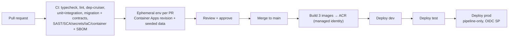

# 07 — Testing, DevOps & Go-Live

**Companion to:** [`../startup-doccs/08_Development_Approach_and_Implementation_Plan.md`](../startup-doccs/08_Development_Approach_and_Implementation_Plan.md) §8–§10, [`../startup-doccs/09_Azure_Resource_Request.md`](../startup-doccs/09_Azure_Resource_Request.md).

---

## 1. Testing strategy — tuned to risk

The test pyramid is deliberately **heavy on integration** for the correctness-critical paths — cheap to test, expensive to get wrong.

| Level | Tooling | Focus |
|-------|---------|-------|
| Unit | Jest (ts-jest) / Vitest | Pure logic: decision-table evaluation, buffer/duration math, attribution rules, hash-chain compute |
| Integration | `@nestjs/testing` + Supertest + **Testcontainers** (Postgres+Timescale, Redis) | The correctness-critical paths (below), against a real DB |
| Contract | Pact + schema tests | The **canonical telemetry schema** and cross-module event payloads (`contracts/`) — the assets that outlive any vendor |
| Component/UI | React Testing Library + MSW | Screens, forms, wizard, patterns; MSW mocks the API from `contracts/` |
| E2E | Playwright (+ axe-playwright) | The full loop (book→consent→approve→handover→return→fine) and a11y |
| Accessibility/i18n | Playwright + axe + manual screen-reader/keyboard review | Every Phase 1 route in English/Arabic, LTR/RTL, 200% zoom, reduced motion, non-colour status, NVDA/Edge and mobile viewport matrix |
| Security | SAST, SCA, secret, IaC, container and DAST tooling | Code/dependency/configuration findings, SBOM, signed image provenance, runtime headers/auth/rate limits |
| Load | Azure Load Testing | The §Phase-0 burst test, re-run before every go-live |
| Mutation (targeted) | Stryker | On the PDP + SoD guard to prove tests actually assert |

### Testing priorities (get these right first — in order)
1. **Eligibility gate / PDP fail-safe** — an outage must **DENY**, never allow.
2. **SoD** — a user cannot approve their own booking/entitlement (all 8 rules).
3. **Consent sequencing** — no booking number without a signed consent; re-consent triggers on material change.
4. **Fine/trip attribution** — including substitution windows.
5. **Audit-log completeness & hash-chain integrity** — end-to-end verification.

## 2. Engineering practices

- **Trunk-based development**, short-lived branches, PR + one review. CI runs: type-check, lint, `dependency-cruiser`, unit + integration, migration dry-run, contract tests, SAST, SCA, secret scanning, IaC scanning, container scanning, SBOM generation and image signing/provenance.
- **Ephemeral environments per PR** (Container Apps revisions) with a seeded, anonymised dataset (simulator generates telemetry).
- **Migrations are forward-only**, reviewed like code; never `synchronize: true`.
- **No feature flags on safety properties** — hard blocks, consent gates, SoD are never flag-controlled.
- **Definition of Done** (per module, from [03](03_Backend_Design.md) §10) includes: audit entries emitted, policy version recorded on the transaction, reason codes translated (EN + AR), event-loop-lag impact considered for any new synchronous work, no secrets outside Key Vault / managed identity.
- **CI guards (must pass):** no `organization_id` reference in app code; no hard-coded business rule (grep for `if.*grade`/`if.*threshold` smells → must be PDP); `dependency-cruiser` boundary; `tsc --noEmit` across the whole project (not just build).
- **Security gate:** no unresolved Critical/High exploitable finding; Medium findings require owner, due date and Security-approved exception. Secrets fail immediately. Production images require SBOM and verified signature/provenance. DAST and penetration findings follow the same release threshold.

## 3. CI/CD (GitHub Actions + OIDC federated credentials)

- **No stored cloud secrets in CI, ever** — OIDC federated credentials to Azure; images pulled via managed identity (AcrPull).
- **Prod is pipeline-only** — humans are Reader + PIM elevation; deployment via the OIDC service principal.
- Build once → promote the same image dev → test → prod.

## 4. Infrastructure as Code (Bicep)

Every resource reproducible from day one, per environment, **UAE North**, naming `fleet-{env}-{resource}`. IaC state in a Blob container. Three environments (`dev`, `test`, `prod`) share the resource set with smaller SKUs in dev/test.

## 5. Azure resources (from `09_Azure_Resource_Request.md`)

| Category | Resources | Critical admin actions |
|----------|-----------|------------------------|
| Governance | 3 resource groups + budgets/alerts + Azure Policy (region=UAE North, required tags, deny public blob) | Prod RG = pipeline-only |
| Compute | Container Apps Environment (Consumption + Dedicated D4 prod), ACR, Container Apps Job (device simulator/migration) | **≥20 vCPU regional quota** for Container Apps |
| Data | PostgreSQL Flexible Server (GP D4ds_v5, ZR-HA prod), Redis (Standard C1), Blob ×2 | **Add `timescaledb` + `pgcrypto` to `azure.extensions` allowlist**; **WORM immutability on the consent container** |
| Messaging | Service Bus (Standard), Event Hubs (Standard, 1→4 TU autoinflate, 4 partitions) | Confirm Event Hubs TU quota |
| IoT/sim | IoT Hub (S1), DPS (S1), Container Instances/job for the device fleet | **Do NOT provision IoT Central** (retired) — IoT Hub is the path |
| AI | Azure AI Document Intelligence (S0) | UAE North or nearest compliant region (confirm residency) |
| Identity/Security | Entra app regs (SPA+API), security groups per role, conditional access (MFA elevated), Key Vault, managed identities | No connection strings in config |
| Edge/Net | Front Door + WAF (prod), VNet + private endpoints (prod) | — |
| Observability | Log Analytics + Application Insights | event-loop-lag custom metric target |
| Ops | Azure Maps (Gen2 S1), Azure Load Testing, IaC state storage | Maps Route Directions drives the simulator |

**The two most-forgotten, most-blocking items:** `timescaledb`+`pgcrypto` in the Postgres extension allowlist, and WORM on the consent Blob container.

## 6. Environments

| Env | Purpose | SKUs | Data |
|-----|---------|------|------|
| `dev` | Drafting/integration | Consumption / Burstable / Basic | Seeded + simulator |
| `test` | UAT / load / pen test | Mid | Anonymised migration dry-run set |
| `prod` | GS Pool pilot | HA / Dedicated / Standard | Real, migrated + steward-signed-off |

## 7. Go-live gates (GS Pool, Mina Zayed) — all 11 green

Restated from [06](06_Phase_Plan_and_Delivery.md):

1. inventory ≥98% + steward sign-off;
2. SSO + roles + SoD-01..08 verified;
3. consent EN+AR loaded including location notice;
4. hard blocks proven (0 bookable on expired documents);
5. simulator ≥90% coverage + live map/auto-odometer/trip attach + unplug alert + source conformance passed;
6. PDPL/security review signed off, including sensitive-read audit and retention;
7. load, soak, failover, security pipeline and penetration tests pass the defined thresholds;
8. timed backup/PITR restore and queue/DLQ/outbox replay prove RPO ≤1 hour and RTO ≤4 hours;
9. GS Pool business UAT is signed with no open Sev-1/Sev-2 defect and accepted treatment for lower severities;
10. Sponsor, Business Service Owner, Security, Operations and Delivery sign the go/no-go record; rollback authority is named;
11. legacy service is read-only, the approved continuity procedure is staffed, training/support are accepted, hypercare roster is active and KPI dashboard is live.

## 8. Rollback & operational readiness

- **Rollback:** promote the previous image revision only when it is schema-compatible; otherwise execute the approved compensating migration before revision swap. The rollback decision tree names the Incident Commander and Business Service Owner as authorities. No destructive down-migration runs on production data.
- **Recovery:** PostgreSQL PITR/restore, Blob recovery, outbox/inbox replay, Service Bus DLQ replay and scheduled-work reconciliation are exercised in test with a timer. Evidence records achieved RPO/RTO, data reconciliation and residual exceptions.
- **Business continuity:** a read-only legacy service is a reference, not a writable fallback. During a platform outage, the Fleet Operations runbook uses a controlled offline booking/handover register with unique temporary references, approver attribution and reconciliation/import after recovery. The service owner approves activation and closure.
- **Runbooks & monitoring:** dashboards for PDP latency, eligibility-gate latency, `api` event-loop lag, ingest consumer lag, compliance-engine cycle health, audit-chain verification. Alert on `api` p99 lag > 10ms.
- **Hypercare:** two weeks staffed post-go-live with named business, support, application, integration, platform, security and data owners; published hours/severity/escalation; daily defect/KPI review. Exit requires five consecutive business days with no Sev-1/Sev-2 incident, queue/backlog within threshold, reconciliations complete, support acceptance and Service Owner sign-off.

## 8.1 UAT and go/no-go evidence

- UAT covers employee booking/consent, manager approval/delegation, fleet handover/return/damage/key custody, compliance blocks, entitlement approval, fine/substitute attribution, operational dashboards, Arabic/RTL, accessibility and continuity procedures.
- Each scenario links to an approved requirement and records tester, role/scope, data, result, defect and evidence.
- Exit: 100% critical scenarios passed; no open Sev-1/Sev-2; lower defects have owner/date and Sponsor-accepted impact.
- Go/no-go record captures every gate, evidence URI, exception, risk owner, rollback authority and signatures from Sponsor, Business Service Owner, Security, Operations and Delivery.

## 9. Risk register (engineering-relevant)

| # | Risk | L/I | Mitigation |
|---|------|-----|------------|
| R5 | Inventory data quality on migration | H/H | M3 tooling + cleansing sprint + steward sign-off before go-live |
| R12 | Open policy decisions block Phase 1 | H/H | Decisions register on the critical path with named owners (see below) |
| R1 | Telematics APIs unavailable on leased vehicles (Phase 2) | H/M | Negotiate into lease renewals; manual odometer fallback; simulator-first de-risks P1 |
| R3 | Entity-level fleet-team resistance | M/H | Change management, entity champions, phased rollout |
| R11 | Payroll recovery legally challenged | M/H | Legal sign-off before enabling; consent text covers it |
| R6 | PDPL constraints on telematics/route replay | M/M | Privacy-by-design review before go-live (D4); proven on simulated data first |
| — | CPU work leaks into `api` | M/H | Event-loop-lag alert + `dependency-cruiser` + load test as regression catch |
| R14 | Break-glass misuse (Phase 2) | M/M | 100% post-hoc review KPI; exception report to Audit |

## 10. Open decisions register (must be tracked, never invented — C14)

Engineering implements each behind a **named configuration point** (a policy rule type or config) and escalates; it never guesses a value.

| # | Decision | Owner | Blocks |
|---|----------|-------|--------|
| D3 | Disciplinary steps after fines threshold | Group HR | fines HR-threshold rule |
| D4 | Location-data residency & retention (PDPL) | Cybersecurity / Legal | **M10 go-live gate** |
| D6 | Depreciation rate(s) | Group Finance | cost/depreciation config |
| D7 | Consent wording (EN + AR) | Legal | all booking |
| D8 | Dedicated-vehicle eligibility policy | Group HR / Cluster CEOs | entitlement decision table |
| D9 | Black-point transfer timeframe + escalation | Group HR / Legal | platform-wide block |
| D12 | Consent re-consent tolerance | Legal / Group Services | re-consent rule |
| D13 | Fine/damage recovery mechanism + waiver authority | HR / Legal / Finance | recovery pipeline |
| D14 | Utilisation definition | Group Services / Finance | dashboards + right-sizing |
| D17 | Break-glass categories + review SLA (P2) | Group Services | emergency booking |
| D19 | Toll recharge policy (P2) | Finance | toll attribution/recharge |
| D21 | Geofence corridor ownership/tolerance (P2) | Ops / D&T | geofence alerts |
| D22 | Telematics device selection + ingestion (P2 hardware) | Procurement / D&T / Cybersecurity | Phase 2 procurement |
| D23 | Telematics microservice-extraction trigger | D&T Architecture | reviewed each phase |
| D10 | CO₂ emission factors (P3) | Group Sustainability | ESG |

*(Full register runs to D23 in the PRD; the above are the engineering-blocking subset.)*

---

**End of the implementation plan.** Return to the [index](README.md) · previous: [06 — Phase-by-Phase Delivery Plan](06_Phase_Plan_and_Delivery.md).
