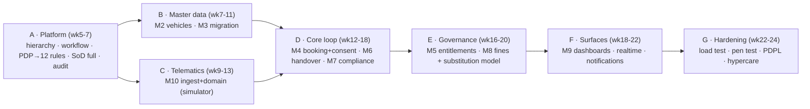

# Backend — Phase 1 (Foundation MVP, Weeks 5–24) · Blocks A–G

**Goal:** the complete accountability loop live at **GS Pool (Mina Zayed)** — book → consent → approve → handover → return → fine pinned to the driver → nothing runs on expired documents — with GPS via simulator.

**Primary source:** [`../../startup-doccs/03_Phase1_MVP_PRD_ADPorts.md`](../../startup-doccs/03_Phase1_MVP_PRD_ADPorts.md) (all FRs) · **Design:** [`../03_Backend_Design.md`](../03_Backend_Design.md) §4 (M1–M10) · **Full-capability context:** [`../../startup-doccs/02_Fleet_Management_Platform_PRD_v3.0.md`](../../startup-doccs/02_Fleet_Management_Platform_PRD_v3.0.md) (C1–C15) · **DB:** [db-phase-1-mvp.md](../database/db-phase-1-mvp.md).

**Entry gate:** [Phase 0](backend-phase-0-foundation.md) inspection gate green (load test passed; 3 deployables; auth+RBAC+SoD+audit; PDP fail-safe).

---

## 1. Build order (dependency-driven)

## 2. Block A — Platform (M1, wk 5–7)

| Build | FRs | Notes |
|-------|-----|-------|
| Configurable N-level **hierarchy engine** (deployed Cluster→Pool→Location); roll-up + scope resolution | FR-CLU-01..04 | `HierarchyService`; `ltree` path (DB) |
| **Workflow engine** — chains, delegation, escalation timers (24h booking / 48h entitlement) | FR-DEL-01/02 | durable `scheduled_work`; BullMQ executes leased work; reconciliation recovers missed timers |
| **PDP → full 12 rule types** | FR-POL-01..08 | each: Zod input schema + output reason codes + safe default + decision-table test |
| **SoD guard** — all 8 rules; overrides logged | SoD-01..08 | authorization layer, each rule tested |
| **Audit** — append-only, hash-chained; Internal-Audit read-only + export; exception report | FR-AUD-01..03 | completes the escalation half of the PDP fail-safe (P0B-3) |
| **PAP (minimal)** — author decision tables, submit→review→approve→effective-date, dry-run diff | FR-POL-03/06 | high-impact rule types need second-person approval |

**12 rule types (register all):** booking-buffer · max-booking-duration · booking-approval-chain · entitlement-approval-chain · dedicated-vehicle-eligibility (D8) · driver-eligibility-gate · compliance-alert-ladders · hard-block-conditions · fines-hr-threshold · black-point-transfer-timeframe · consent-re-consent-tolerance · fuel-deviation-threshold.

**Endpoints:** `GET /hierarchy`, `GET /me`, `POST /delegations`, `GET /audit`, `GET /reports/exceptions`, `/admin/policy` (PAP).
**Acceptance:** 12 rule types pass their decision-table tests + logged in `decision_log`; escalation timers fire; SoD-01..08 tests pass, including override exception evidence; audit chain verifies. **Rules-vs-decisions caveat:** rule *tables* for D3/D6/D8/D9/D12/D14 hold real values only when those decisions close — engine ships now, tables populated on decision close (gap P1B-2).

## 3. Block B — Master data (M2 vehicles, M3 migration, wk 7–11)

- **M2 `vehicles`** — full 6-group data model, 7 lifecycle + 5 operational statuses, group-level uniqueness (plate/VIN/Salik/Darb), document vault (versioned), pool include/exclude, **equipment/bus never bookable**, event-publish on change. FR-INV-01..07 / FR-INV-11. Endpoints per 03 §4 M2.
- **M3 `migration`** — CSV/XLSX import (**BullMQ sandboxed** parse), pre-commit validation, dedup + steward merge, reconciliation report + completeness score, **steward sign-off before operational**. FR-MIG-01..05. `POST /imports` → 202+jobId.
**Acceptance:** a real pilot inventory imports to **≥98%** completeness with steward sign-off; uniqueness + equipment/bus rules enforced. **Cleansing sprint runs in parallel** (gap P1B-4).

## 4. Block C — Telematics (M10, wk 9–13)

- **`telematics-ingest`** with `SimulatorSource` (permanent, first-class) — Adapter Layer → canonical schema → batched COPY → domain events. FR-GPS-P1-00/01/10.
- **`telematics/domain`** (in `api`) — device registry & pairing, live map, auto-odometer, **trip auto-attach**, unplug/tamper alerts, GPS-status enum, device-health console, **privacy guardrails on simulated data**. FR-GPS-P1-02..09.
- **Dependency-inversion fix (gap P1B-1):** trip-attach is built behind a `bookings` **port + test double** in Block C; full integration test runs at the **start of Block D** when bookings exist.
**Acceptance:** simulator drives ≥90% of pool vehicles; live map + auto-odometer + trip-attach verified; unplug alert exercised; `TelemetrySource` swap-tested (simulator → stub aggregator) **with no domain change**.

## 5. Block D — Core loop (M4, M6, M7, wk 12–18)

- **M4 `bookings` (PEP)** — search/availability/buffer, **consent sequencing** (after selection, before submission), eligibility gate, unique number **only after consent**, waitlist auto-allocate, reminders (24h/1h), no-show/late capture, mid-trip extension. Persist the PDP-derived reservation range + policy version; DB exclusion conflicts return 409. Consent void/supersede uses append-only lifecycle events. FR-BOOK-01..15, FR-CON-01..06.
- **M6 `handover`** — verify booking+employee, odometer/fuel/GPS-status/signature, return reconciliation + **fuel-deviation flag via PDP** (advisory), key log; **odometer-conflict** rule FR-HAND-11 (telematics is system of record). FR-HAND-01..07.
- **M7 `compliance` (PEP + scheduled)** — `EligibilityService` (the one gate, FR-COMP-10), `ComplianceEngine` claims durable work rows and executes via BullMQ with lease recovery, **hard block no-override** on expired Mulkiya/insurance (FR-COMP-03). FR-COMP-01..05.
**Acceptance:** full loop passes; **0 bookings possible on expired documents**; override attempts **denied + logged**; eligibility-gate p95 **< 500 ms**.

## 6. Block E — Governance (M5, M8, wk 16–20)

- **M5 `entitlements` (PEP)** — request types, **eligibility pre-check (D8 decision table)**, justification, **approval chain to Cluster CEO** (LM→CFL→CEO), **driver consent before allocation**, **BSD return** from HCM leave calendar (auto-revert), utilisation/justification report. FR-DVR-01..09. PDP: `dedicated-vehicle-eligibility`, `entitlement-approval-chain`.
- **M8 `fines`** — manual register, **auto-attribution** (booking-active driver → else assigned driver → honour substitution window), fines-per-user + **≥3/12mo HR alert**, accidents register, **black-point transfer + platform-wide block** via `access_block` (FR-FINE-05), minimal recovery record, **substitution-attribution data model** (FR-SUB-01/02) live now with a **minimal admin/API entry** (gap P1B-4/substitution UI). FR-FINE-01..07.
**Acceptance:** entitlement runs the Cluster CEO chain; a fine in a substitution window attributes to the **substitute**; overdue black-point transfer **blocks the driver platform-wide** (proven via the eligibility gate).

## 7. Block F — Surfaces + platform services (M9, wk 18–22)

- **M9 `dashboards`** — read-optimised query services + materialized views; **cost masking** (non-Finance) + Executive-aggregate-only; feeds utilisation, fines-per-user, compliance heat map, entitlement inventory, telematics-coverage %.
- **Realtime** — Socket.IO gateway + Redis adapter (live map, booking status, alerts), scope-bound subscriptions.
- **Notification dispatcher (P9, Email/M365)** — driven by Service Bus events + compliance engine; compliance alerts unmutable (gap P1B-5 — was unowned).
**Acceptance:** each screen matches its page spec; KPI tiles live; which KPIs are truly live at a single pool is explicit (gap P1B-7).

## 8. Block G — Hardening (wk 22–24)

Load test with **real modules + migrated data** (the binding run, supersedes the Phase-0 floor); penetration test; **PDPL privacy review (D4) sign-off**; performance tuning to NFR; hypercare readiness; **business UAT with GS Pool users** (gap P1B-6-UAT).

## 9. Cross-cutting (Phase 1)

- **Eventing (outbox → Service Bus):** `BookingConfirmed/Cancelled`, `EntitlementApproved`, `HandoverCompleted`, `FineRecorded`, `ComplianceBlockRaised/Cleared`, `TripEnded`, `DeviceSilent`, `ConsentSigned`; consumers deduplicate through `inbox_message`.
- **Critical work:** compliance ladders, approval SLA escalation, delegation expiry and notification obligations live in `scheduled_work`; BullMQ executes leased rows. Migration/OCR payloads remain replayable from their durable source records.
- **Error model:** RFC-7807; 403 + machine `reasons[]` (EN/AR); PDP-unavailable = DENY + escalate.
- **DoD (03 §10)** applies to every module.

## 10. Inspection Gate — Gap Analysis & Fixes

> Severity **H** blocks go-live · **M** scheduled · **L** track. Two-pass review (sequencing/scope, then correctness/edges).

**Round 1 — sequencing, dependencies, scope**

| # | Gap | Sev | Fix | Owner |
|---|---|---|---|---|
| P1B-1 | Trip-attach (Block C) built before bookings (Block D) exist → unverifiable | H | Build behind a bookings port + test double; full integration test at start of D | Backend |
| P1B-2 | 6 of 12 rule **tables** need closed decisions (D8/D9/D12/D14/D3/D6) | H | Split "engine complete" (A) from "tables populated + 2nd-person approved" (on decision close); per-rule tracker | Backend + Sponsor |
| P1B-3 | Consent hard-gate (C4) has no contingency if D7 (EN+AR wording) slips | H | Escalate D7 with a dated deadline; pre-load a Legal-reviewed **v0** to unblock build (not go-live) | Legal |
| P1B-4 | Migration ≥98% gate needs a cleansed dataset; cleansing sprint only implied | H | Schedule cleansing in parallel with B–E; steward assigned at kickoff | Data Steward |
| P1B-5 | **Notification dispatcher unowned** (M7 ladders + M4 reminders need it) | M | Build the dispatcher (P9, Email/M365) explicitly in Block A/D | Backend |
| P1B-6 | No business **UAT** before go-live | M | 1–2 week UAT with GS Pool users across F→G | QA + Sponsor |
| P1B-7 | KPI reality at one pool (cost-per-km/ESG need P2 data) | M | Tag each KPI measurable-now vs P2; scope M9 to the measurable set | Backend + PM |

**Round 2 — correctness, concurrency, edges**

| # | Gap | Sev | Fix | Owner |
|---|---|---|---|---|
| P1B-8 | **Double-booking race** — buffer relies on an index, not a reservation | H | Commit to DB exclusion constraint (`tstzrange && `) + `FOR UPDATE` in the booking txn; concurrent-booking test | Backend + DB |
| P1B-9 | **Eligibility vs HCM freshness** — stale/absent sync mis-allows or over-blocks | H | HCM freshness SLA; fail-direction = block + escalate; show "data as of" | Backend + Integration |
| P1B-10 | **Trip-attach ≥90% KPI self-fulfilling** with booking-aware simulator | M | Add non-booking-aware/adversarial trips (drift/overlap/gaps) to the eval set | Backend + QA |
| P1B-11 | **Substitution model unreachable** in P1 (UI is P2) | M | Minimal admin/API entry for substitution windows in Block E | Backend |
| P1B-12 | **Time-zone/DST** across windows, buffers, reminders, expiry ladders | M | Centralize UTC↔Asia/Dubai conversion; tz-boundary test cases | Backend |
| P1B-13 | **D4 (PDPL) timing vs Block C** — late sign-off forces telematics rework | M | Pull D4 to precede Block C; build guardrails to the decided policy | Cybersecurity/Legal |

**Exit criteria:** all **11 controlled go-live gates** in [07](../07_Testing_DevOps_GoLive.md) pass; every **H** gap has closure evidence; the binding load/soak/failover tests pass; DB [Phase 1 gate](../database/db-phase-1-mvp.md) is green. → proceed to [Phase 2](backend-phase-2-scale-automate.md).
