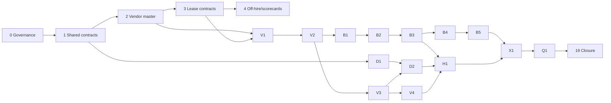

# Booking and Vehicle Management — End-to-End Implementation Program

> **Status:** Planning baseline — implementation requires phase-specific mockup approval
> **Scope:** Vendor/lease lifecycle, vehicle master/lifecycle, pool-trip booking, dedicated-vehicle entitlements, handover/return, supporting compliance/telematics/fines integration, frontend, backend, database, tests and rollout
> **Business authority:** `docs/startup-doccs/01` through `08`; mockups are visual/interaction evidence, not permission to invent business rules
> **Implementation rule:** Before every UI phase, request the detailed mockup set from the user, review it against the business documents, document decisions/gaps, obtain confirmation, then implement DB/BE/FE together

## 1. Domain boundaries

1. **Vendor & Lease Management** owns vendor identity/source, compliance evidence, commercial terms, lease contracts, renewal ladders, off-hire, invoice discrepancies and computed scorecards.
2. **Vehicle Management** owns vehicle identity, ownership/lease, hierarchy assignment, booking-pool inclusion, lifecycle, documents, maintenance, telematics pairing, key custody, transfer, import and history.
3. **Pool-Trip Booking** owns a time-bounded trip using a bookable pool vehicle: search, eligibility, selection, consent, approval, reservation, modify/extend/cancel, waitlist, handover and return.
4. **Dedicated Vehicle Entitlement** owns long-term/temporary allocation with/without driver: eligibility, business justification, approval to Cluster CEO where required, consent, vehicle allocation, BSD return-to-pool and expiry/return.
5. **Policy/Workflow** decides values/routes/eligibility and orchestrates approvals; it does not own screens, vendor/vehicle state or transactional effects.
6. A leased vehicle cannot activate without an Active vendor and valid contract; a user never books a vehicle that Vehicle Management has not onboarded, scoped, made compliant and included in the booking pool.

## 2. Source priority

1. Approved business decisions and signed requirements.
2. `docs/startup-doccs/02_Fleet_Management_Platform_PRD_v3.0.md`.
3. Phase documents (`03` Phase 1, `04` Phase 2, `05` Phase 3).
4. `07_Page_Functional_Specifications.md` and `06_UX_Design_System_v2.md`.
5. Approved phase mockups supplied by the user.
6. Current source behavior, used as implementation baseline rather than business authority.
7. `app-ui/developer-docs/design-system.md` and current component-library plan as the Wayfinder implementation baseline.
8. `docs/05-implementation/decision-and-workflow-platform-plan/` for Organization, Policy, Workflow, authorization and provenance foundations.

Conflicts are logged and escalated. Never resolve D1–D24 or legal/policy ambiguity by guessing.

## 2.1 External foundation evidence gate

Phase 1 validates, imports and links evidence from the existing foundation program; it does not reimplement it. Before domain phases start, confirm:

- Organization hierarchy/scope APIs, organization consistency and authorized closure are green.
- Policy scoped evaluation, immutable versions, decision provenance and selector/rollback are green.
- Workflow definition/version/task/timer and exactly-once domain-command boundaries are approved.
- HCM employee/status/manager/leave source contract and freshness behavior are approved for the target environment.
- Compliance/eligibility, fines/black-points, dashboards, audit/outbox and notification foundations have named adoption owners.

If an external foundation is incomplete, the dependent phase is blocked or runs in an explicitly documented simulator/manual mode with safe failure behavior.

## 3. Phase map

| Phase | Document | Outcome | Mockup gate |
| --- | --- | --- | --- |
| 0 | [00-program-governance-and-traceability.md](00-program-governance-and-traceability.md) | Business scope, traceability and mockup workflow frozen | Program references |
| 1 | [01-shared-domain-contracts-and-data-foundation.md](01-shared-domain-contracts-and-data-foundation.md) | Cross-domain IDs, scope, actor, provenance, audit and lifecycle contracts | No new screen |
| 2 (S1) | [02-vendor-source-master-and-onboarding.md](02-vendor-source-master-and-onboarding.md) | Source-labelled Vendor Master and dual-controlled onboarding | Supplied master/onboarding mockups; request missing states |
| 3 (S2) | [03-lease-contracts-renewals-and-reconciliation.md](03-lease-contracts-renewals-and-reconciliation.md) | Lease contracts, renewal ladder and AP discrepancies | Supplied contract/discrepancy mockups; request detail workflows |
| 4 (S3) | [04-vendor-performance-and-off-hire.md](04-vendor-performance-and-off-hire.md) | Computed scorecards and durable off-hire workflow | Supplied scorecard/off-hire mockups; request action screens |
| 5 (V1) | [05-vehicle-onboarding-and-import.md](05-vehicle-onboarding-and-import.md) | Onboard/import owned, leased, transfer-in and replacement vehicles | **Request onboarding/import mockups** |
| 6 (V2) | [06-vehicle-registry-and-detail.md](06-vehicle-registry-and-detail.md) | Scoped vehicle list, inspector/detail and search | **Request list/detail mockups** |
| 7 (V3) | [07-vehicle-lifecycle-transfer-and-maintenance.md](07-vehicle-lifecycle-transfer-and-maintenance.md) | Lifecycle, transfer, maintenance/off-hire and booking-pool controls | **Request lifecycle/transfer mockups** |
| 8 (V4) | [08-vehicle-documents-compliance-telematics-and-custody.md](08-vehicle-documents-compliance-telematics-and-custody.md) | Documents, compliance runway, GPS/device, keys and history | **Request tabs/map/custody mockups** |
| 9 (B1) | [09-live-pool-booking-foundation.md](09-live-pool-booking-foundation.md) | Live self/on-behalf booking wizard and backend authority | **Request booking wizard mockups** |
| 10 (B2) | [10-booking-availability-eligibility-consent-and-submit.md](10-booking-availability-eligibility-consent-and-submit.md) | Availability, eligibility, selection, consent, number and submit | **Request results/consent/confirmed mockups** |
| 11 (B3) | [11-booking-approval-and-fleet-operations.md](11-booking-approval-and-fleet-operations.md) | Approval inbox, delegation, scoped assignment and Fleet Manager queue | **Request approval/operations mockups** |
| 12 (B4) | [12-my-bookings-changes-and-completion.md](12-my-bookings-changes-and-completion.md) | My Bookings, modify, re-consent, extend, cancel, early return and completion | **Request My Bookings/detail mockups** |
| 13 (B5) | [13-advanced-booking-scenarios.md](13-advanced-booking-scenarios.md) | Waitlist, recurring, emergency, cross-node, no-show and late return | **Request each advanced-flow mockup** |
| 14 (D1) | [14-dedicated-vehicle-request-and-eligibility.md](14-dedicated-vehicle-request-and-eligibility.md) | Employee/Fleet Manager dedicated request and eligibility | **Request dedicated request mockups** |
| 15 (D2) | [15-dedicated-approval-consent-allocation-and-bsd.md](15-dedicated-approval-consent-allocation-and-bsd.md) | Approval, consent, allocation, BSD, review and return | **Request decision/allocation/BSD mockups** |
| 16 (H1) | [16-handover-return-and-accountability.md](16-handover-return-and-accountability.md) | Handover/return, condition, damage, keys, fuel/odometer and trip evidence | **Request handover/return mockups** |
| 17 (X1) | [17-integration-reporting-and-operational-readiness.md](17-integration-reporting-and-operational-readiness.md) | Notifications, map, reporting, audit, imports and integration readiness | **Request operations/report mockups** |
| 18 (Q1) | [18-testing-rollout-and-cutover.md](18-testing-rollout-and-cutover.md) | Full E2E, UAT, performance, migration, rollback and go-live | Evidence mockups/screenshots |
| 19 | [19-traceability-and-completion-matrix.md](19-traceability-and-completion-matrix.md) | Objective completion matrix and residual risk | All prior gates |

## 4. Dependency flow

## 5. Mandatory phase loop

For every phase:

1. Request and receive its detailed mockups before UI design.
2. Create/update `mockups/<phase>/mockup-review.md` with source files, states, decisions and gaps.
3. **Delivery does not begin until the user explicitly confirms “Mockups approved — proceed” and the approval date/reference is recorded.**
4. Compare mockups with business requirements/current source; log conflicts and open decisions.
5. Update the phase document and contracts before code.
6. Implement DB → backend → frontend in the smallest complete vertical slices.
7. Run focused and full verification.
8. Run one rigorous adversarial critique/gap analysis.
9. Fix all critical/high findings.
10. Update this package and repository memory.
11. Report completion and ask for the next phase’s mockups before starting it.

## 5.1 EN/AR/RTL and responsive strategy

- Primary journey/page mockups require EN and AR/RTL evidence; supporting dialogs may be derived from the approved Wayfinder system and documented in mockup review.
- Browser gates: 320px mobile, 768px tablet, 1024px desktop and 1440px wide desktop; no overlap or horizontal page overflow.
- RTL checks: logical spacing, mirrored navigation/chevrons, correct table/step order, overlays inheriting `dir`, Arabic input direction and focus order.
- Automated axe/Playwright checks on every implemented route; manual NVDA + Chrome on Windows for booking, approvals, vendor/vehicle wizards and handover. VoiceOver is required where a supported macOS test device exists.
- Keyboard coverage includes Tab/Shift+Tab, Escape, Enter/Space, Arrow keys, Home/End where components use those patterns, visible focus and focus restoration.
- Status is never color-only; targets are at least 44px on touch layouts.

## 5.2 Design-system/component gate

Mockups are adapted to current Wayfinder tokens and shared components, not copied into isolated custom CSS. Each mockup review lists required components and availability. Missing primitives are built/tested in the component library before the feature page. Design deviations record reason, owner and accessibility impact.

## 5.3 Critical path and release boundaries

- Vendor/Lease phases 2–4 are **Phase 2 product scope** from the startup roadmap, but Vendor Master/manual contract foundations are critical prerequisites for production leased-vehicle onboarding. Owned-vehicle onboarding may proceed independently after Phase 1.
- Phase 4 delivers off-hire contracts/read models and initiation; production completion is enabled only after Phase 7 lifecycle, Phase 8 custody/device/document and Phase 16 condition-return evidence pass.
- Phase 6 may show compliance/GPS placeholders only as typed lazy states; live compliance/device data lands with Phase 8.
- Phase 1 telematics is simulator-first. Aggregator/direct hardware sources remain Phase 2 and use the same adapter contract.
- Recurring, break-glass and active professional/substitute-driver workflows remain Phase 2 unless sponsor changes scope through governance.

## 6. Current-state correction

- `/en/booking` is currently a static mock page despite having unused typed booking API hooks.
- Vendor/lease screens shown in supplied mockups are design references only; no vendor/lease tables, APIs or production routes exist yet.
- Existing `vehicle.vendor_id` is not a valid reference until Phase 2 creates Vendor Master and a real FK; `lease_contract_ref` is currently free text.
- Vehicle Management list/detail/onboarding screens are not delivered as live production routes.
- Dedicated Vehicle UI is not delivered as a live employee/Fleet Manager journey.
- Backend schemas/services are substantial but do not make a user journey complete without role/scope-secure UI and E2E proof.
- Existing Phase 8 policy migration is a dependency/integration stream, not a replacement for this end-to-end product implementation program.
