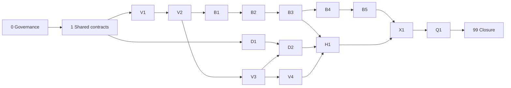

# Booking and Vehicle Management — End-to-End Implementation Program

> **Status:** Planning baseline — implementation requires phase-specific mockup approval
> **Scope:** Vehicle master/lifecycle, pool-trip booking, dedicated-vehicle entitlements, handover/return, supporting compliance/telematics/fines integration, frontend, backend, database, tests and rollout
> **Business authority:** `docs/startup-doccs/01` through `08`; mockups are visual/interaction evidence, not permission to invent business rules
> **Implementation rule:** Before every UI phase, request the detailed mockup set from the user, review it against the business documents, document decisions/gaps, obtain confirmation, then implement DB/BE/FE together

## 1. Domain boundaries

1. **Vehicle Management** owns vehicle identity, ownership/lease, hierarchy assignment, booking-pool inclusion, lifecycle, documents, maintenance, telematics pairing, key custody, transfer, import and history.
2. **Pool-Trip Booking** owns a time-bounded trip using a bookable pool vehicle: search, eligibility, selection, consent, approval, reservation, modify/extend/cancel, waitlist, handover and return.
3. **Dedicated Vehicle Entitlement** owns long-term/temporary allocation with/without driver: eligibility, business justification, approval to Cluster CEO where required, consent, vehicle allocation, BSD return-to-pool and expiry/return.
4. **Policy/Workflow** decides values/routes/eligibility and orchestrates approvals; it does not own screens, vehicle state or transactional effects.
5. A user never books a vehicle that Vehicle Management has not onboarded, classified, scoped, made compliant and included in the booking pool.

## 2. Source priority

1. Approved business decisions and signed requirements.
2. `docs/startup-doccs/02_Fleet_Management_Platform_PRD_v3.0.md`.
3. Phase documents (`03` Phase 1, `04` Phase 2, `05` Phase 3).
4. `07_Page_Functional_Specifications.md` and `06_UX_Design_System_v2.md`.
5. Approved phase mockups supplied by the user.
6. Current source behavior, used as implementation baseline rather than business authority.

Conflicts are logged and escalated. Never resolve D1–D24 or legal/policy ambiguity by guessing.

## 3. Phase map

| Phase | Document | Outcome | Mockup gate |
| --- | --- | --- | --- |
| 0 | [00-program-governance-and-traceability.md](00-program-governance-and-traceability.md) | Business scope, traceability and mockup workflow frozen | Program references |
| 1 | [01-shared-domain-contracts-and-data-foundation.md](01-shared-domain-contracts-and-data-foundation.md) | Cross-domain IDs, scope, actor, provenance, audit and lifecycle contracts | No new screen |
| V1 | [10-vehicle-onboarding-and-import.md](10-vehicle-onboarding-and-import.md) | Onboard/import owned, leased, transfer-in and replacement vehicles | **Request onboarding/import mockups** |
| V2 | [11-vehicle-registry-and-detail.md](11-vehicle-registry-and-detail.md) | Scoped vehicle list, inspector/detail and search | **Request list/detail mockups** |
| V3 | [12-vehicle-lifecycle-transfer-and-maintenance.md](12-vehicle-lifecycle-transfer-and-maintenance.md) | Lifecycle, transfer, maintenance/off-hire and booking-pool controls | **Request lifecycle/transfer mockups** |
| V4 | [13-vehicle-documents-compliance-telematics-and-custody.md](13-vehicle-documents-compliance-telematics-and-custody.md) | Documents, compliance runway, GPS/device, keys and history | **Request tabs/map/custody mockups** |
| B1 | [20-live-pool-booking-foundation.md](20-live-pool-booking-foundation.md) | Live self/on-behalf booking wizard and backend authority | **Request booking wizard mockups** |
| B2 | [21-booking-availability-eligibility-consent-and-submit.md](21-booking-availability-eligibility-consent-and-submit.md) | Availability, eligibility, selection, consent, number and submit | **Request results/consent/confirmed mockups** |
| B3 | [22-booking-approval-and-fleet-operations.md](22-booking-approval-and-fleet-operations.md) | Approval inbox, delegation, scoped assignment and Fleet Manager queue | **Request approval/operations mockups** |
| B4 | [23-my-bookings-changes-and-completion.md](23-my-bookings-changes-and-completion.md) | My Bookings, modify, re-consent, extend, cancel, early return and completion | **Request My Bookings/detail mockups** |
| B5 | [24-advanced-booking-scenarios.md](24-advanced-booking-scenarios.md) | Waitlist, recurring, emergency, cross-node, no-show and late return | **Request each advanced-flow mockup** |
| D1 | [30-dedicated-vehicle-request-and-eligibility.md](30-dedicated-vehicle-request-and-eligibility.md) | Employee/Fleet Manager dedicated request and eligibility | **Request dedicated request mockups** |
| D2 | [31-dedicated-approval-consent-allocation-and-bsd.md](31-dedicated-approval-consent-allocation-and-bsd.md) | Approval, consent, allocation, BSD, review and return | **Request decision/allocation/BSD mockups** |
| H1 | [40-handover-return-and-accountability.md](40-handover-return-and-accountability.md) | Handover/return, condition, damage, keys, fuel/odometer and trip evidence | **Request handover/return mockups** |
| X1 | [50-integration-reporting-and-operational-readiness.md](50-integration-reporting-and-operational-readiness.md) | Notifications, map, reporting, audit, imports and integration readiness | **Request operations/report mockups** |
| Q1 | [60-testing-rollout-and-cutover.md](60-testing-rollout-and-cutover.md) | Full E2E, UAT, performance, migration, rollback and go-live | Evidence mockups/screenshots |
| 99 | [99-traceability-and-completion-matrix.md](99-traceability-and-completion-matrix.md) | Objective completion matrix and residual risk | All prior gates |

## 4. Dependency flow

## 5. Mandatory phase loop

For every phase:

1. Request and receive its detailed mockups before UI design.
2. Compare mockups with business requirements/current source; log conflicts and open decisions.
3. Update the phase document and contracts before code.
4. Implement DB → backend → frontend in the smallest complete vertical slices.
5. Run focused and full verification.
6. Run one rigorous adversarial critique/gap analysis.
7. Fix all critical/high findings.
8. Update this package and repository memory.
9. Report completion and ask for the next phase’s mockups before starting it.

## 6. Current-state correction

- `/en/booking` is currently a static mock page despite having unused typed booking API hooks.
- Vehicle Management list/detail/onboarding screens are not delivered as live production routes.
- Dedicated Vehicle UI is not delivered as a live employee/Fleet Manager journey.
- Backend schemas/services are substantial but do not make a user journey complete without role/scope-secure UI and E2E proof.
- Existing Phase 8 policy migration is a dependency/integration stream, not a replacement for this end-to-end product implementation program.
